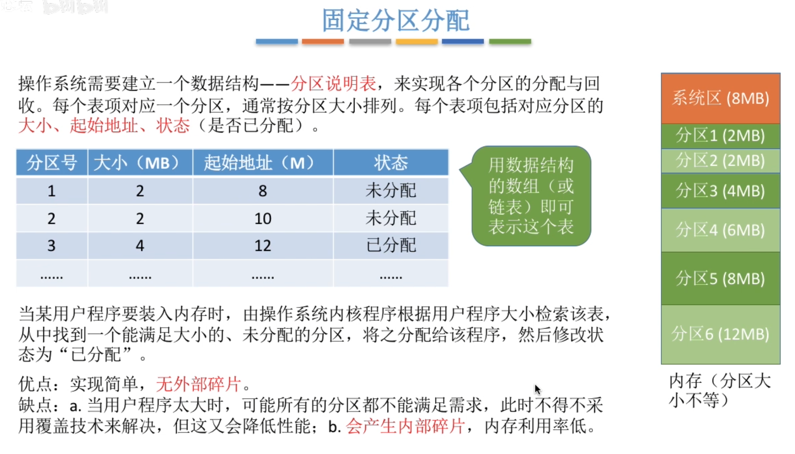
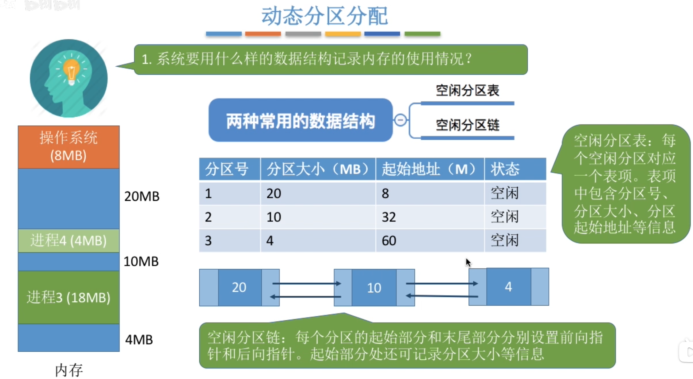
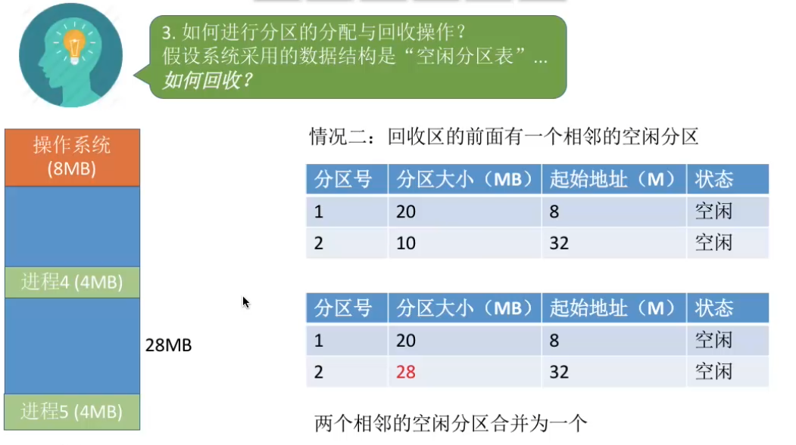
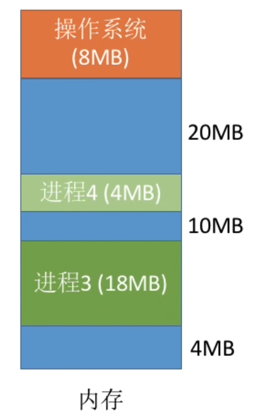
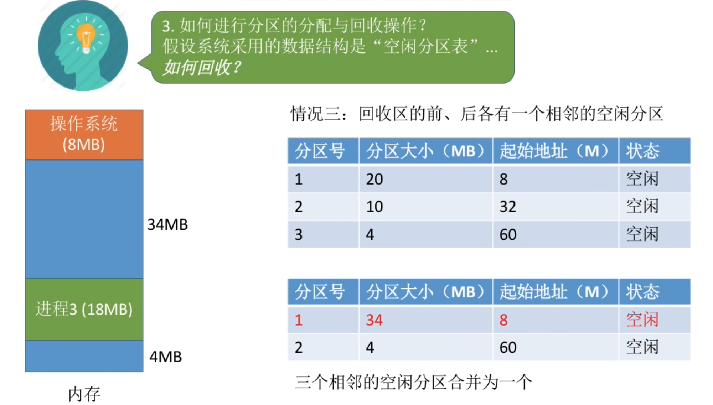
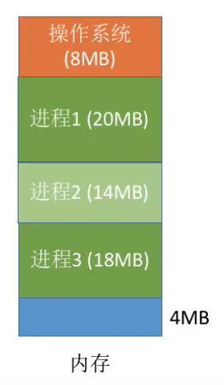
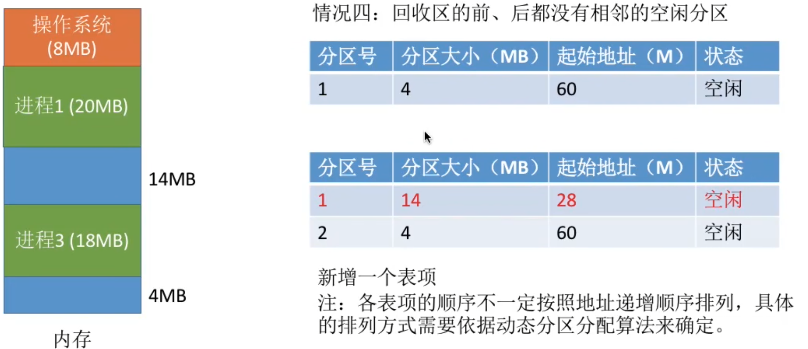
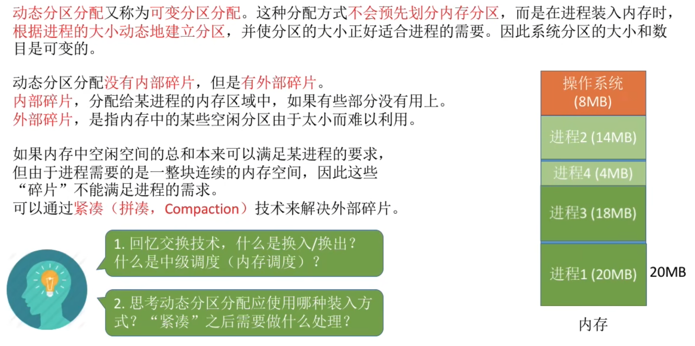
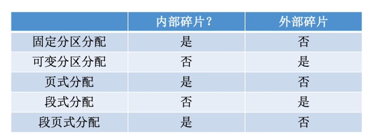
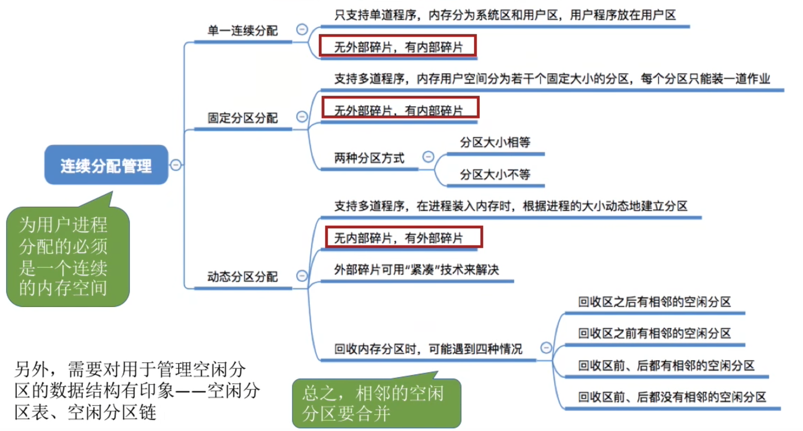

---
tags:
  - 操作系统
---
连续分配：指为用户进程分配的必须是一个连续的内存空间
# 单一连续分配

# 固定分区分配

>各个分区大小可以相等或不等
# 动态分区分配

## 记录内存的使用情况

>用空闲分区表或空闲分区链

## [[动态分区分配算法]]

## 分区的分配与回收
### 分配

>进程5分配到1号分区

>进程5分配到3号分区

### 回收
回收区后面有一个相邻的空闲分区

>回收了原来在1号分区大小为4M的进程

回收区前面有一个相邻的空闲分区

回收区的前后各有一个相邻的空闲分区

回收区的前后都没有相邻的空闲分区

# 内部碎片与外部碎片

>紧凑技术：就是将内存里的进程进行移位，从而将原本零碎的空闲分区组合在一起并变大

- 分页式，段页式，固定分区式都会产生内部碎片
- 分段式不会产生内部碎片

# 总结
