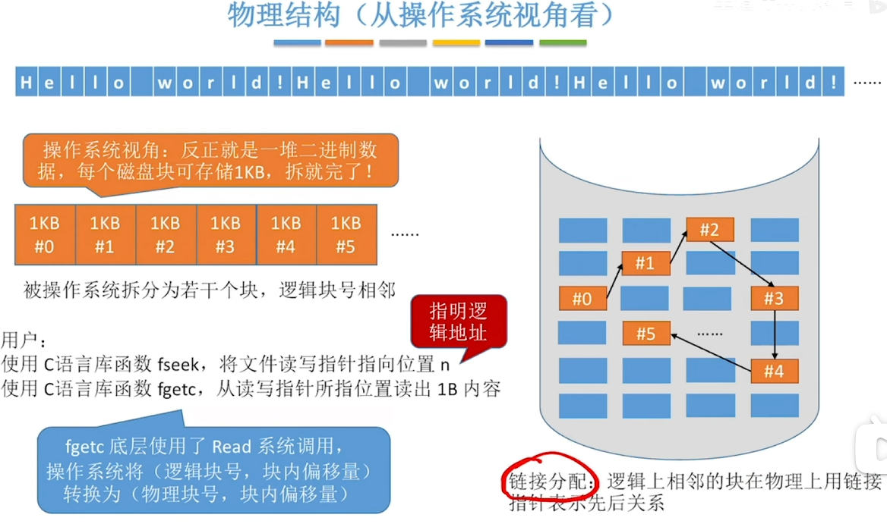
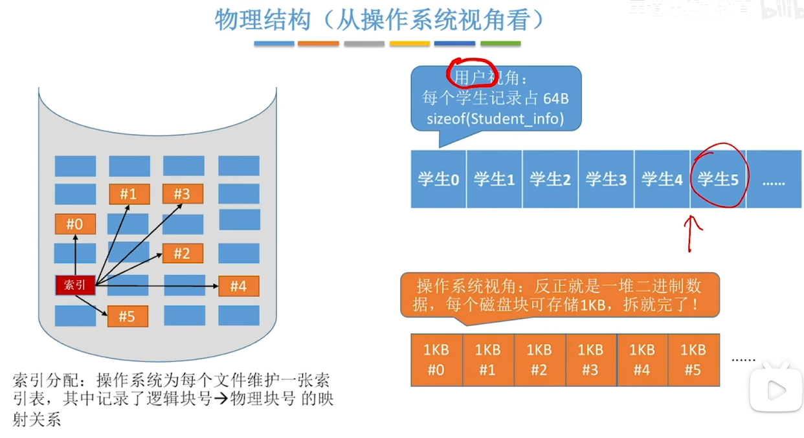
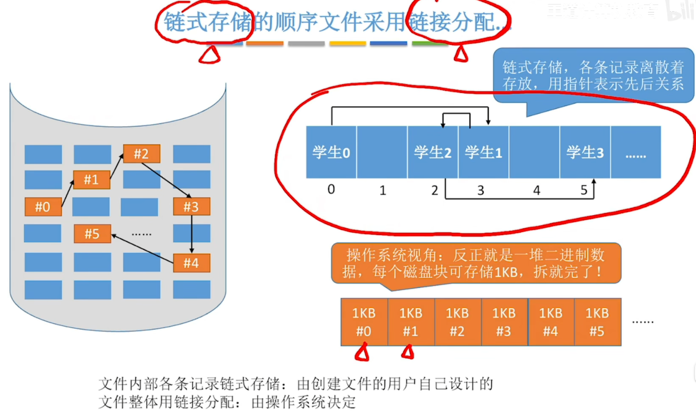
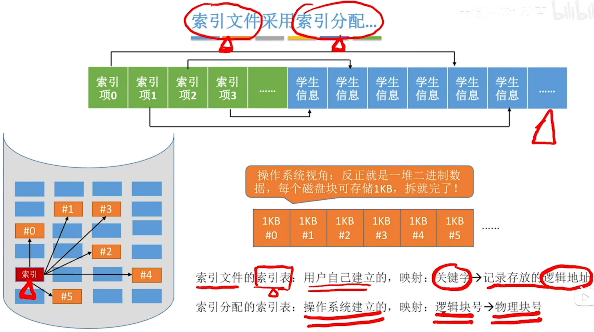
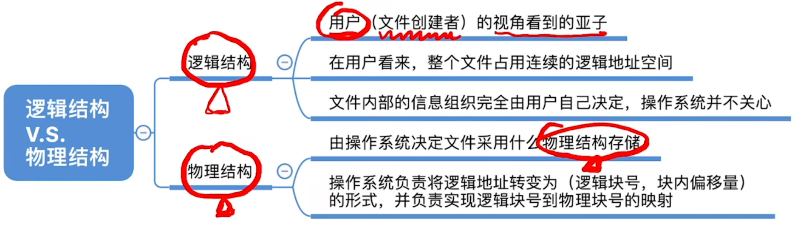

---
tags:
  - 操作系统
---
# 用户视角
## 无结构文件

>在用户视角，数据是连续存放
>
>但在操作系统视角下，就是若干个磁盘块，可以用不同的分配方式进行存储

## 顺序文件

>在用户视角下数据还是连续存放
>
>在操作系统视角下依然只是一个个磁盘块

## 采用链式存储的[顺序文件](文件的逻辑结构.md#顺序文件)采用[链接分配](文件的物理结构.md#链接分配)

>链式存储是用户来设计的
>而链接分配是操作系统来决定

# [索引文件](文件的逻辑结构.md#索引文件)采用[索引分配](文件的物理结构.md#索引分配)

# 总结
