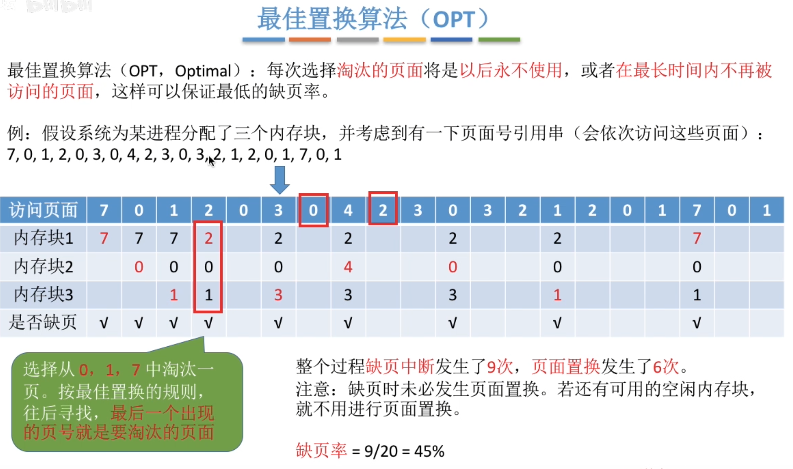
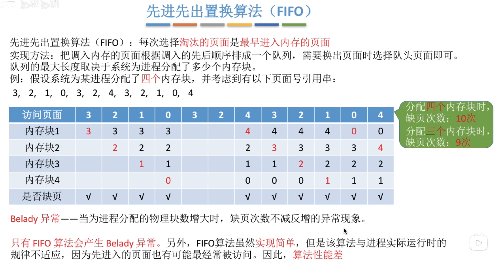
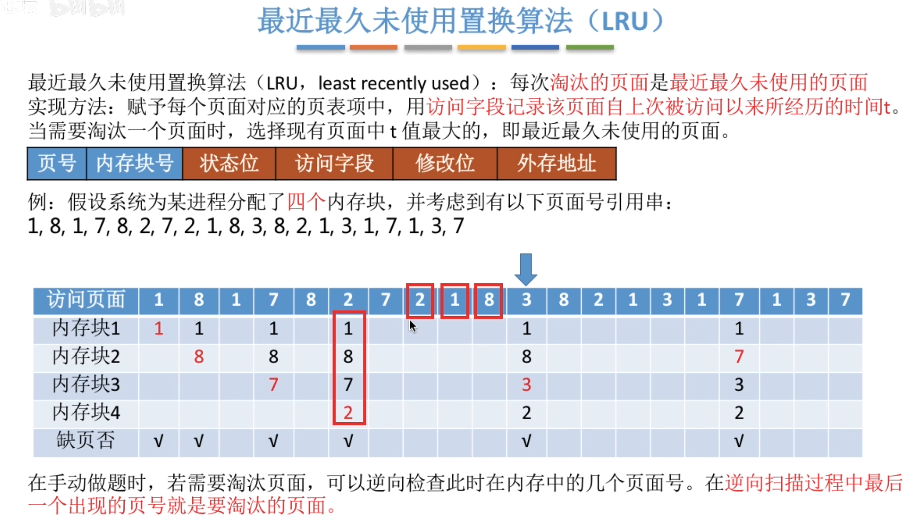
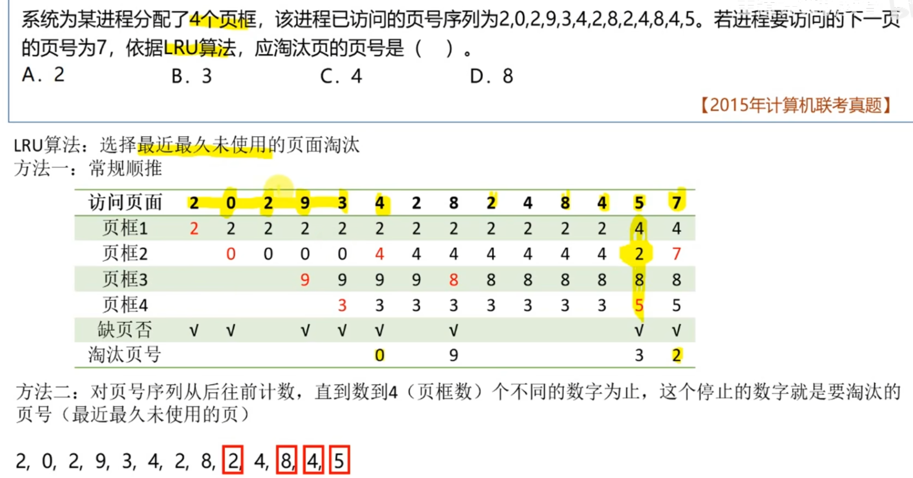
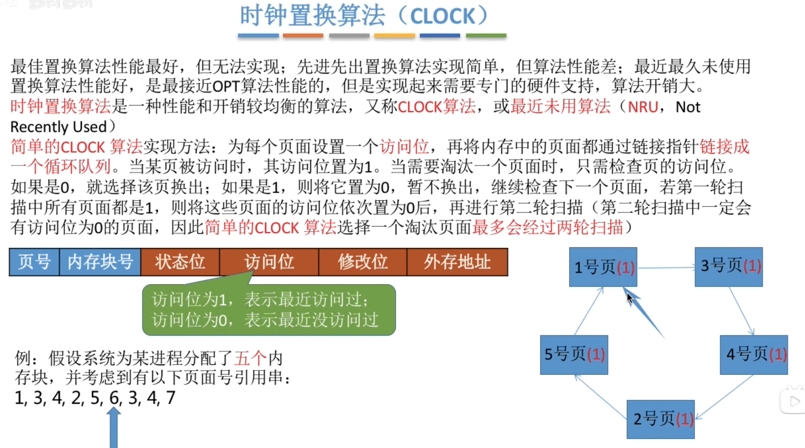
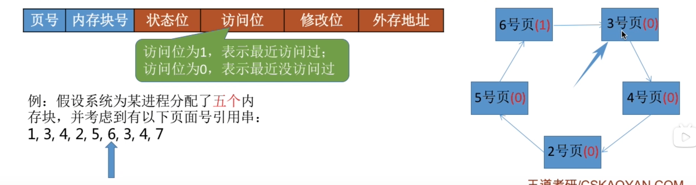
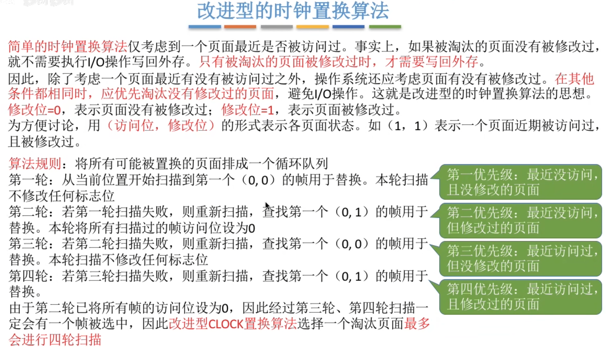
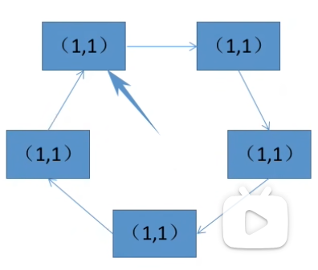
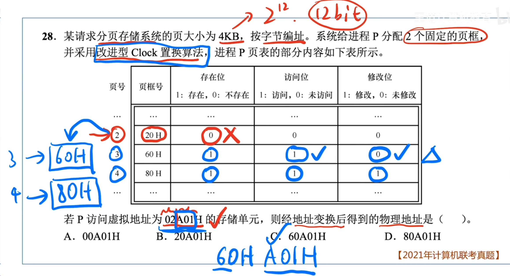
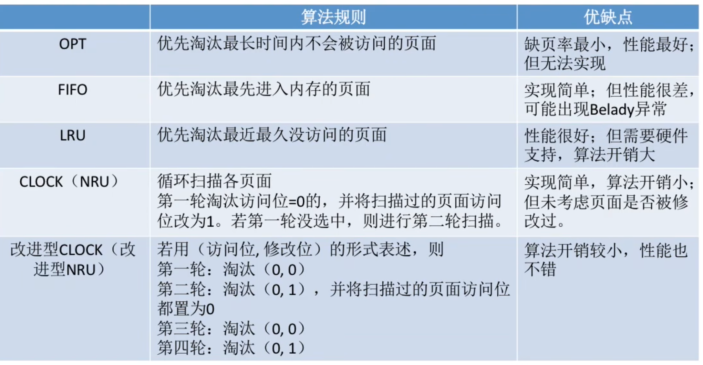

---
tags:
  - 操作系统
---
# 最佳置换算法（OPT）

>访问了7,0,1之后访问页面2，此时3个内存块都已占满，需要置换未来要访问的页面中最长时间不会再被访问的页面也就是看往后要访问的页面里7,0,1哪个是最后一个被访问的，往后找，有0，然后看到1，最后才出现7，所以选择置换7
>---
>最佳置换算法（OPT，Optimal）：每次选择淘汰的页面将是以后永不使用，或者在最长时间内不再被访问的页面，这样可以保证最低的缺页率。
>最佳置换算法可以保证最低的缺页率，但实际上，只有在进程执行的过程中才能知道接下来会访问到的是哪个页面。操作系统无法提前预判页面访问序列。因此，最佳置换算法是无法实现的。

# 先进先出置换算法（FIFO）

>Belady异常
>访问3,2,1,0形成队列3->2->1->0，下次需要置换时置换队头也就是3

# 最近最久未使用替换算法（LRU）

>访问页面3时，此时4个内存块里是（1,8,7,2），需要替换，从访问顺序里往前找，遇到8，然后是1，然后是2。所以7肯定是最后出现的，选择替换掉7号页面
>该算法的实现需要专门的硬件支持，虽然算法性能好，但是实现困难，开销大
>例题
>

# 时钟置换算法（CLOCK/NRU）

>扫描过的页访问位如果是1则置0
>替换第一个访问位是0的页面，如果全为1（如图）则第一轮扫描将所以页的访问位置0，然后第二轮扫描，1号页访问位是0，选择替换1号页，然后指针指向下一个位置（3号页）
>
>被访问：访问的页已经在内存块里，进行访问，访问位置1
>被扫描：需要替换时指针进行扫描
## 改进型的时钟替换算法

>
>例题
>
>物理页框是共享资源：您可以把**物理页框想象成停车场里的停车位，而虚拟页是等待停放的车辆**。题目中说系统给进程P分配了2个固定的页框，这就像只给了P进程2个停车位。从页表可以看出，这两个停车位（页框）分别是60H和80H，当前正被3号车和4号车（3号页和4号页）占用。
页表是动态映射表：页表的作用是记录哪辆车（虚拟页）停在了哪个车位（物理页框）。它不是一成不变的。当一辆车离开，另一辆车停进来时，这个记录是需要更新的。
页面置换的过程：

    当进程P要访问虚拟地址02A01H时，系统发现它需要的是2号页。
    查询页表发现，2号页的“存在位”是0，说明2号页（2号车）不在内存（停车场）里，发生了缺页中断。
    由于内存中只有2个页框，并且都被占用了（被3号页和4号页占用），操作系统必须执行页面置换：选择一个旧页面换出，为新页面腾出空间。
    根据改进型Clock算法，系统选择了3号页作为牺牲页（因为它没有被修改，换出代价小）。
    于是，3号页被从内存中移除，它原先占用的页框60H就被释放了，变成了一个空闲的停车位。
    接下来，操作系统将2号页从磁盘调入这个刚刚空出来的页框60H中。
    最后，系统会更新页表，将2号页对应行的“页框号”字段修改为60H，并把“存在位”改为1
>页号对应的页框号，页框号是一个**位置**并不是专属对应某个页面，是内存中一个位置的编号
    

# 各算法优缺点
