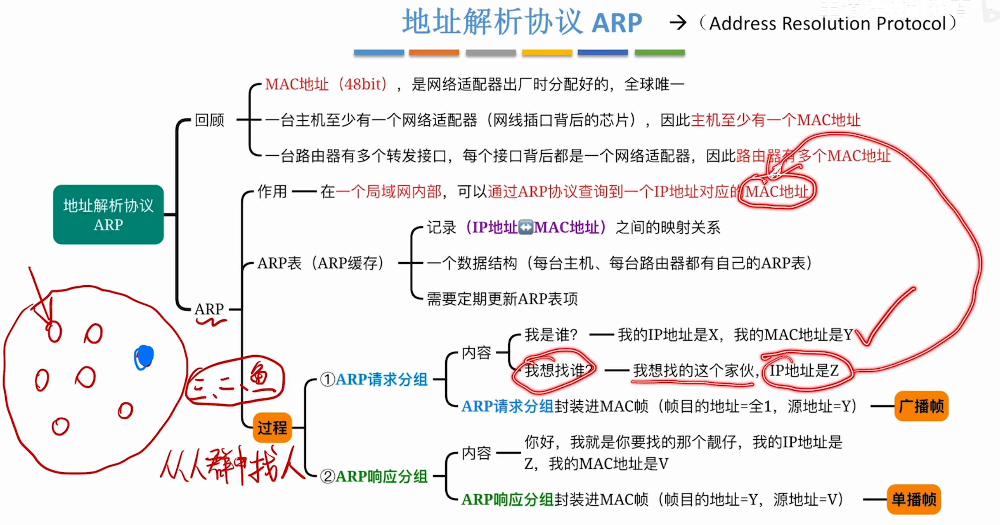
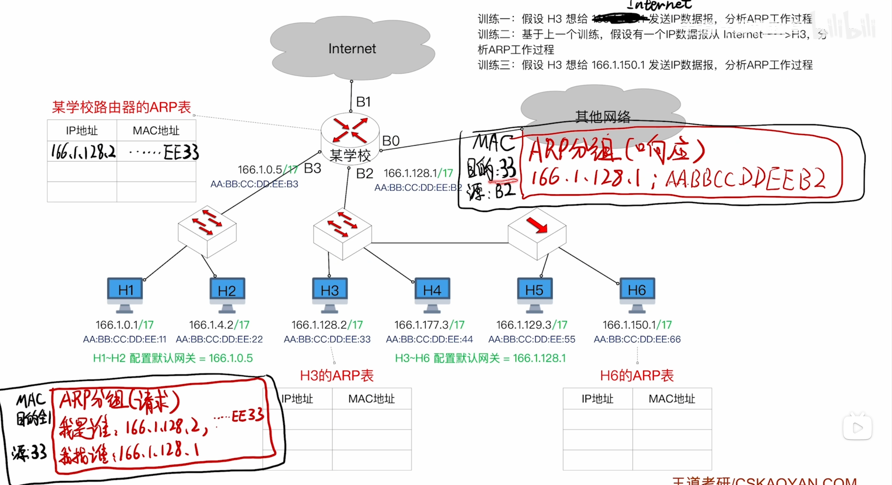
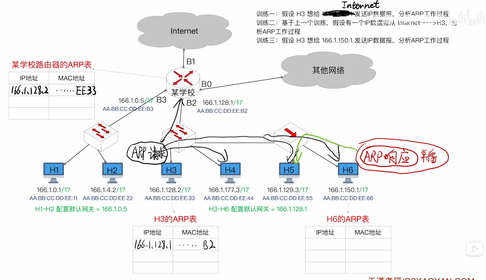
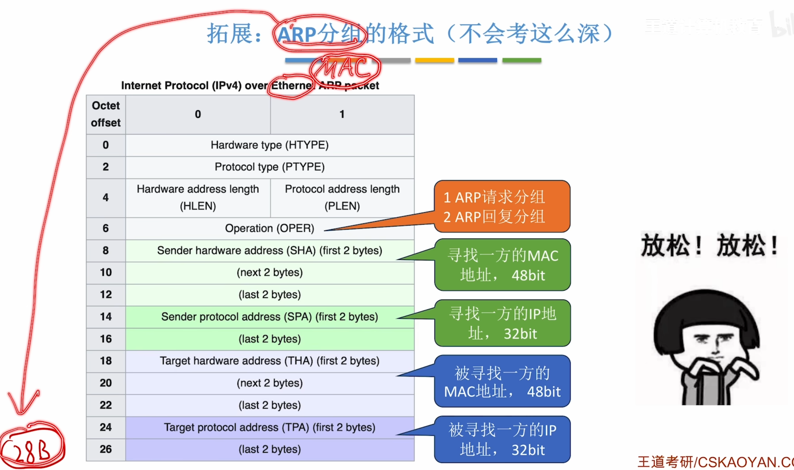
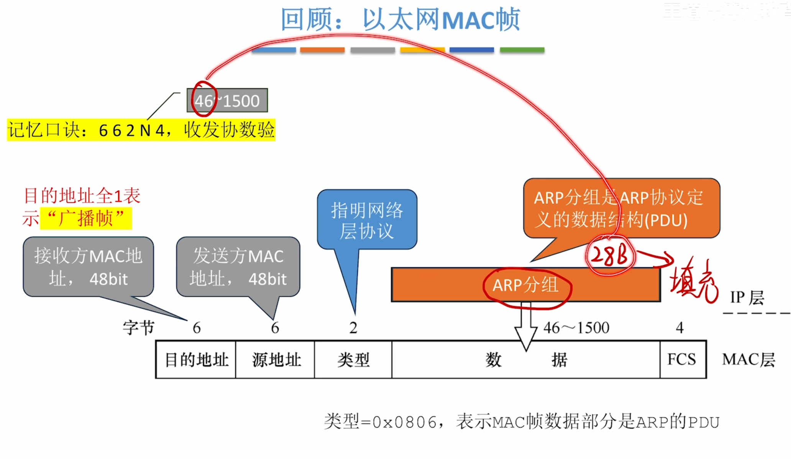

---
tags:
  - 计算机网络
---
# 地址解析协议ARP

ARP的MAC帧

# ARP协议工作原理

>H3->Internet

H3的目的IP是默认网关，但此时ARP表还没有默认网关IP对应的MAC，于是H3会构建一个ARP请求分组（封装成广播帧），里面写上自己的IP和MAC地址
外层：以太网帧头（Ethernet Header

|字段|值|
|---|---|
|目的 MAC|`FF:FF:FF:FF:FF:FF`（广播）|
|源 MAC|发送方自己的 MAC 地址|
|类型（Type）|`0x0806`（表示载荷是 ARP）|
内层：ARP 报文正文

| 字段                  | 值（以 IPv4 over 以太网为例）  |
| ------------------- | --------------------- |
| 硬件类型                | `1`（以太网）              |
| 协议类型                | `0x0800`（IPv4）        |
| 硬件地址长度              | `6`                   |
| 协议地址长度              | `4`                   |
| 操作码                 | `1`（请求）               |
| 发送方硬件地址（Sender MAC） | 发送方自己的 MAC 地址 ← 第一次出现 |
| 发送方协议地址（Sender IP）  | 发送方自己的 IP 地址          |
| 目标硬件地址（Target MAC）  | 全 0（还不知道，填空）          |
| 目标协议地址（Target IP）   | 你想查询的那台机器的 IP         |
>当接收方收到ARP请求分组后，会在自己的ARP表上记录发送方的IP和MAC，然后发送一个ARP响应分组，此时是单播帧

---

>H3-H6,然后H6回应ARP响应的时候，由于连的是集线器，所以H5和H3都会收到ARP响应，不过H5检查单播帧的目的MAC地址和自己的对不上，所以H5的数据链路层不会接收这个帧

# ARP分组的格式

>一个ARP分组只有28B，如果要封装进MAC帧(数据部分46~1500)，则需要填充
>