---
tags:
  - 计算机网络
---
# BGP的基本特点
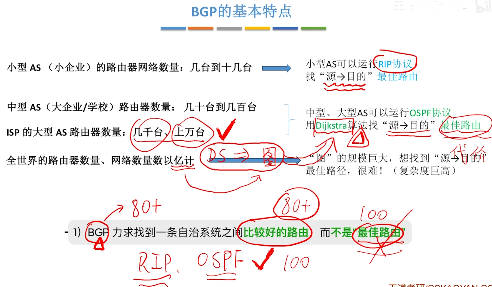
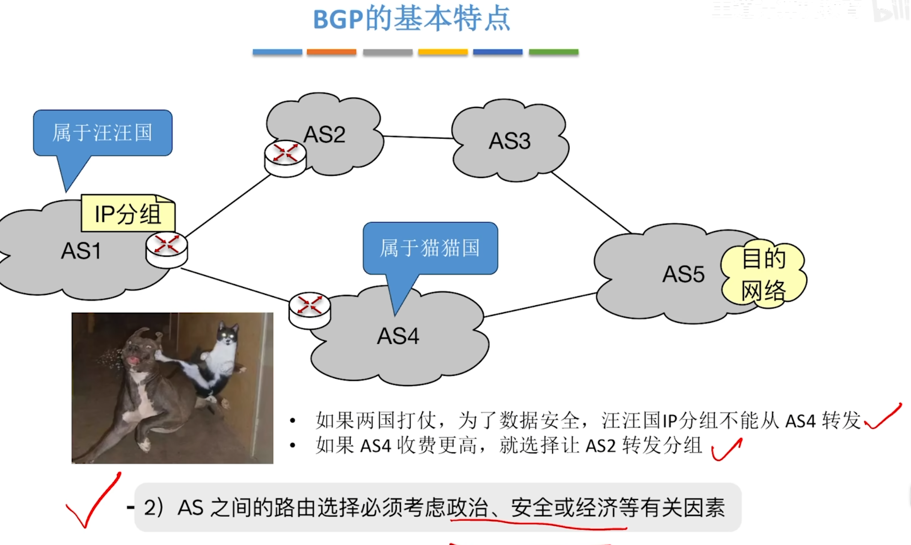
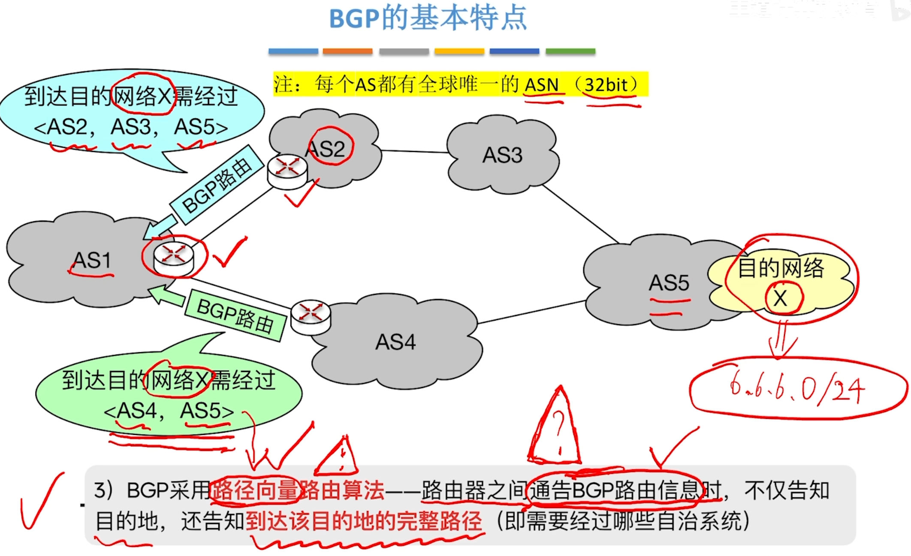
>BGP采用路径向量路由算法

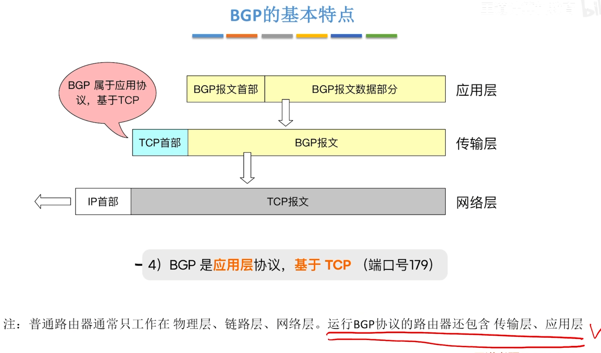
>BGP是应用层协议

# BGP相关概念
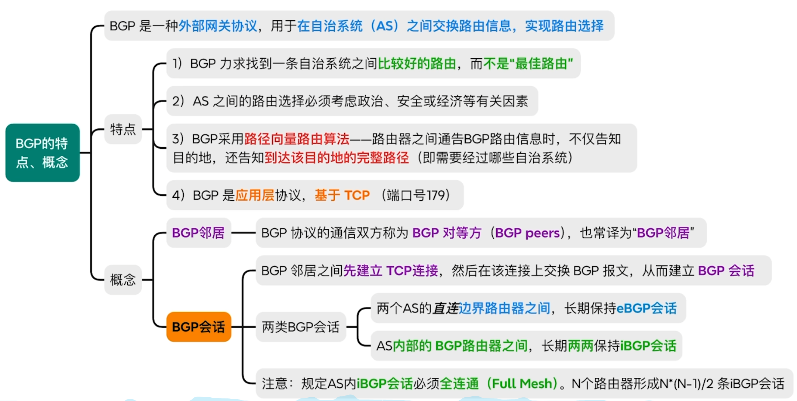
哪些路由器需要运行BGP
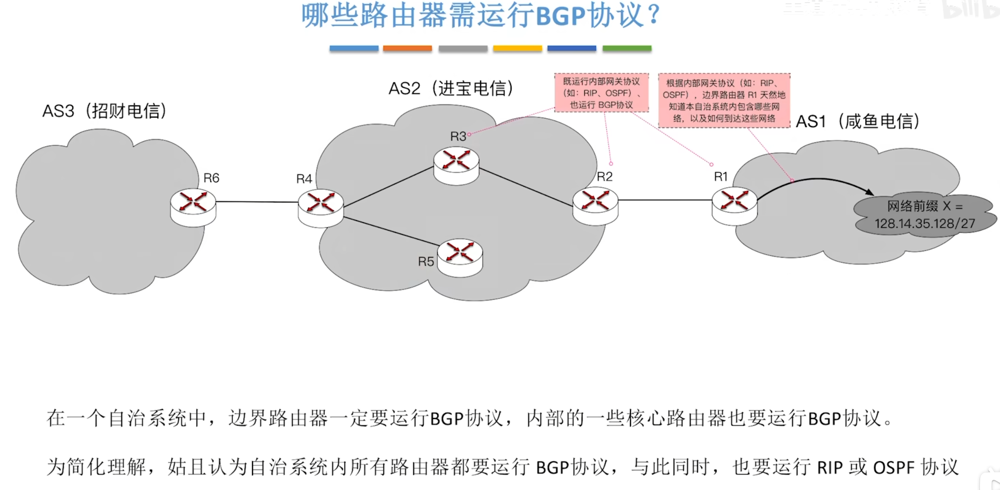

## BGP邻居
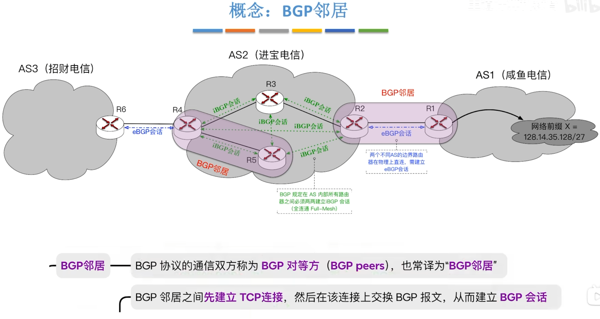

## BGP会话
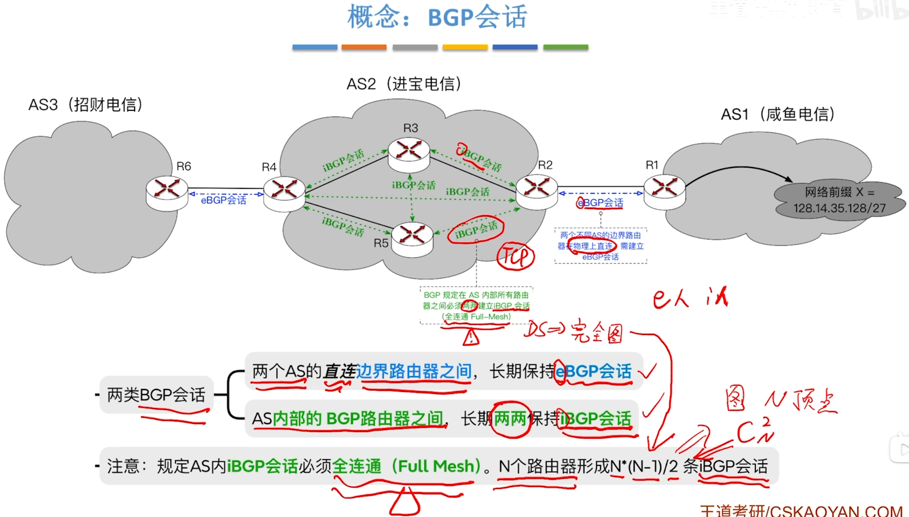

# BGP路由信息和工作原理
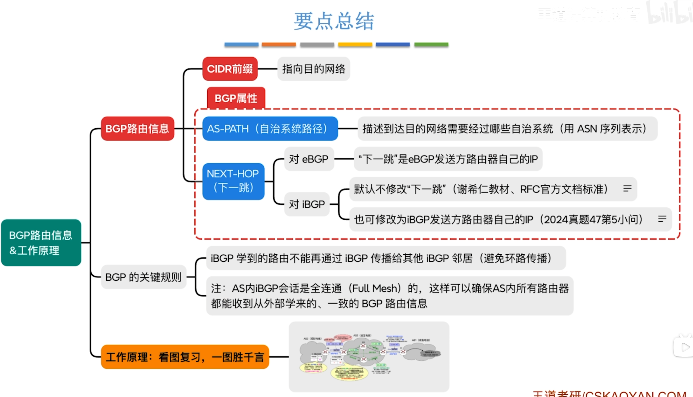
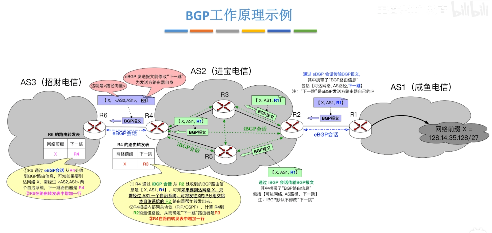

# BGP路由选择
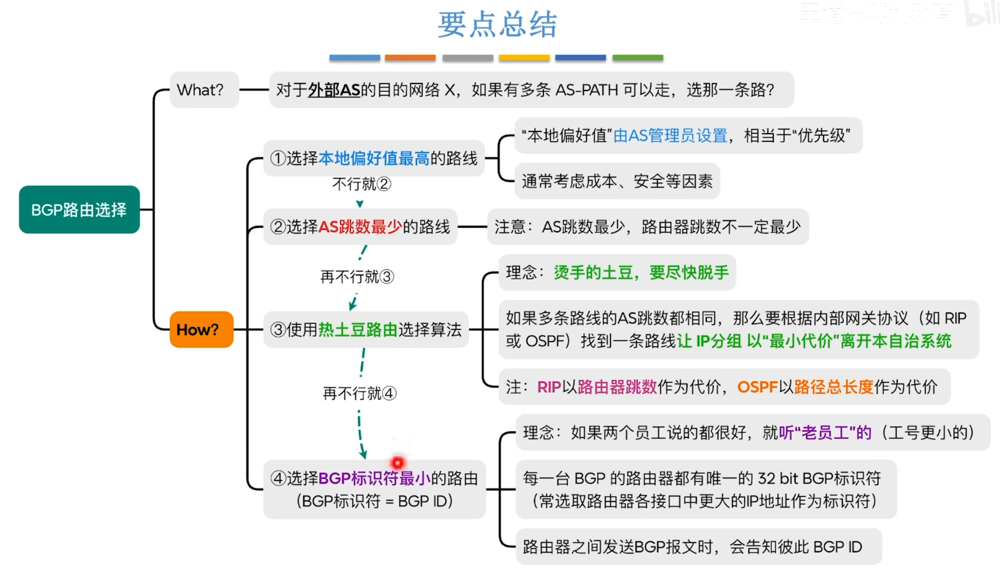

## 本地偏好值
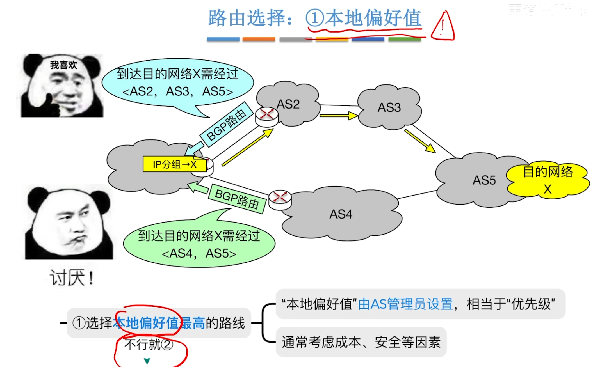

## AS跳数最少
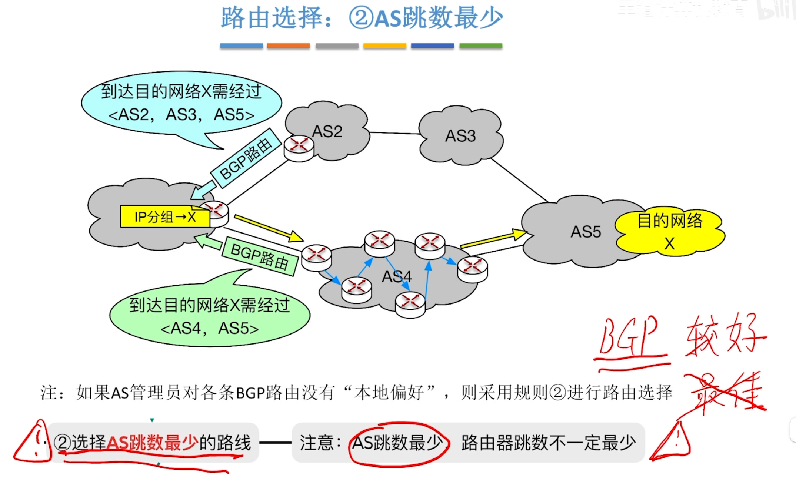

## 热土豆路由
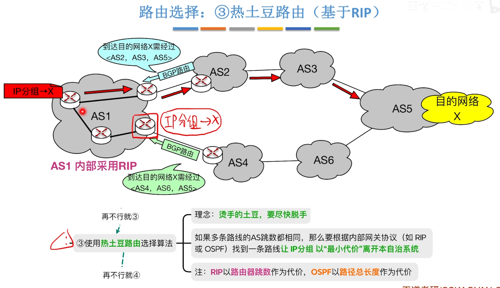
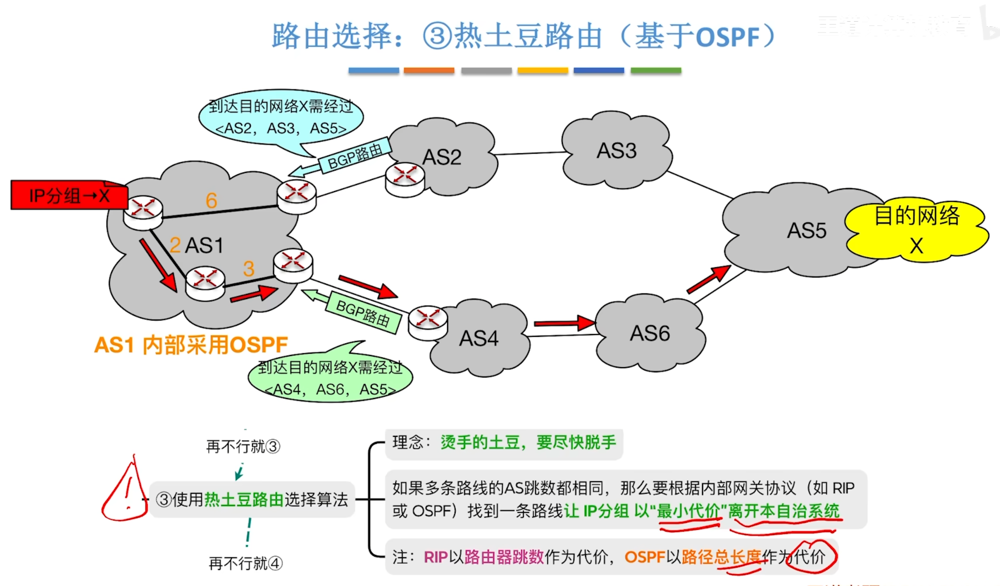

## BGP标识符
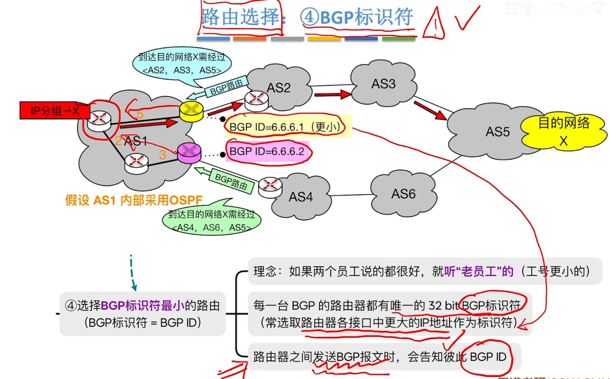

# BGP的四种报文
