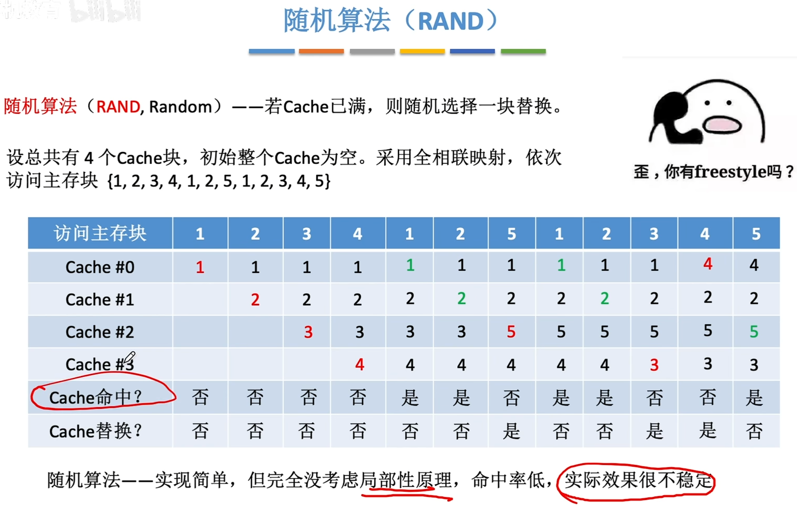

---
tags:
  - 计算机组成原理
---
P114
当Cache未命中时,需从主存块中将该地址所在的一个主存块整体调入Cache
# 随机(RAND)算法

# 先进先出(FIFO)算法

>这个替换是对访问Cache块的顺序来说的,不是访问主存块的顺序
# 近期最少使用算法
## 手算做题方法

>访问1,2,3,4,1,2访问到**5**时,需要替换
>从5这个位从后往前数是,2,1,4,(总共4个Cache块,留3个换一个)那么最久没被访问的就是3,所以5是替换主存块3所在的位置