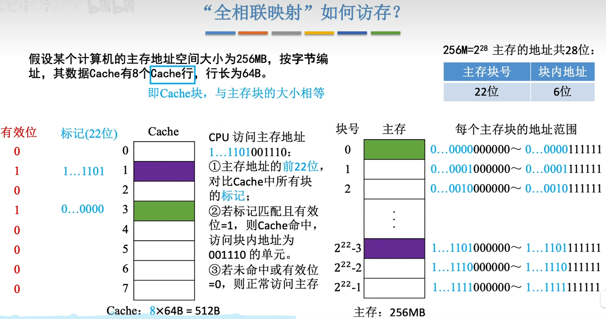
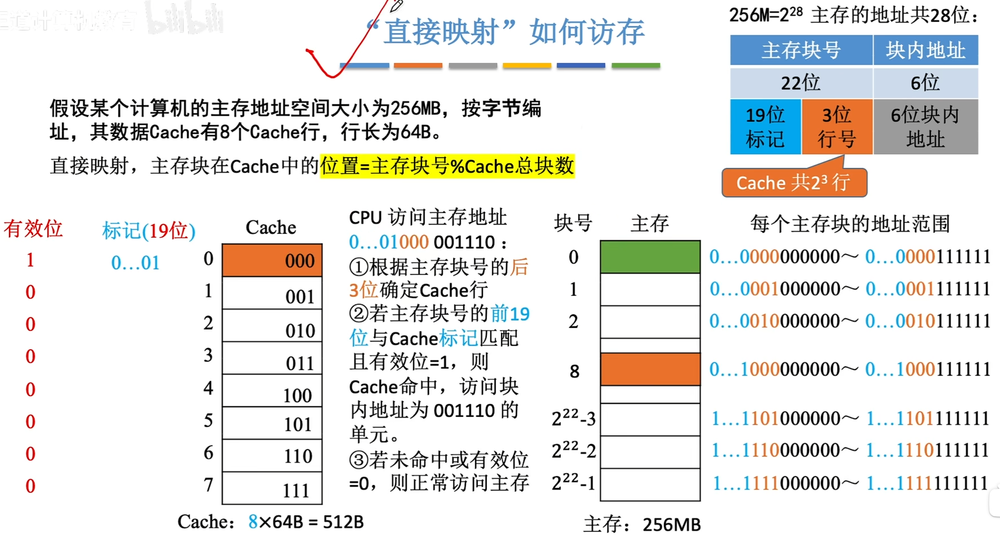
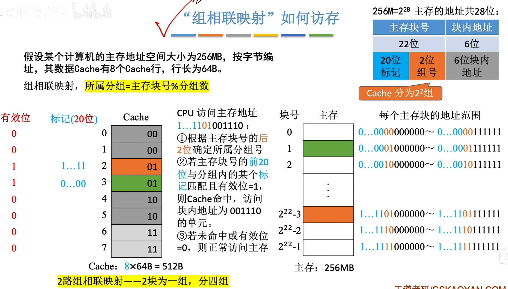
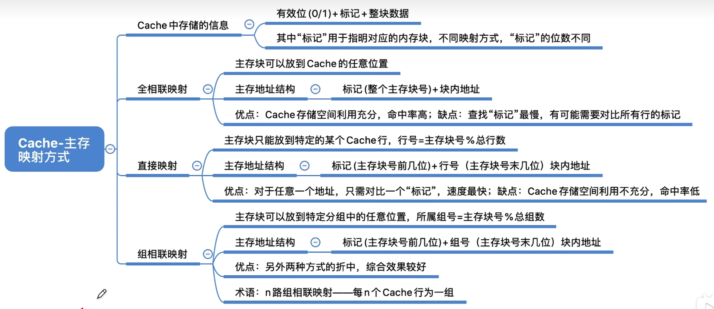

---
tags:
  - 计算机组成原理
---
P113
# 全相联映射

若CPU未命中Cache则直接访问主存[存储器芯片的基本原理](408/存储器基本的半导体元件及原理.md#存储器芯片的基本原理).
# 直接映射

>主存块号在Cache中的位置=主存块号%总块数
>Cache总块数是8,也就是$2^3$,这就相当于只保留主存块号(22位)的末尾3位,而每个主存块根据末尾3位又是对应着唯一的Cache行,所以在Cache行里就没有必要保存22位标记了,只需要保存前19位就可以,最后三位可以根据Cache行的位置确定.

# 组相联映射

>这里的Cache的标记位类似于[[#直接映射]],因为组数可以写成**2的n次幂的形式**
>所以主存块号的最后两位不需要保存在标记里

# 总结
