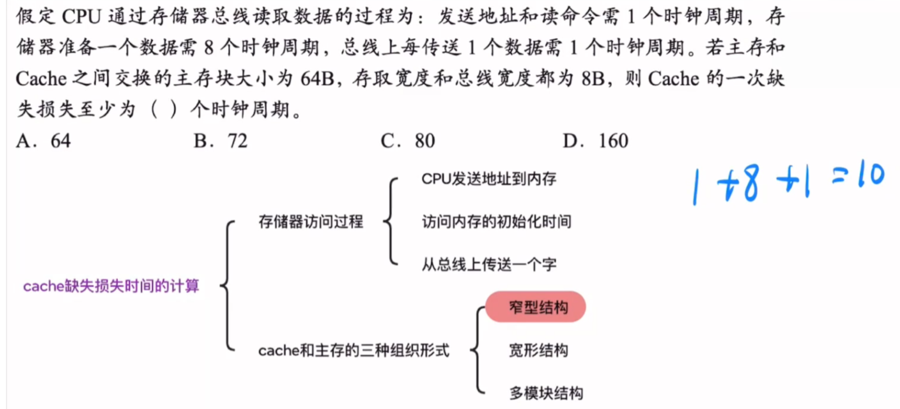
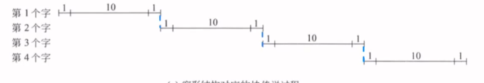
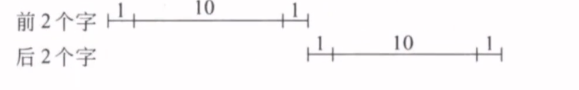
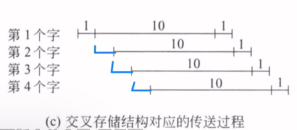

Cache缺失时读取一个数据损失的时间为**发送地址和读命令的时间+存储器准备一个数据的时间+总线上传送一个数据的时间**
但是根据不同的Cache与主存的组织形式,多个数据之间读取损失的时间有时候并不是简单的相加

---

主存、总线和 cache 之间主要有 3 种连接方式。假定一个主存块有 **4 个字**，以下是针对这三种结构的缺失损失分析：

#### 1. 窄形结构

- **特点**：每次按 **一个字的宽度** 进行传送。
- **传送过程**：连续进行“送地址-读出-传送” **4 次**，每次传一个字。
- **缺失损失计算**： $$ 4 \times (1 + 10 + 1) = 48 \text{ 个时钟周期} $$

>窄形结构是连续的送入,准备,读取,所以时间就是逐个相加
#### 2. 宽形结构

- **特点**：每次传送 **多个字**。
- **传送过程（宽度为 2 个字）**：
    - 连续进行“送地址-读出-传送” **两次**，每次传两个字。
    - **缺失损失**：$ 2 \times (1 + 10 + 1) = 24 $ 个时钟周期。
- **传送过程（宽度为 4 个字）**：
    - 假定增加总线条数及总线接口部件，使得每次可传送 4 个字。
    - **缺失损失**：$ 1 \times (1 + 10 + 1) = 12 $ 个时钟周期。

>宽形结构可以类比窄形结构,但是宽形结构一次可以传多个字
#### 3. 多模块交叉存取结构

- **特点**：轮流启动多个存储模块进行读写，按一个字的宽度进行传送（**多模块存储器的同时启动**）。
- **传送过程**：
    1. 在首地址送出后，每隔一个时钟周期轮流启动一个存储模块。
    2. 每个模块都用 10 个时钟周期准备好一个字。
    3. 然后送总线进行传送。
- **缺失损失计算**： $$ 1 + 1 \times 10 + 4 \times 1 = 15 \text{ 个时钟周期} $$
  
>很像[多体并行存储器](408/多体并行存储器.md),是轮流启动的
>如果是**突发传送**:题目中的“突发传送”就是指利用“发送一次首地址，然后连续传输8个数据”的这种高效模式。如果没有突发传送，读取8个数据需要重复8次“发地址+等数据+传数据”的过程，耗时将远大于使用突发传送。
>如果图片中的突发长度为4,那么蓝色的部分就不需要了,只有第1个字的时候CPU才“发地址+等数据+传数据”,后面的3个只有等数据+传数据.

---

> **结论**
> 
> 通过以上分析可知，**多模块交叉存取结构的性价比最好**。