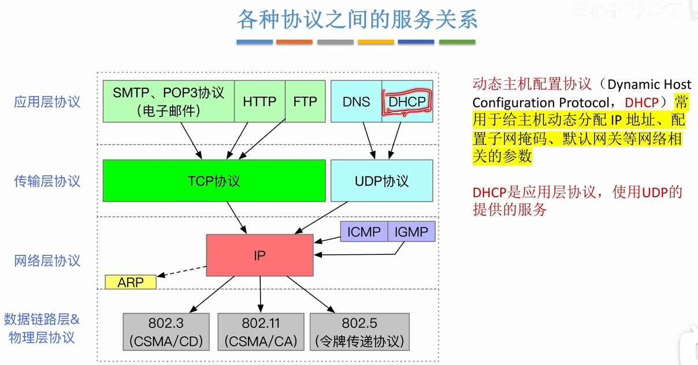
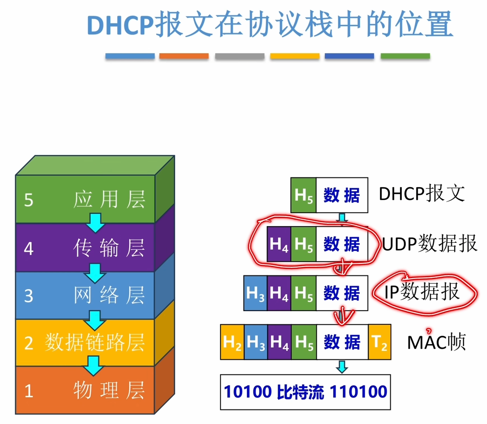
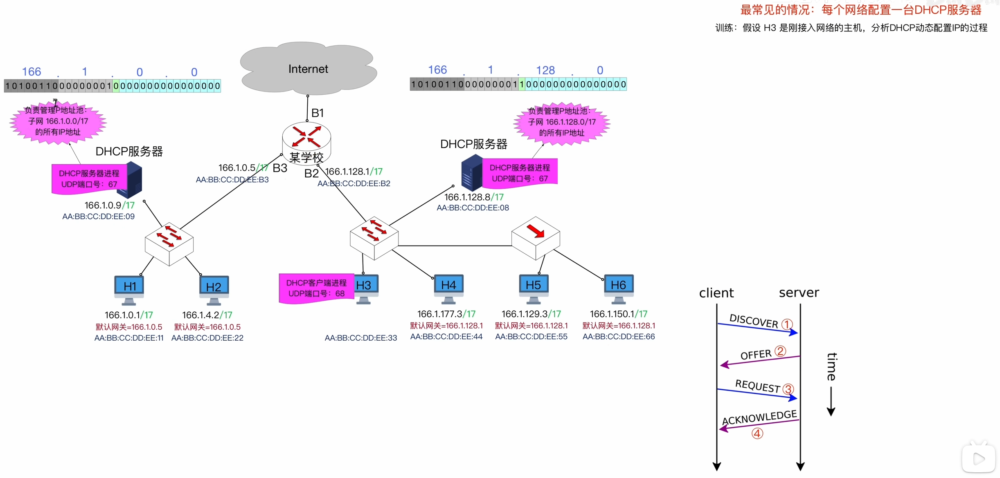
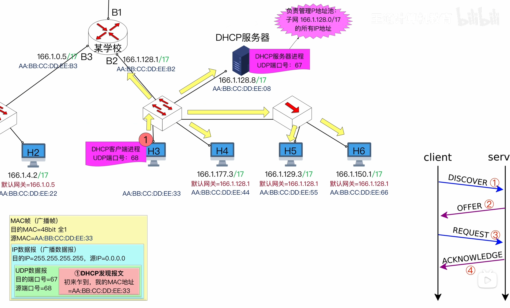
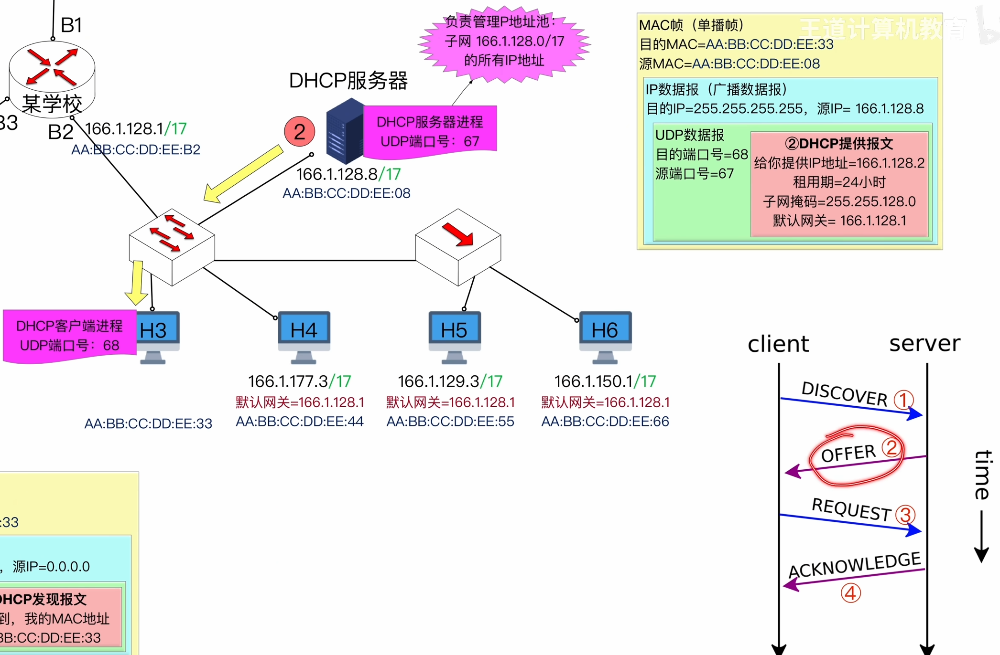
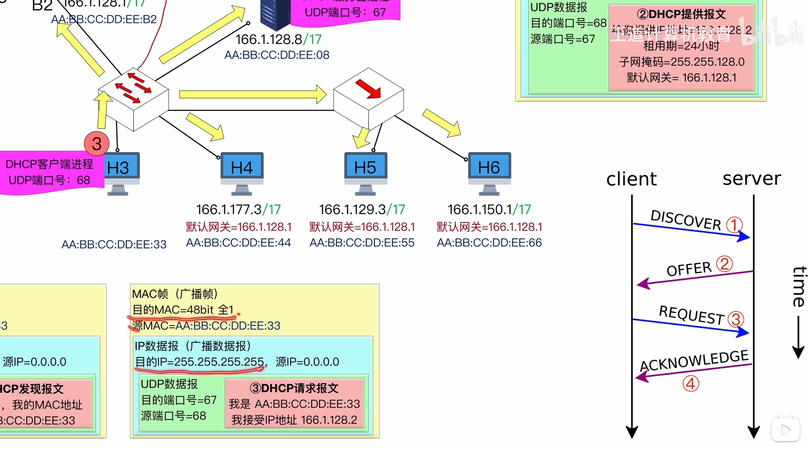

---
tags:
  - 计算机网络
---
动态主机配置协议DHCP
# DHCP所处的位置

>DHCP是应用层协议，使用UDP提供的服务
>

# DHCP的工作过程

>一般会为每个子网配置一个DHCP服务器，负责管理这个子网的IP地址池

## 1.DHCP发现报文

>H6接收到了这个广播帧，发现目的MAC和目的IP都是广播，于是会一直接收到网络层，但是到了传输层，会发现端口不对，于是不会接收(重要的像67这个端口号是不会绑定给其他进程使用的，这是规定的技术标准)

>网络层：目的IP是全1表示广播，全0表示本网络的本主机，因为现在H3还没有自己的IP地址[一些特殊用途的IP地址](408/IP地址.md#一些特殊用途的IP地址)

## 2.DHCP提供报文

>MAC帧这里由于在发现报文里已经知道了H3的MAC，所以虽然网络层是广播数据报，但数据链路层是单播帧，于是交换机会精准的转发给H3，其他的主机收不到这个提供报文
>每个主机的IP地址都有租用期，当IP地址快到期时，可以向DHCP服务器续租

## 3.DHCP请求报文

>注意MAC帧和IP数据报依旧是广播的
>原因：
如果网络里有多台 DHCP 服务器（这是很常见的，做冗余），它们都发了 Offer。广播的 Request 报文里会带上被选中服务器的标识，这样没被选中的服务器就知道可以收回刚才预留的 IP，避免地址浪费。