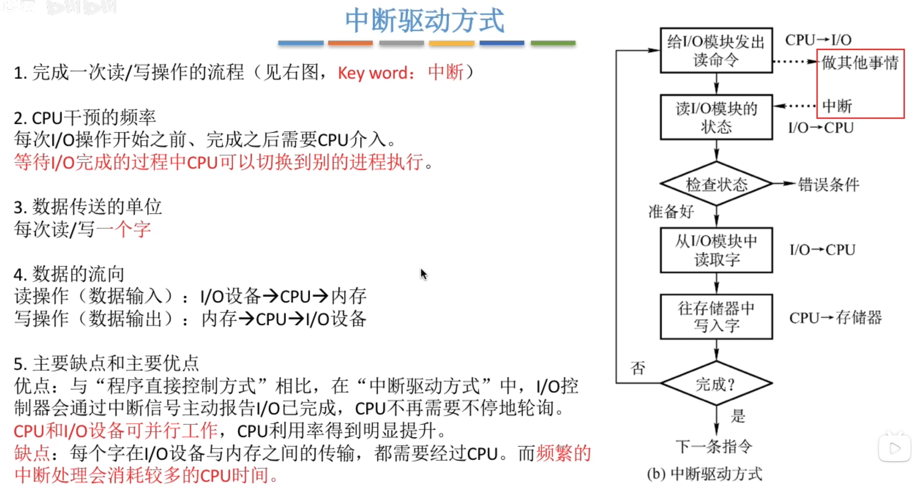
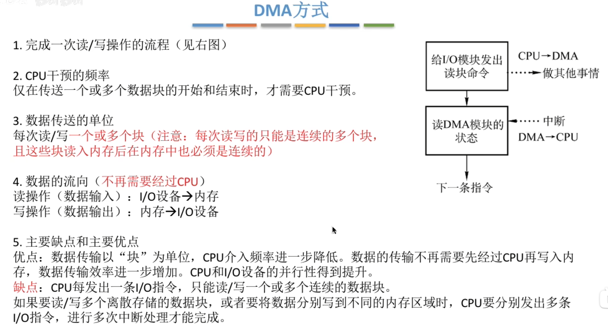
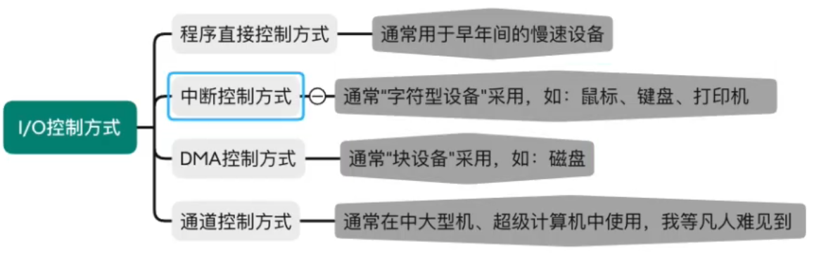

---
tags:
  - 操作系统
---
[IO方式（计组）](408/IO方式（计组）.md)
# 程序直接控制方式

# 中断驱动方式

# [DMA方式](408/DMA方式.md)

## DMA控制器

## DMA特点

# [通道控制方式](408/IO控制方式.md#通道控制方式)

>一个通道，可以控制多个IO控制器，一个IO控制器又可以控制多个IO设备

# 总结
