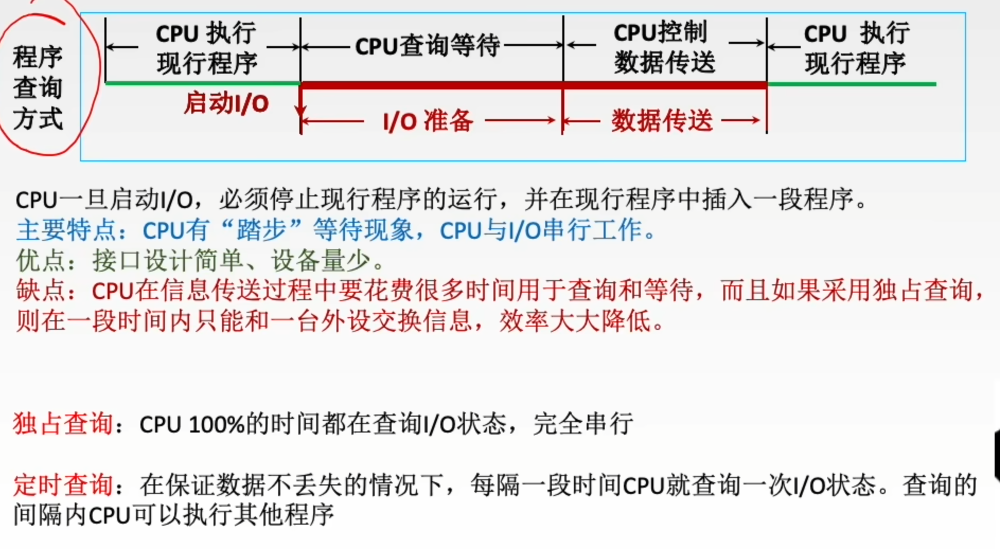
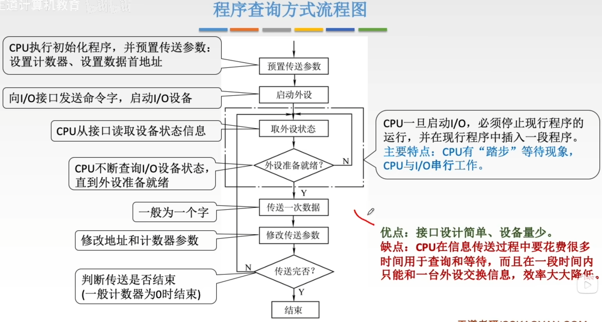
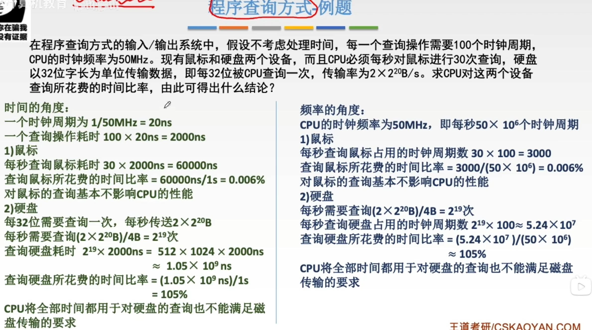
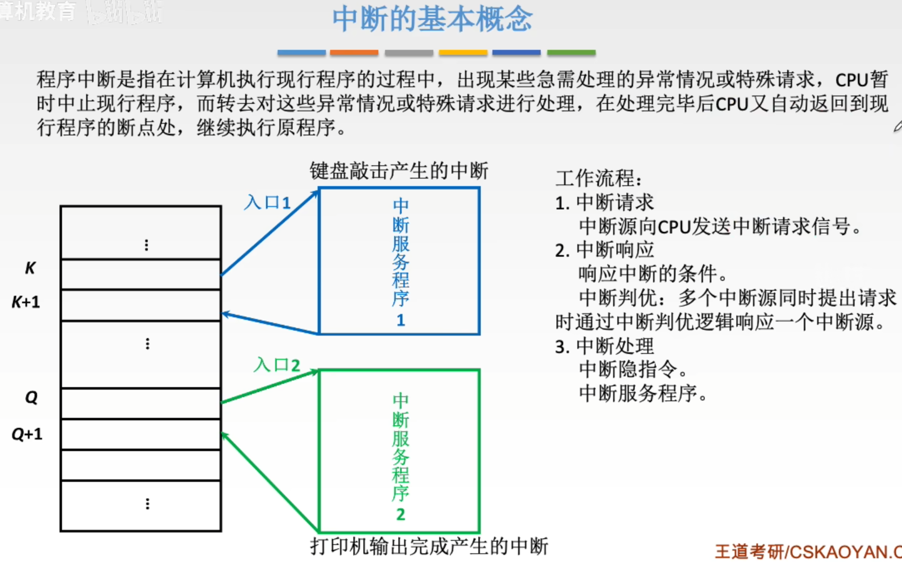
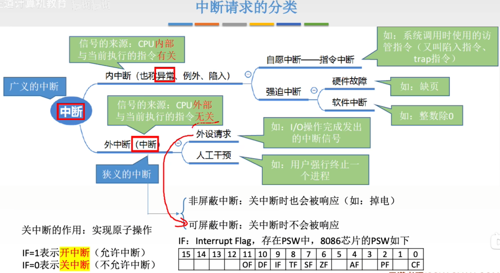
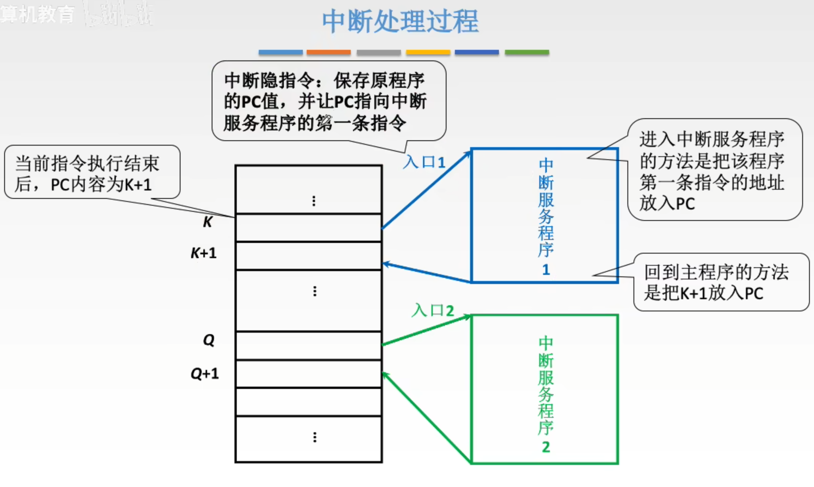
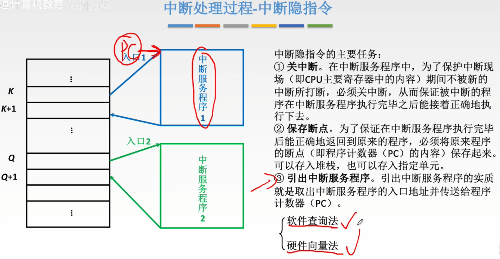

---
tags:
  - 计算机组成原理
---
# 程序查询方式

## 程序查询方式例题

>采用定时查询的策略

# 程序中断方式
## 中断基本概念

## 中断请求的分类

>通过PSW内的IF来表示当前是开中断还是关中断

## 中断请求标记

>通过中断请求标记触发器INTR来表示哪个设备中断源有请求

## 中断判优

### 优先级设置

## 中断处理过程

### 中断隐指令

### 硬件向量法

>存放中断向量的内存区域（图上向量地址12H,13H,14H）称为中断向量表
>通过向量地址（中断类型号）找到对应的中断向量存储的地址->中断向量->中断服务程序