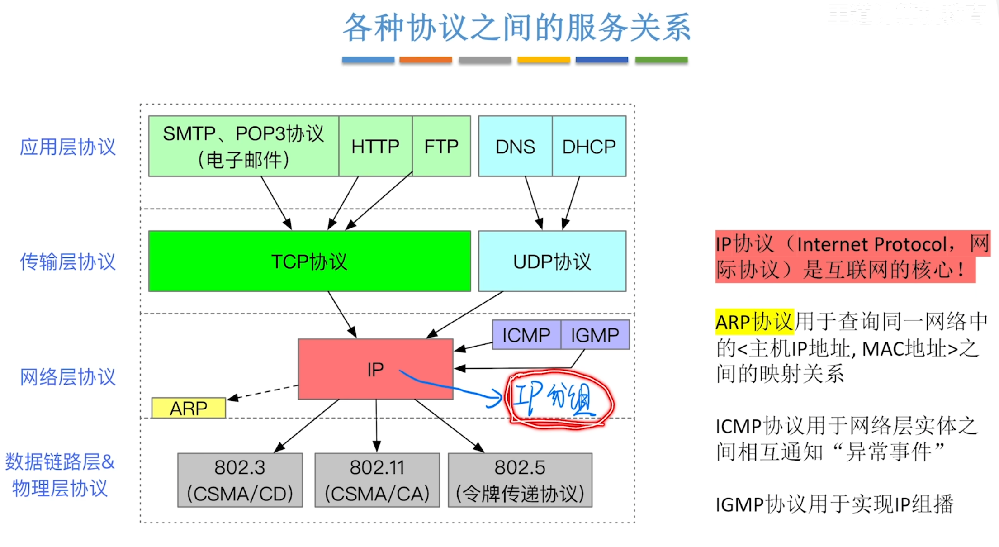
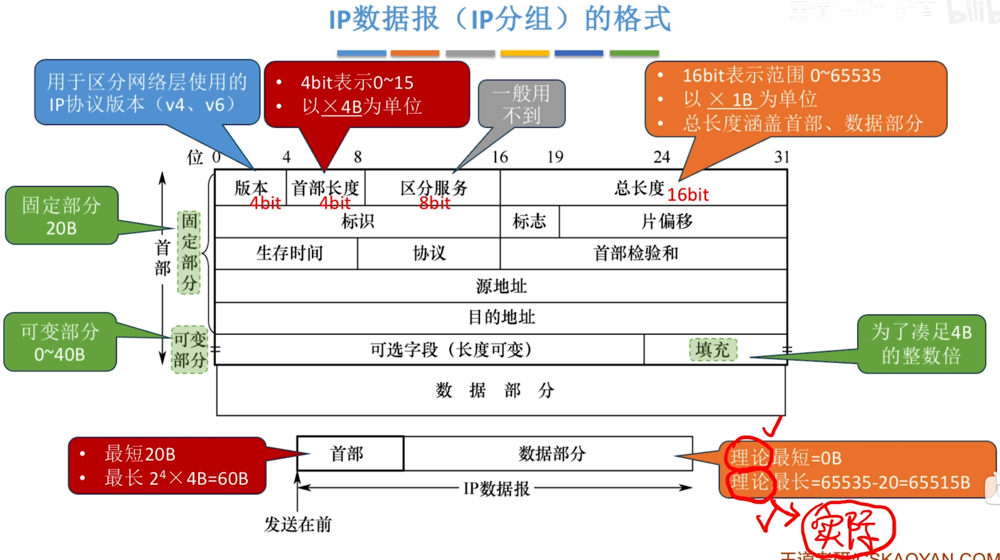
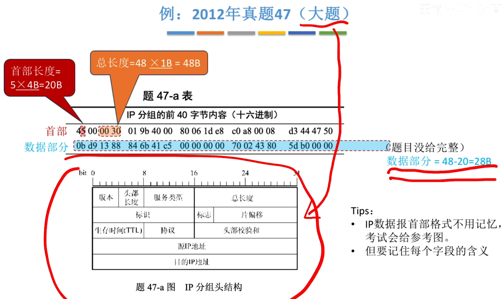
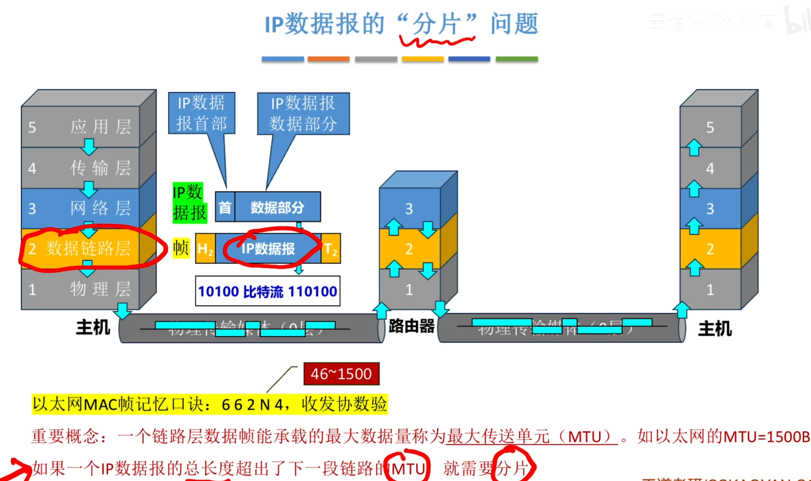
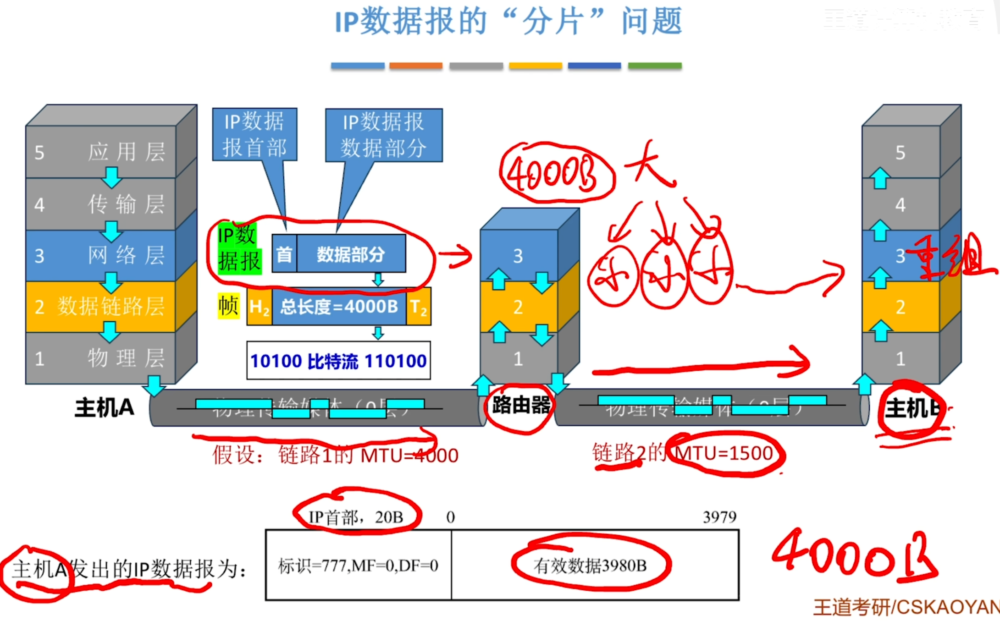
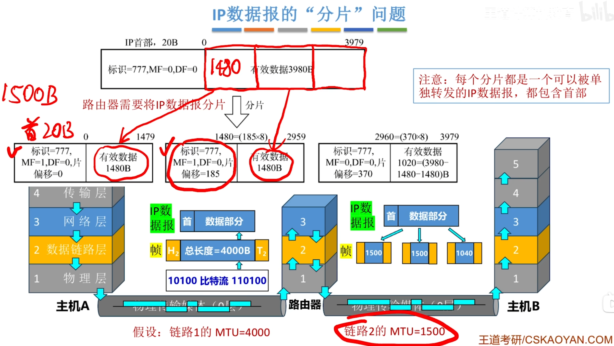
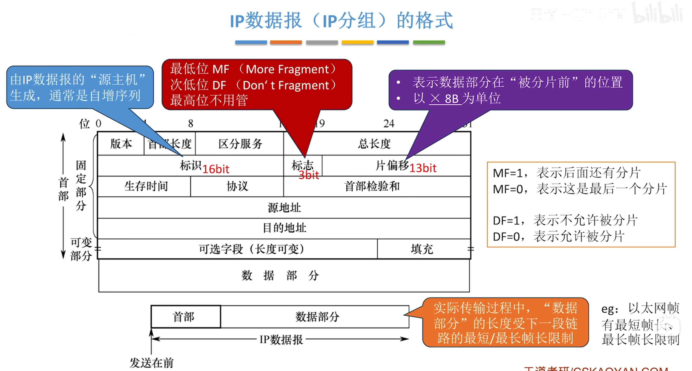
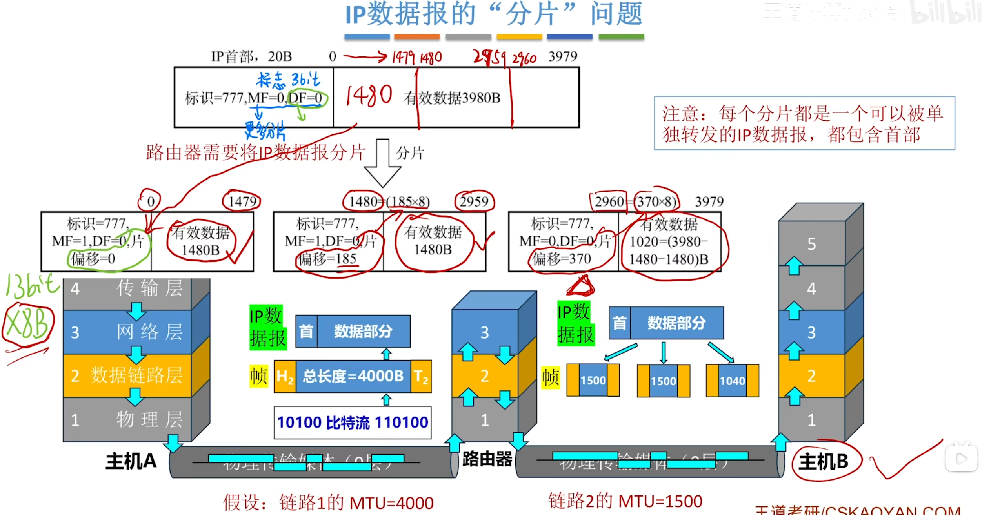
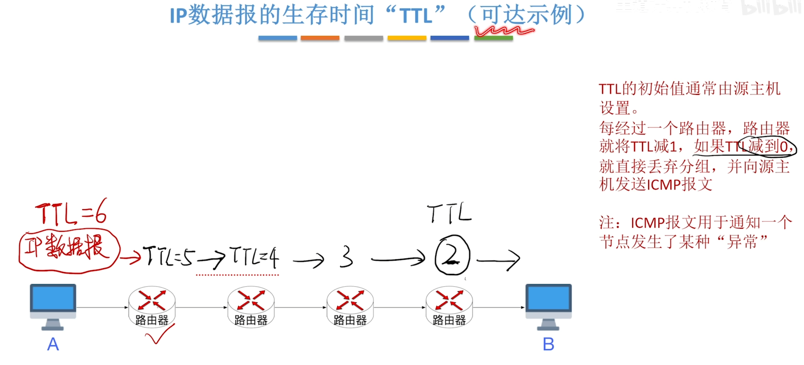
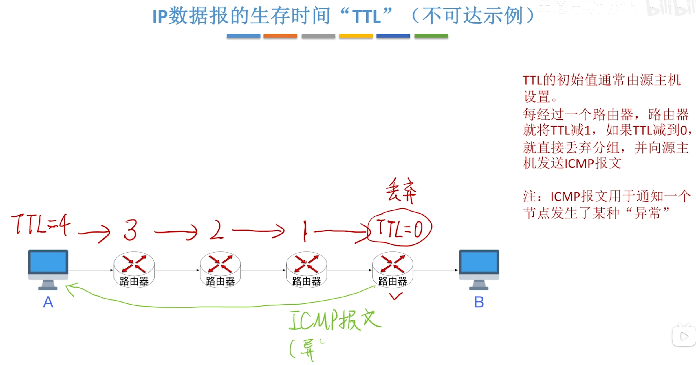

---
tags:
  - 计算机网络
---
# 各种协议之间的服务关系

# IP数据报（分组）的格式

>IP首部总共20个字节，被分成了5行，每行32bit（4字节）来展示。每一行都是紧接着上一行的，是拼接关系，不是覆盖关系
>例题
>IP数据报的理论长度实际上受到数据链路层最短帧长和最长帧长的限制
## IP数据报的分片问题

>最大传送单元（MTU）
>

例子

>4000>1500链路2需要分片

### 怎么组装分片

>受到的分片如果标识一样，源地址也一样，那么就属于同一个IP数据报
>如果DF=1，然后这个链路的MTU不允许IP数据报这么大，路由器会把这个不允许分片又发不出去的数据报丢弃，给数据报的源主机发送ICMP报文，用来通知源主机发生了某种异常情况
>根据标识还有片偏移进行组装

## IP数据报的生存时间TTL

