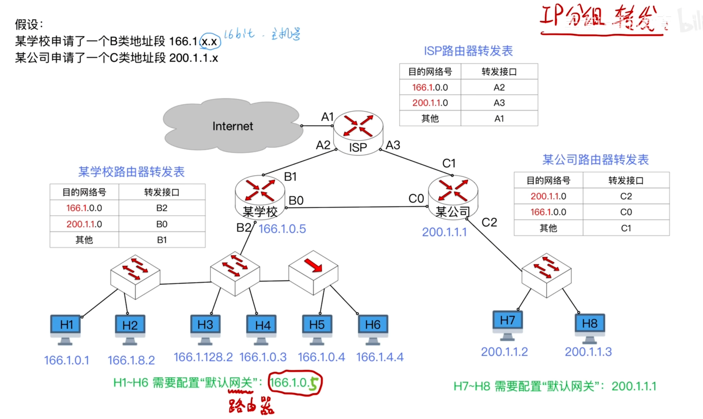

---
tags:
  - 计算机网络
---
# 最初的IP地址分配方案

>单播地址，多播地址

>被虚线固定的位**不是网络号的一部分**，它是**类别标识位**（用来告诉路由器：“我是一个 A 类地址”）。
**后 7 位（bit 1 ~ bit 7）：** 这才是真正的 **网络号**。
网络号 0（0.x.x.x）： 被保留，用来表示“本网络”或默认路由，不分配给任何具体网络。
网络号 127（127.x.x.x）： 被保留作为环回测试地址（也就是大家最熟悉的 127.0.0.1 本机地址），也不分配给实际网络

>在B类地址的前16个bit（前两个字节）中，划分如下：前2 位： 固定为 10，这是B类地址的类别标识位。
后 14 位： 真正的网络号（16 - 2 = 14位）。

## 配置默认网关

>默认网关其实就是默认路由器，就是每一台主机需要接入互联网的时候，需要经过哪一台路由器的转发

