---
tags:
  - 计算机网络
---
# OSPF的特点
## OSPF在协议栈的位置

## OSPF的大致原理

>LSA表示路由器存储的自己与哪些节点直连的单链表这个数据结构
### OSPF的特点

>洪泛法，从一个接口接收，从其他所有接口转发出去

其他特点

2

>负载均衡
3

>具有鉴别功能
4

5

# OSPF 的基本工作原理
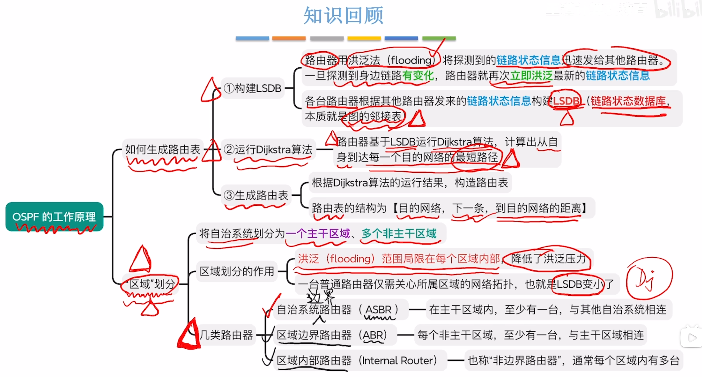

>LSDB链路状态数据库
>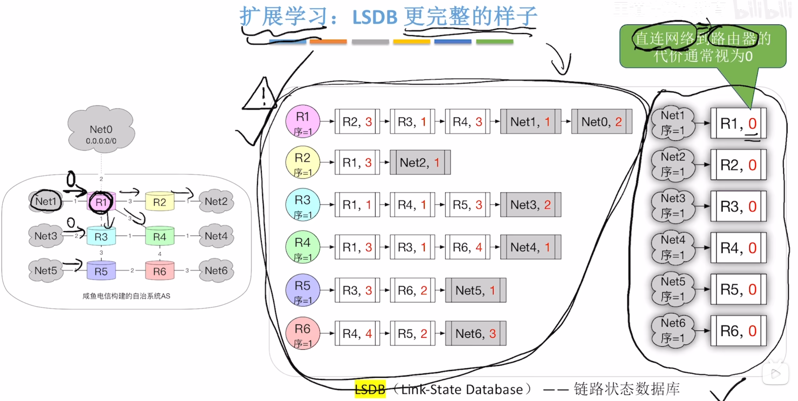

>构造路由表

## OSPF的区域划分

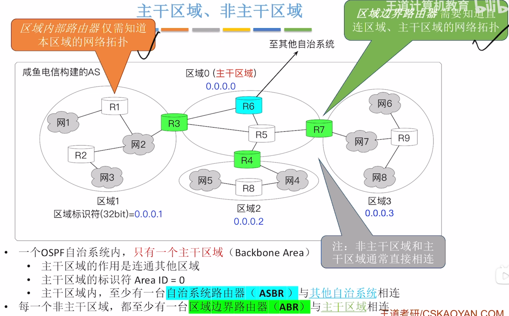
>ASBR自治系统路由器
>ABR区域边界路由器
>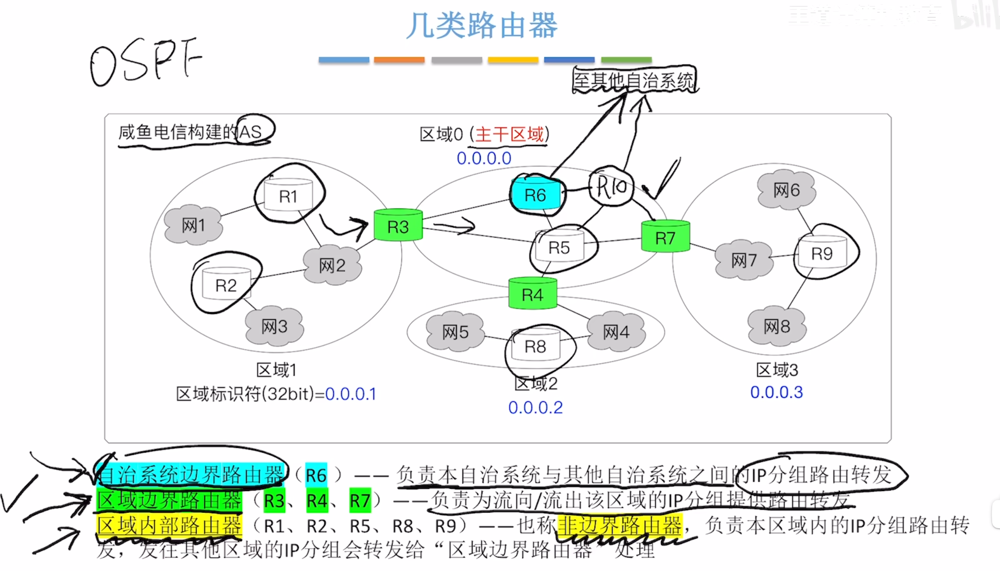
>主干路由器：在主干区域中的路由器都叫
## LSDB，LSA，LSI
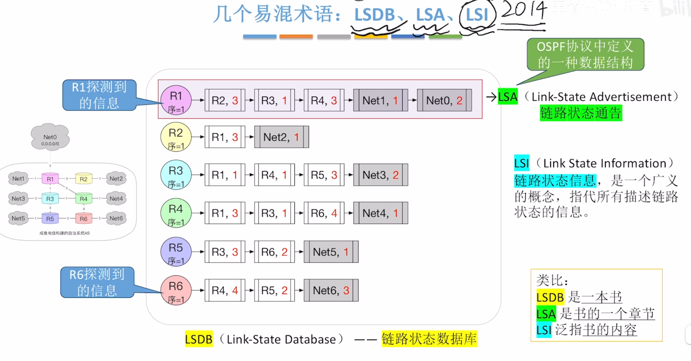

# OSPF的分组类型
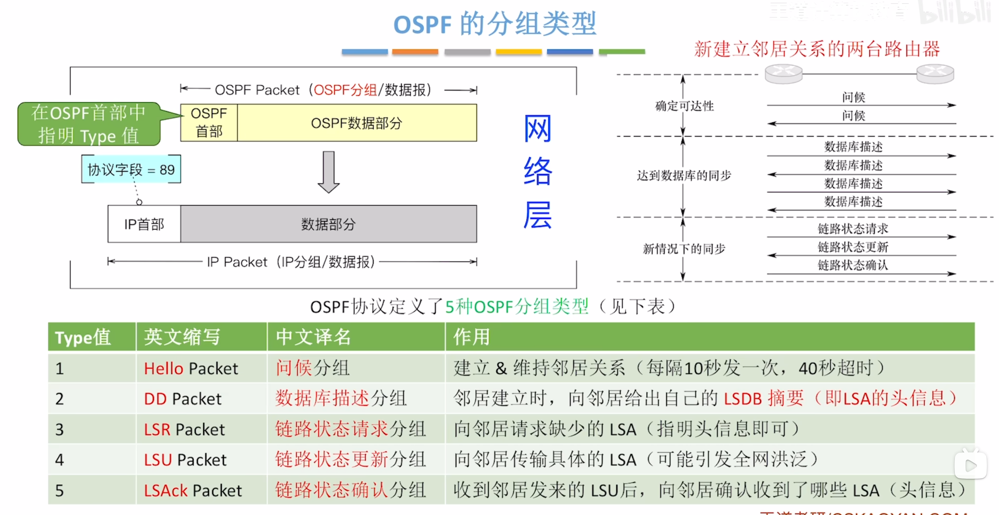

## hello分组
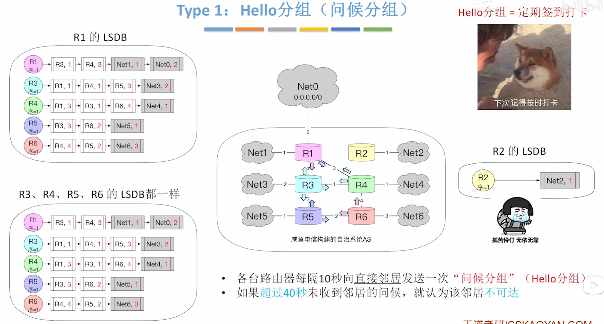
>R2加入后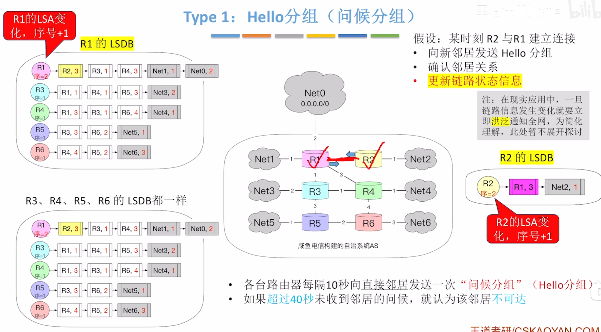

## DD分组
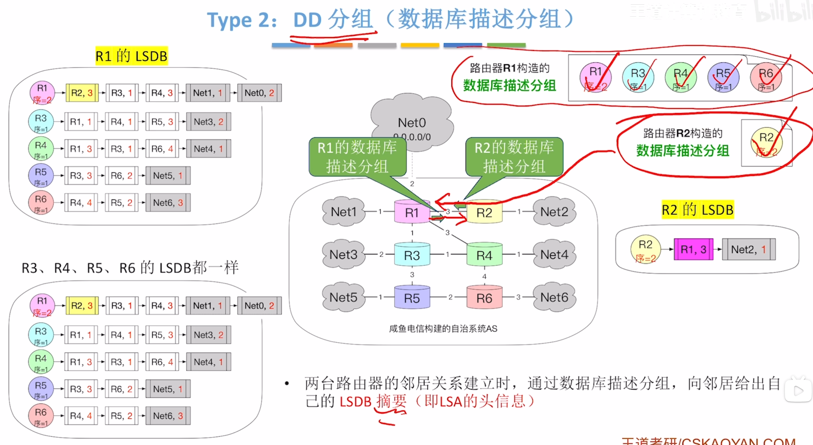

## LSR分组
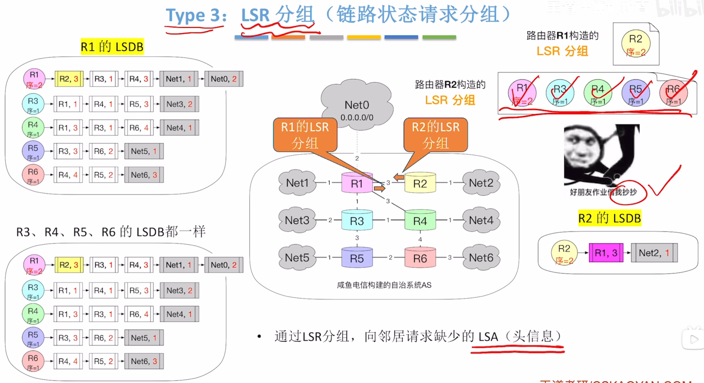

## LSU分组
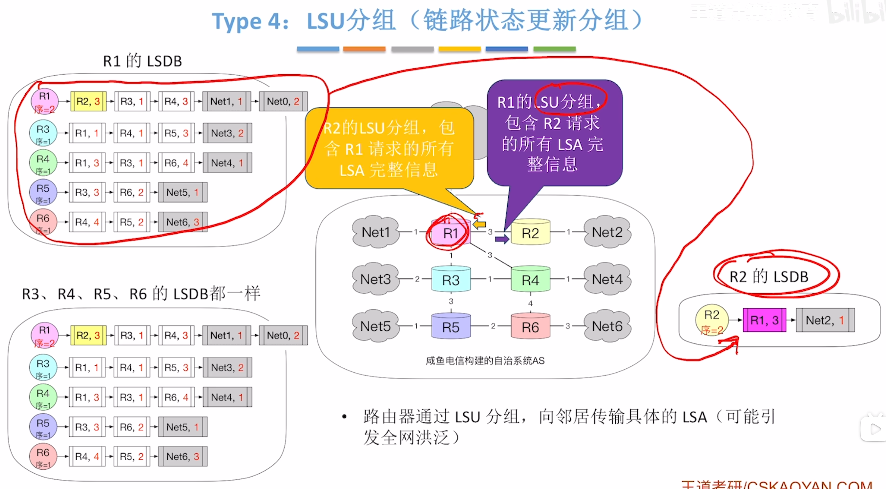
>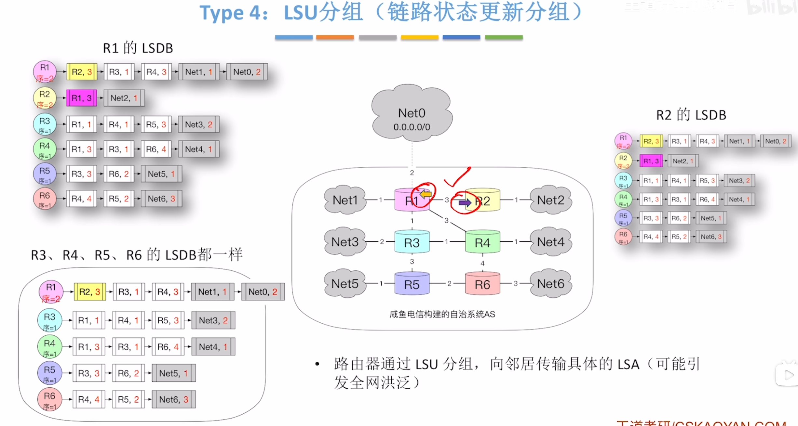
>引发全网洪泛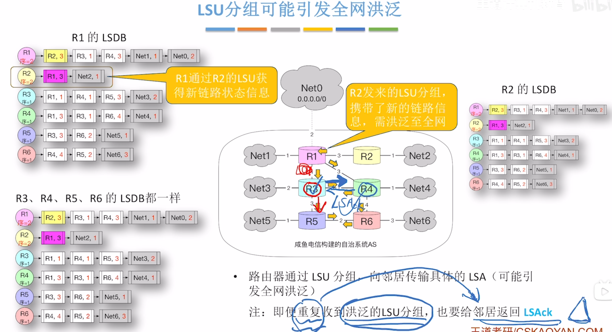

## LSAck分组
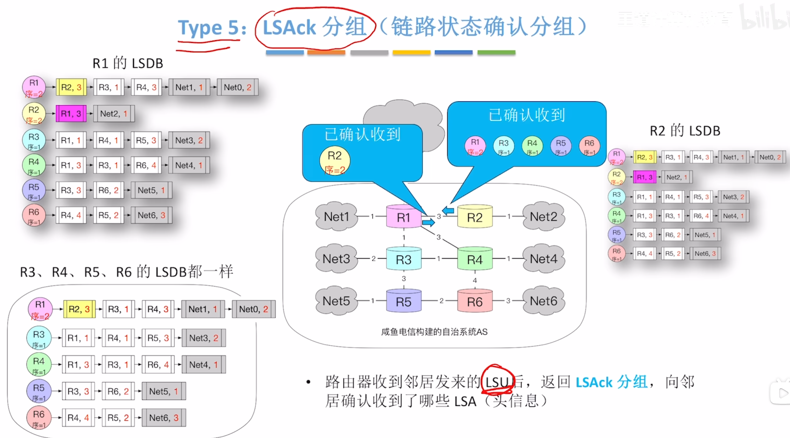
