---
tags:
  - 计算机网络
---
# OSPF的特点
## OSPF在协议栈的位置
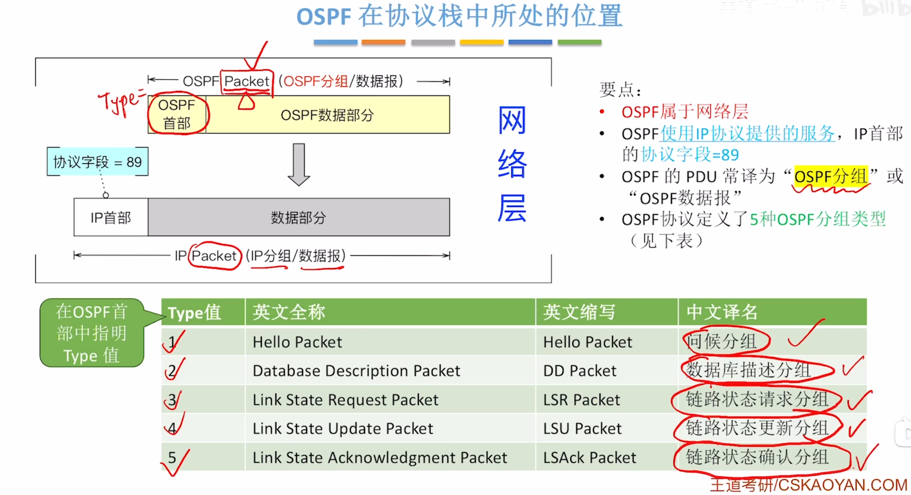

## OSPF的大致原理
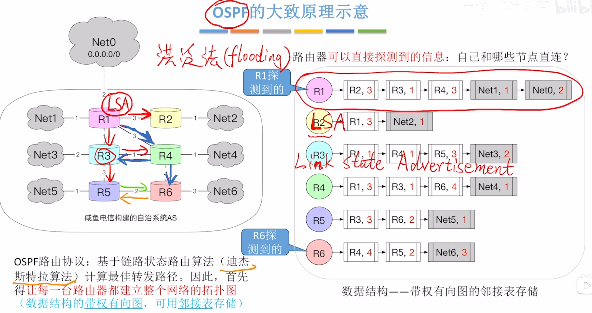
>LSA表示路由器存储的自己与哪些节点直连的单链表这个数据结构
### OSPF的特点
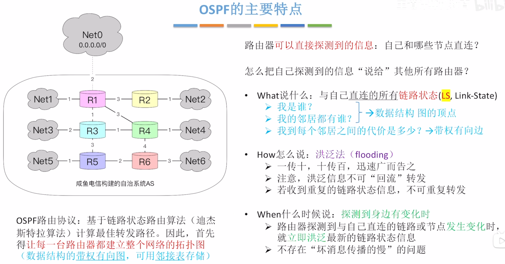
>洪泛法，从一个接口接收，从其他所有接口转发出去

其他特点
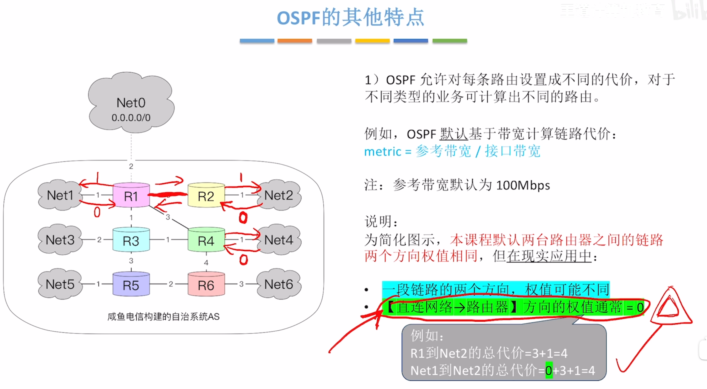
2
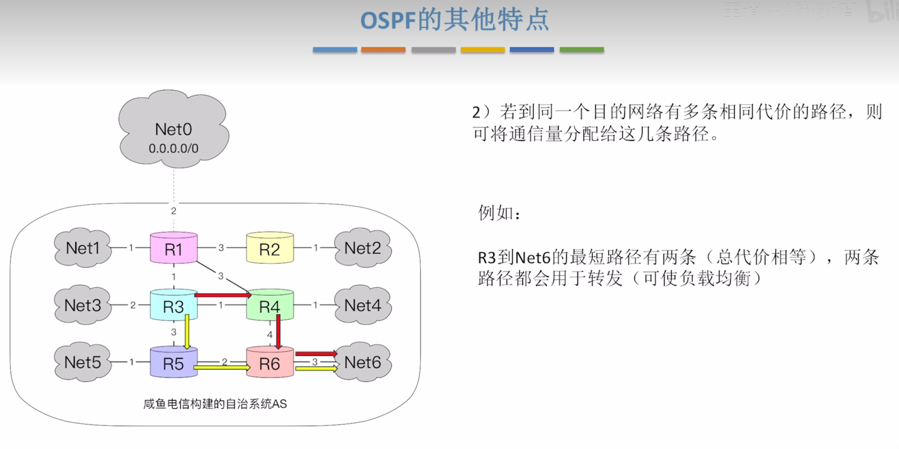
>负载均衡
3
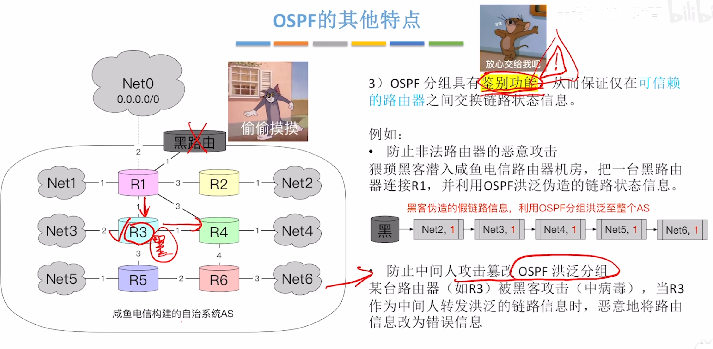
>具有鉴别功能
4
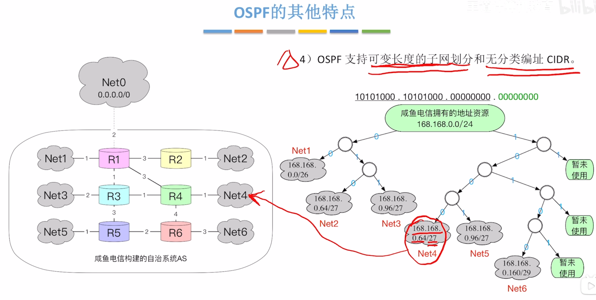

5
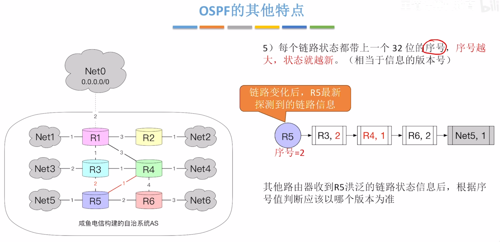

# OSPF 的基本原理
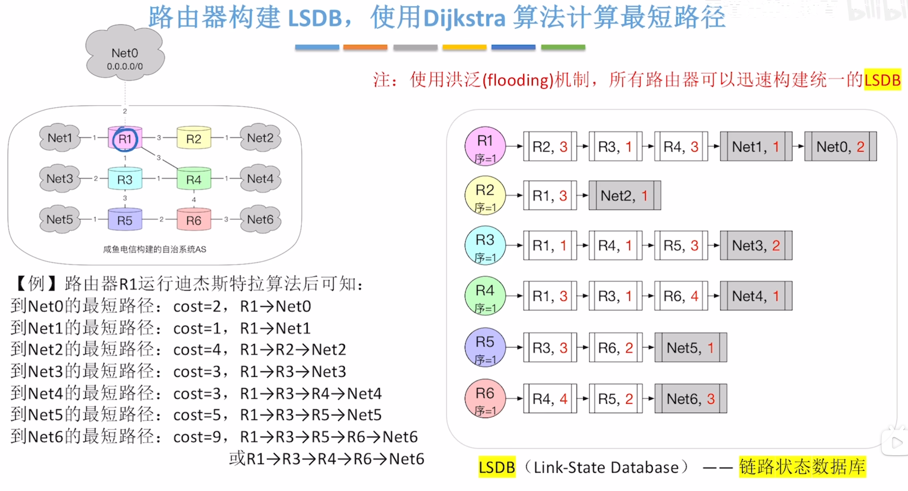
>LSDB链路状态数据库

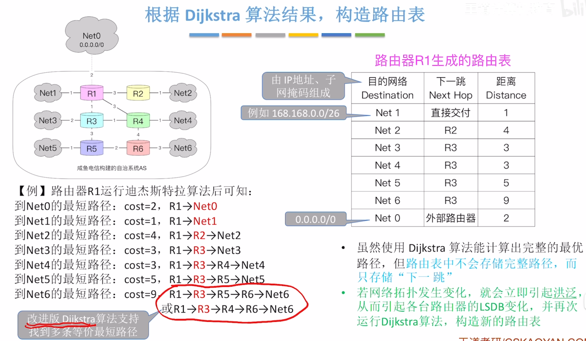
>构造路由表

## OSPF的区域划分
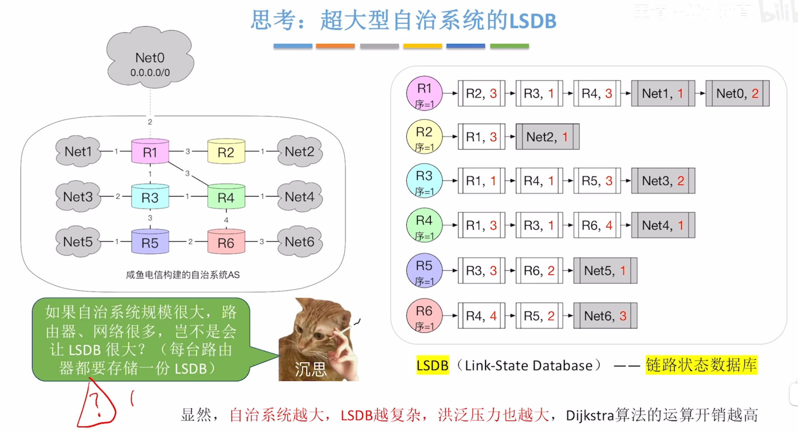

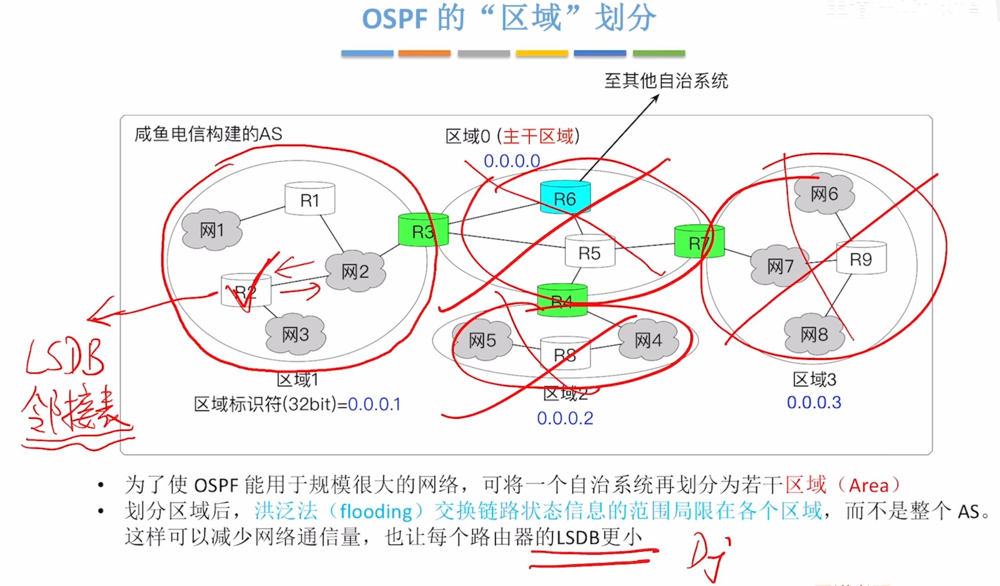
