---
tags:
  - 计算机网络
---
# 路由算法，路由协议之间的关系
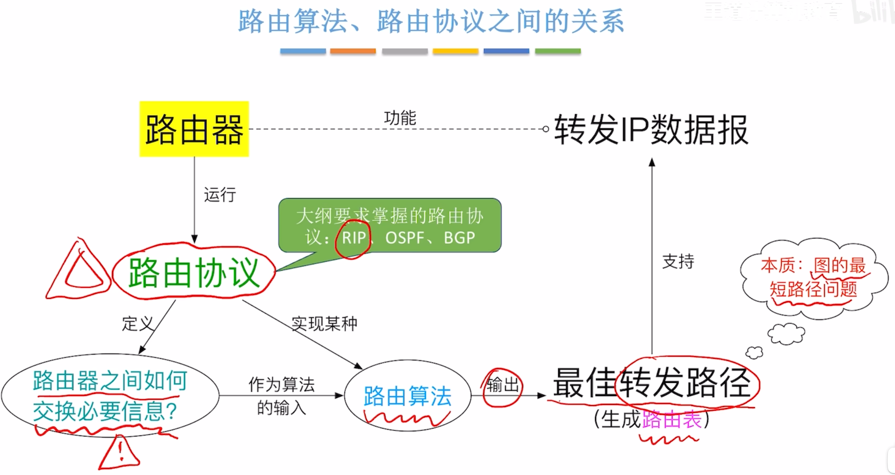

# RIP在协议栈中的位置
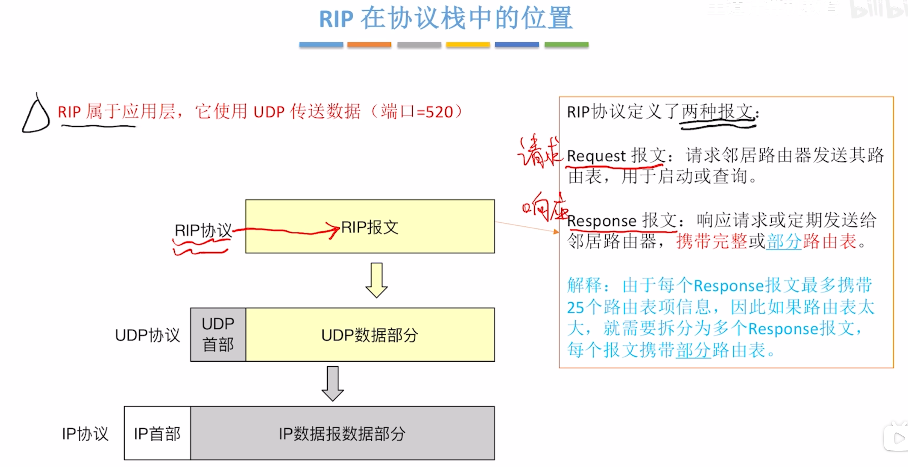
>RIP属于应用层

# RIP的规定
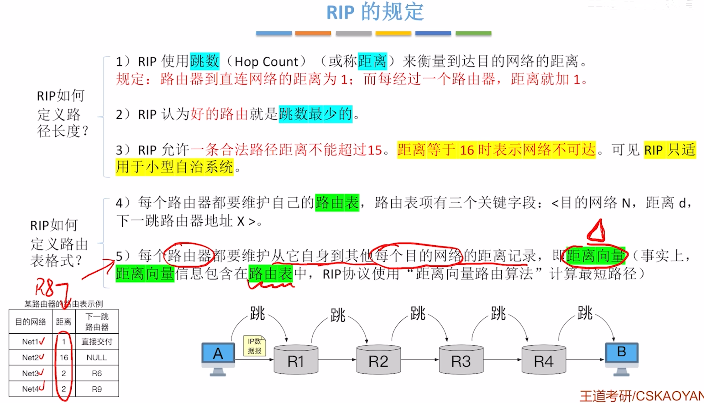

# RIP路由器之间如何交换信息
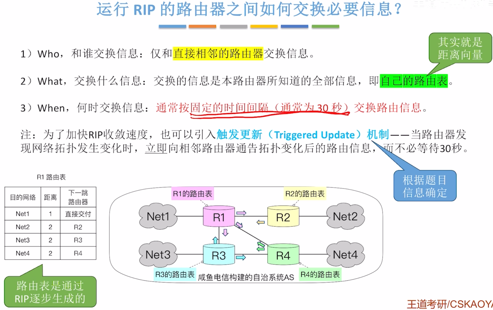

# RIP的工作过程
## 从路由器启动到收敛
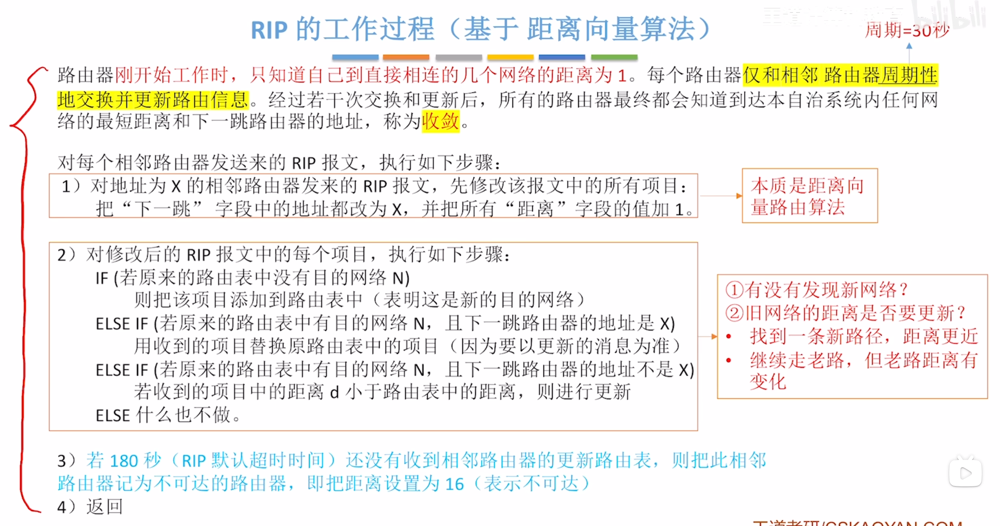

### 初始化
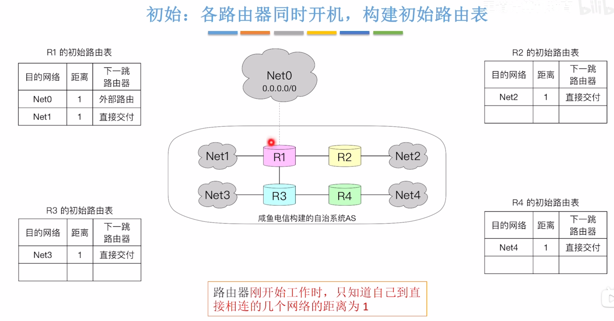
>初始化自己的路由表，把与自己直接相连的网络加入路由表，距离为1
>R1的第一个表项，连到外部网络下一跳还是路由器，所以是外部路由，第二项是连到Net1，连的是一个交换机

### 0时刻
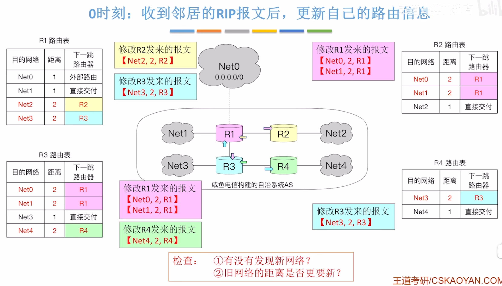
### 30时刻
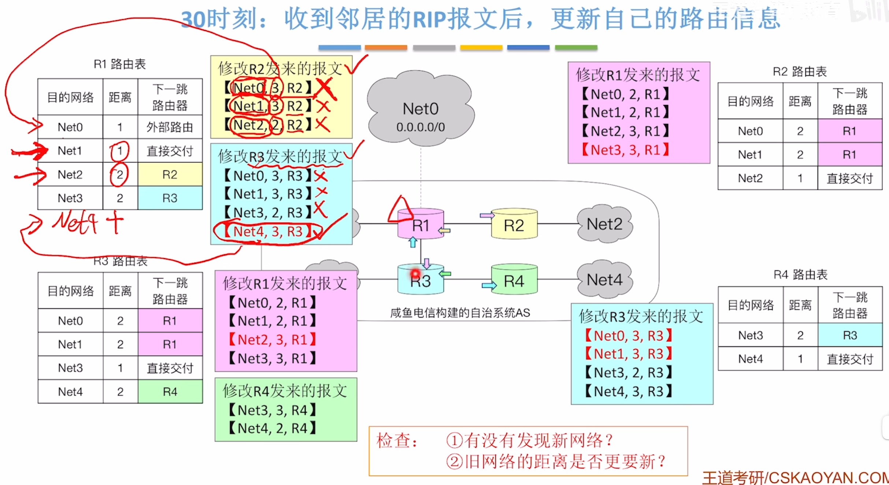

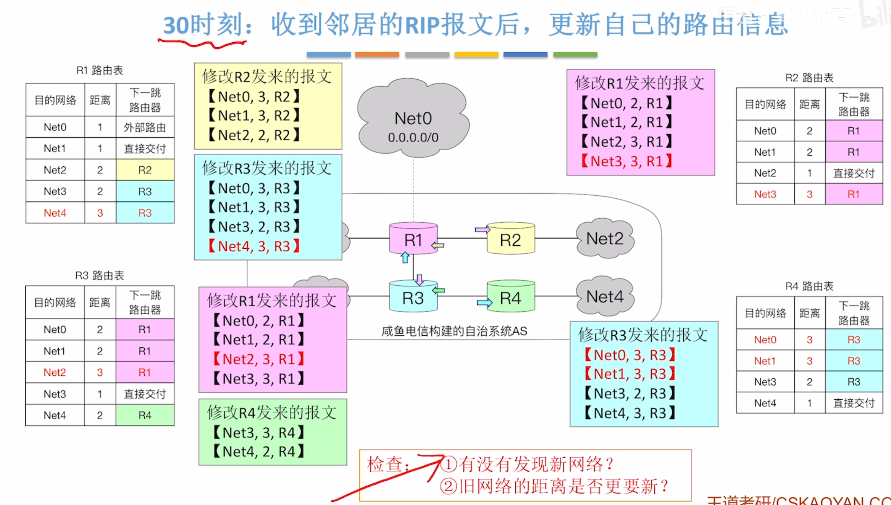

### 60时刻
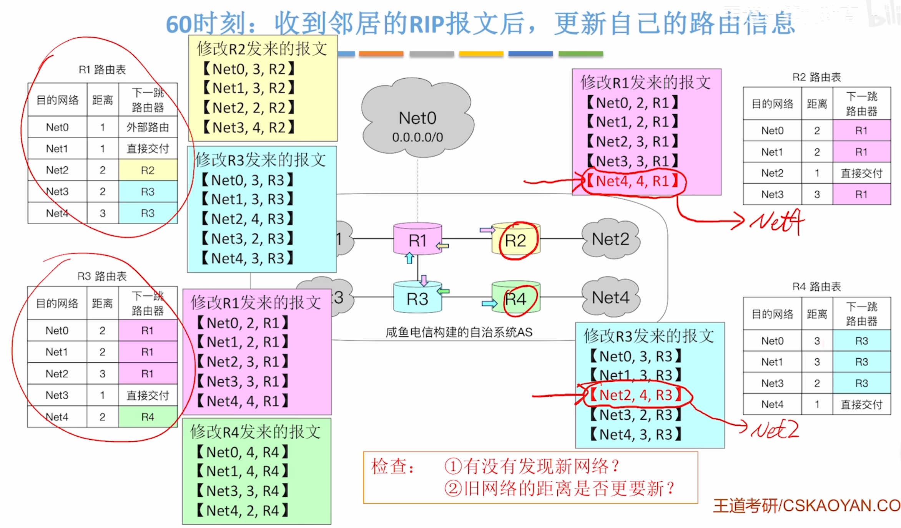
更新之后
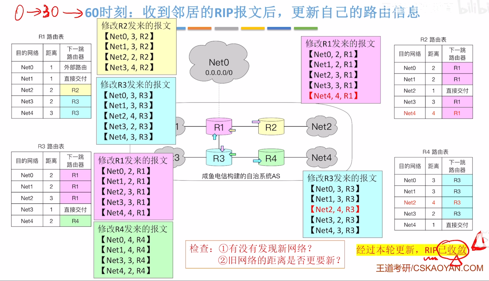
>RIP收敛：每个路由器已经知道到达任何一个目的网络的最佳路由
>90时刻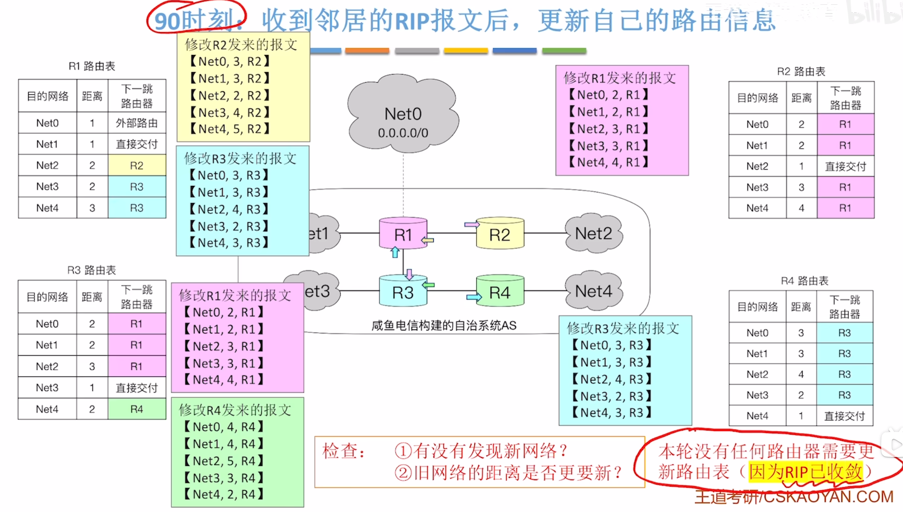

## 动态适应网络拓扑变化
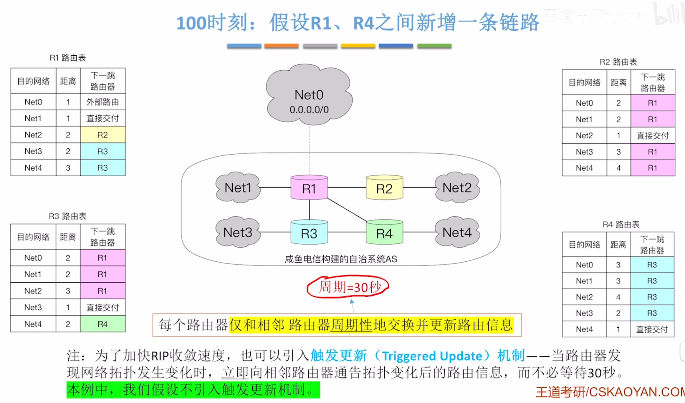
>在R1-R4之间增加一条链路

### 120时刻
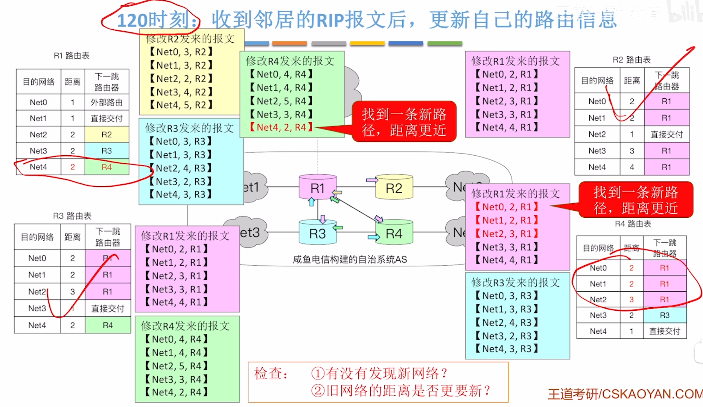

### 150时刻
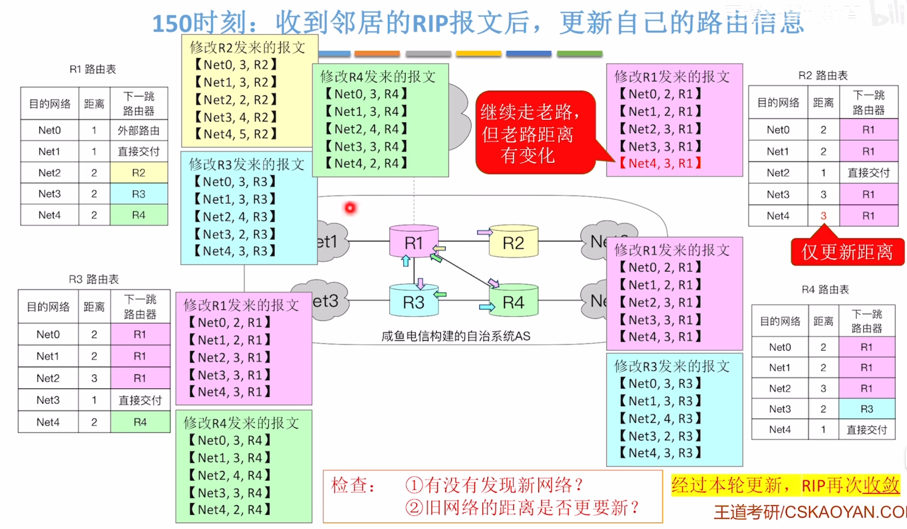

## RIP的缺点
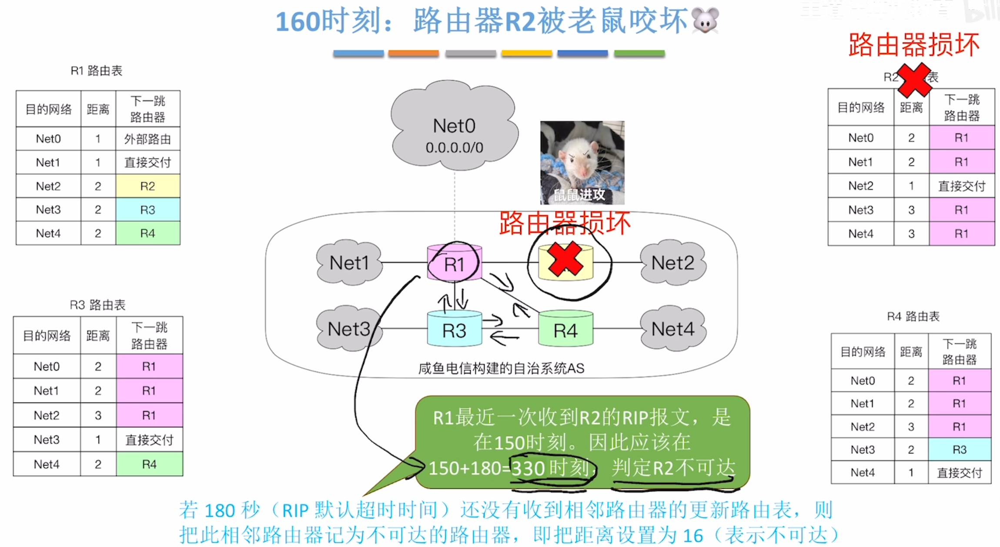

### 330时刻
R1发现R2这条路走不通
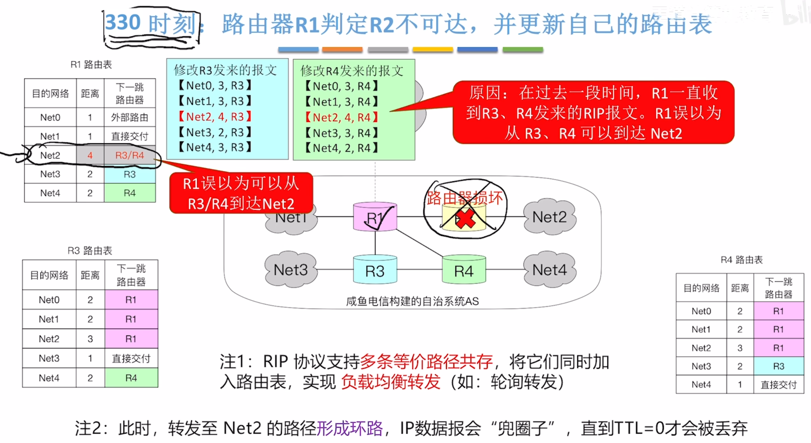

交换RIP报文
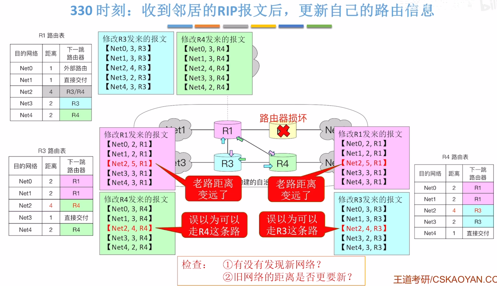
>R3和R4更新原则[从路由器启动到收敛](#从路由器启动到收敛)第二个IF

