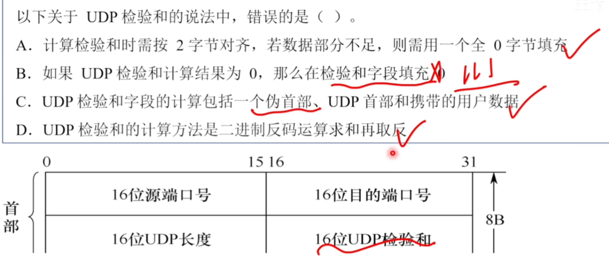
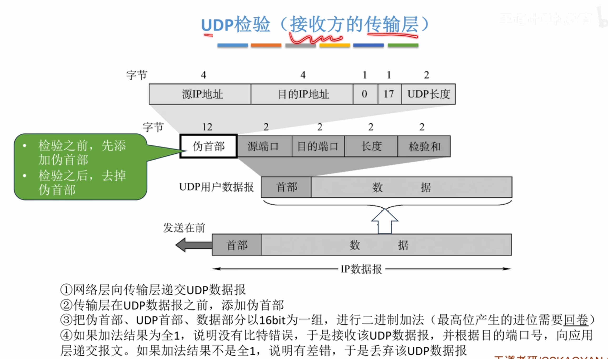
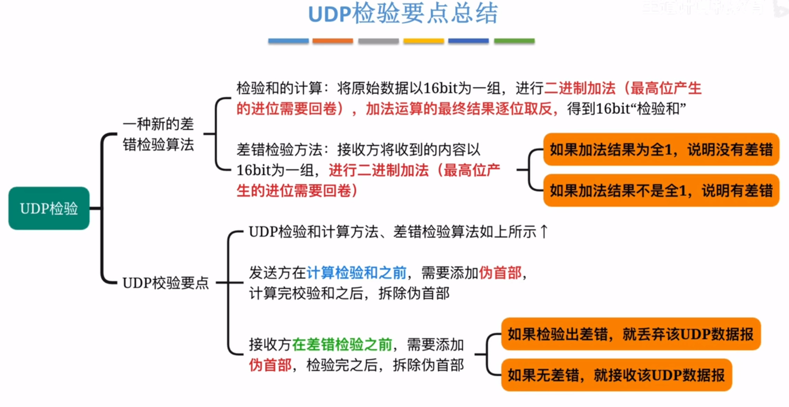
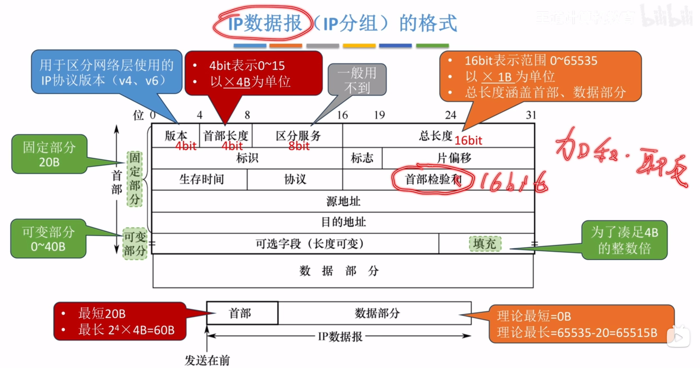
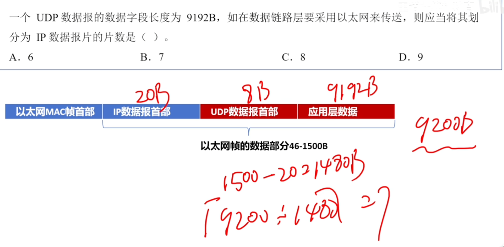
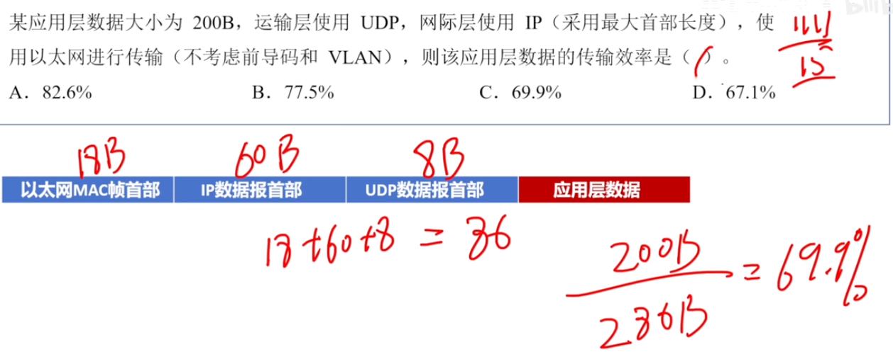

---
tags:
  - 计算机网络
---
# UDP和TCP数据报的区别
UDP

TCP

# UDP数据报格式

>实际最大长度受限于IP数据报
>实际长度最多为65515

## UDP数据报举例

## 小结

# UDP校验

>因为校验和是加和起来的结果然后取反，所以如果没有发生比特错误，全部加起来得到的结果肯定是全1

## UDP检验
### 发送方的传输层

>在首部会加一个12字节的伪首部，计算完校验和之后将其填到首部的校验和字段

### 接收方的传输层

## 小结

# IP数据报的首部校验和

>与UDP得到首部校验和的方式一样，但是不添加伪首部，只用IP数据报的首部，16bit为一组加和然后取反[IP数据报（分组）的格式](408/IPv4分组.md#IP数据报（分组）的格式)

# 例题

>[IP数据报的分片问题](408/IPv4分组.md#IP数据报的分片问题)注意UDP数据报是不能分片的
>1. 核心结论：分片是 IP 层（网络层）的工作，不是 UDP 层的工作
首先，回答你的核心疑问：
UDP 数据报本身确实不能被 UDP 协议分片，但它可以作为 IP 数据报（网络层）的数据部分，而 IP 数据报在传输过程中是可以被分片的。
当 IP 数据报在传输过程中，遇到一个最大传输单元（MTU）较小的网络（例如以太网 MTU 为 1500B）时，IP 层会负责将大的 IP 数据报切割成多个小的 IP 分片（IP 数据报片），以便能够在这个较小的链路中传输。
2. 为什么 UDP 数据报会被“分片”？
这里的“分片”其实指的是 IP 数据报的分片，而不是 UDP 数据报的分片。
我们可以把数据想象成装箱运输：

    应用层/传输层（UDP）：把数据装进一个 UDP 包裹（包含 UDP 首部和数据）。
    网络层（IP）：把 UDP 包裹装进一个更大的 IP 箱子（包含 IP 首部和 UDP 包裹）。
    链路层（以太网）：把 IP 箱子装进卡车（以太网帧）。

如果这个 IP 箱子 太大了，超过了卡车（以太网帧）能装载的最大尺寸（MTU = 1500B），那么 IP 层 就会把这个大 IP 箱子强行砸碎，切成多个小 IP 箱子（IP 分片）。
关键点在于： 这些 IP 分片里面装的，依然是完整的 UDP 数据报的一部分。对于 IP 层来说，它只关心怎么把数据切分；对于 UDP 层来说，它根本不知道自己的数据报被 IP 层切成了几片，它只负责在接收端把数据还原。

>[V2标准的以太网MAC帧](408/以太网与IEEE802.3.md#V2标准的以太网MAC帧)
>