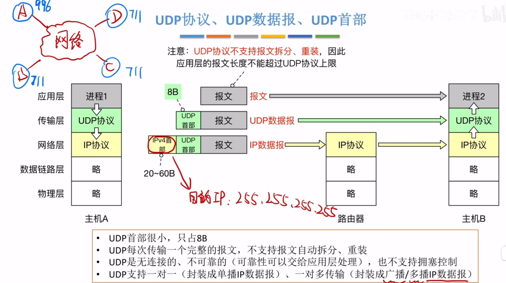
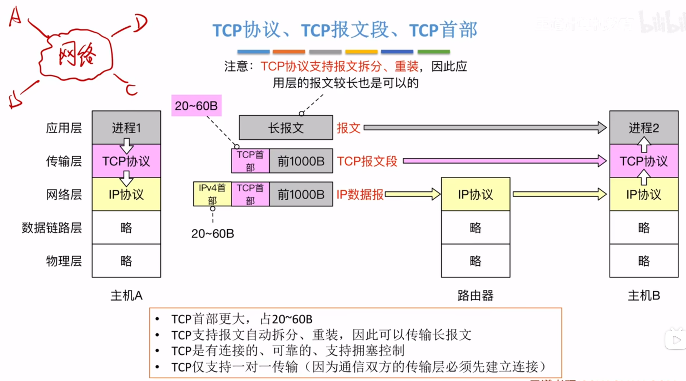
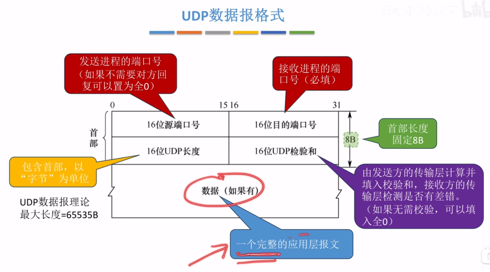
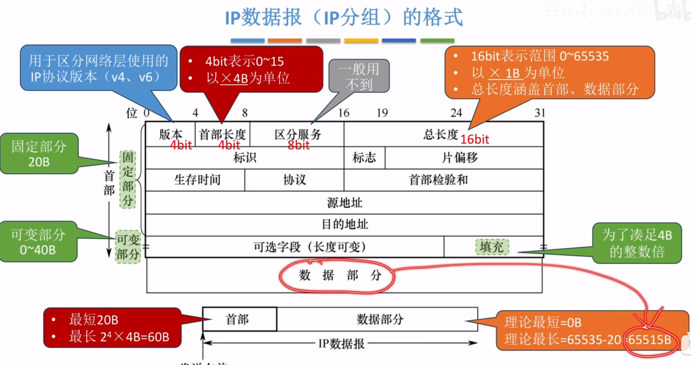
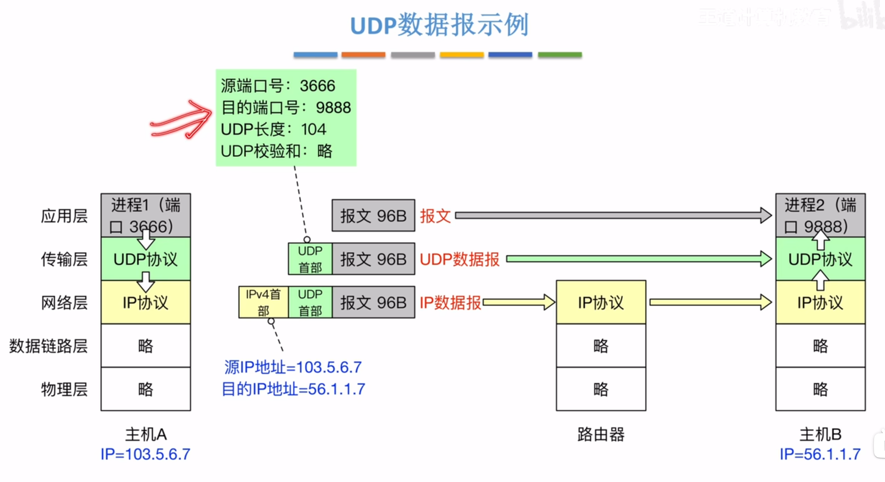
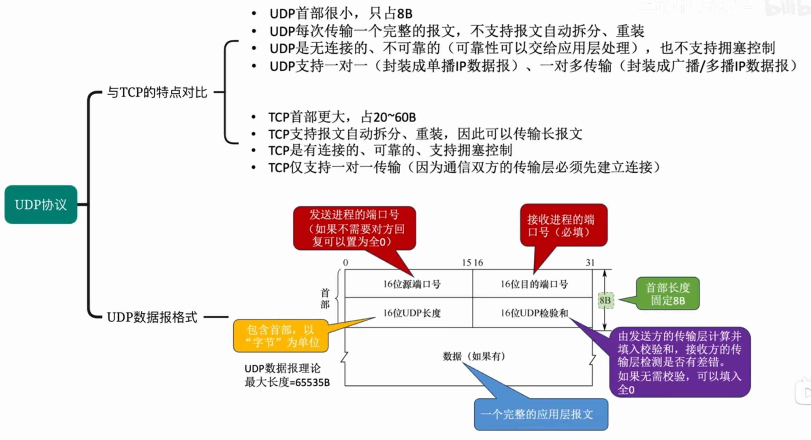
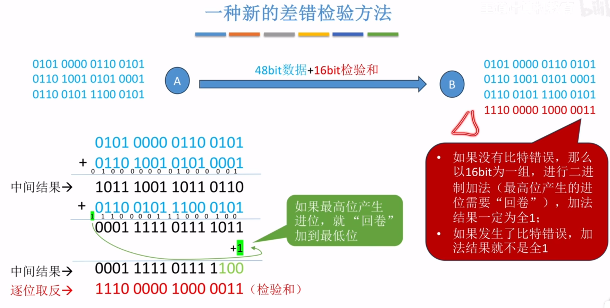
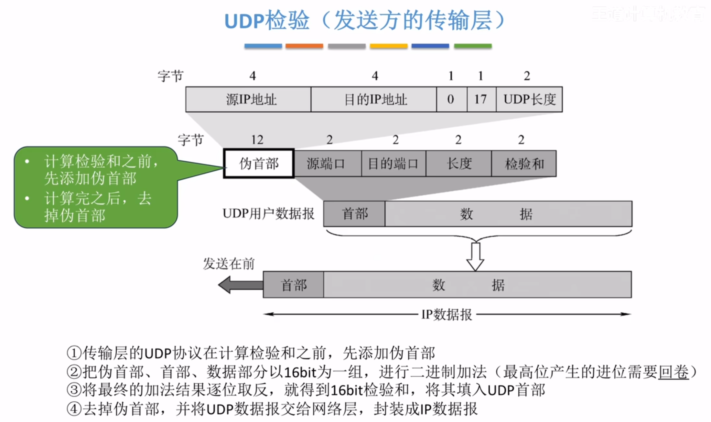

---
tags:
  - 计算机网络
---
# UDP和TCP数据报的区别
UDP

TCP

# UDP数据报格式

>实际最大长度受限于IP数据报
>实际长度最多为65515

## UDP数据报举例

## 小结

# UDP校验

>因为校验和是加和起来的结果然后取反，所以如果没有发生比特错误，全部加起来得到的结果肯定是全1

## UDP检验
### 发送方的传输层

>在首部会加一个12字节的伪首部，计算完校验和之后将其填到首部的校验和字段

