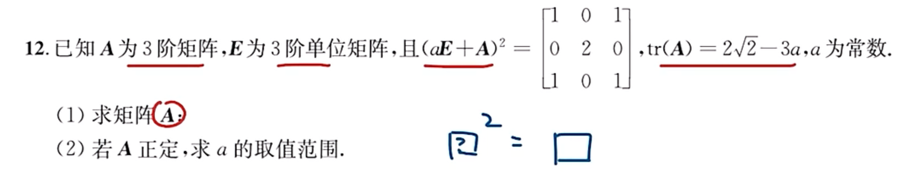

像这种一个矩阵的平方等于另一个矩阵的条件
一般的操作是：
$$B=\begin{bmatrix}
1 & 0 & 1\\0 & 2 & 0\\1 & 0 & 1
\end{bmatrix}
$$
然后将B相似对角化得到$P^{-1}BP=\Lambda$
$$\begin{align}
B&=P\Lambda P^{-1}\\
B&=P\sqrt{\Lambda}\cdot\sqrt{\Lambda} P^{-1}\\
B&=P\sqrt{\Lambda}\quad P^{-1}P\quad\sqrt{\Lambda} P^{-1}\\
B&=(P\sqrt{\Lambda}P^{-1})^{2}
\end{align}$$
这样便完成了B的开方