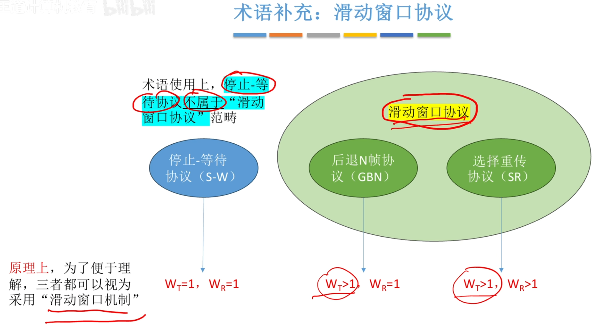
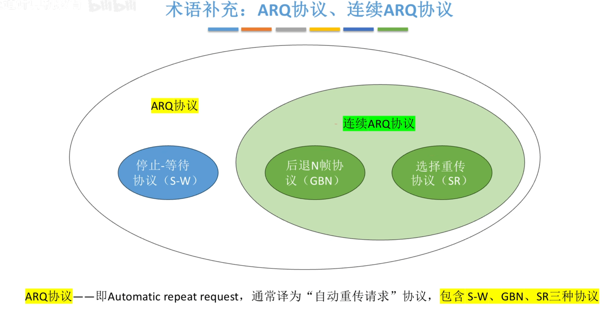
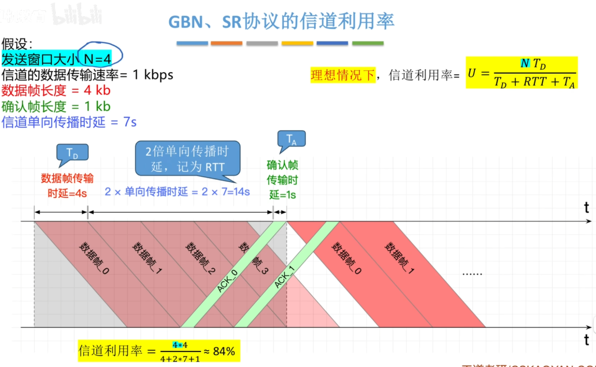
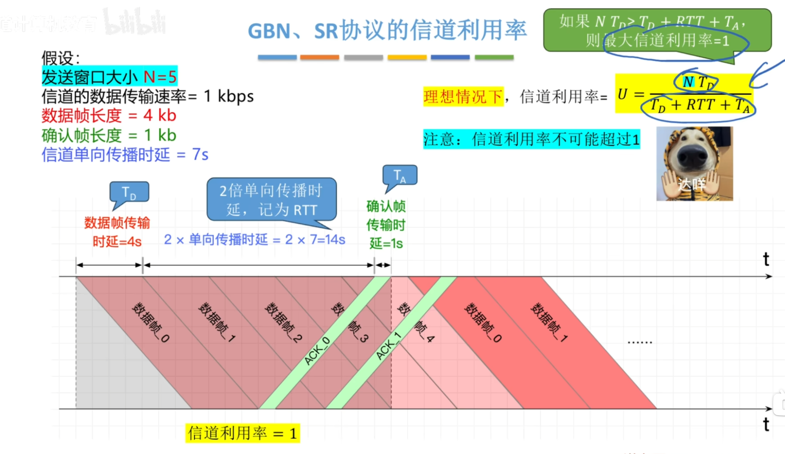
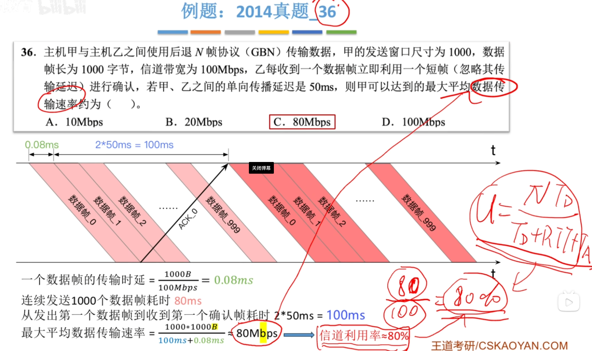
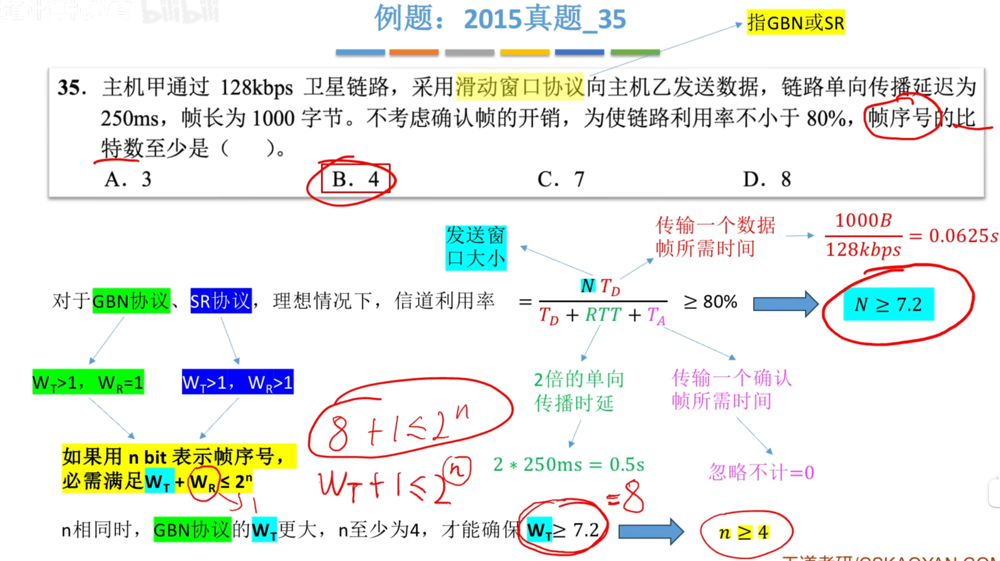

---
tags:
  - 计算机网络
---
# 滑动窗口协议

# ARQ协议

# [停止-等待协议（S-W）](流量控制，可靠传输与滑动窗口.md#停止-等待协议（S-W）)

>
>例题

# [后退N帧协议（GBN）](流量控制，可靠传输与滑动窗口.md#后退N帧协议（GBN）)和[选择重传协议（SR）](流量控制，可靠传输与滑动窗口.md#选择重传协议（SR）)

>
>

## 例题

>连续发送1000个帧是80ms，而发出第一个到收到第一个确认是100ms ，80<100 ，一个周期的时间是100ms+0.08ms ，这个周期内发送了1000个数据帧，每个数据帧是1000B。得到实际的数据传输速率，实际的数据传输速率/信道带宽，也可以得到信道利用率

>由公式先算出发送窗口大小的范围，然后去推算帧序号的比特数