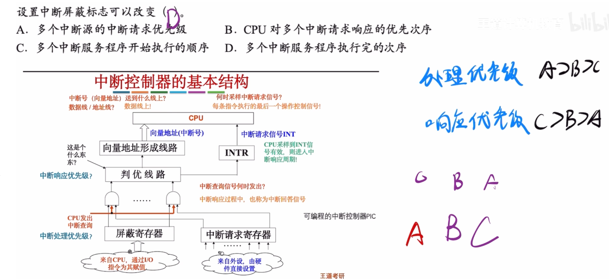

---
tags:
  - 计算机组成原理
---

>中断处理优先级对应的是屏蔽寄存器
>中断响应优先级对应的是中断判优线路
>如图所示的处理优先级，假设在ABC之前的中断没有屏蔽ABC，那么ABC都会进入判优线路，此时根据响应优先级，C进入CPU执行中断程序

>C在执行开中断之后，C就可以被比他处理优先级高的中断源中断了，根据处理优先级，此时AB可以进入判优线路，然后再根据响应优先级，B去执行中断程序
>这时就是[多重中断](408/多重中断.md)了，C还没有执行完，就被B中断
>后续就是A再中断B
>所以进入CPU执行的顺序是C->B->A
>但是中断程序最先完成的却是A(有点像递归)
>中断完成顺序是A->B->C，与处理优先级相同