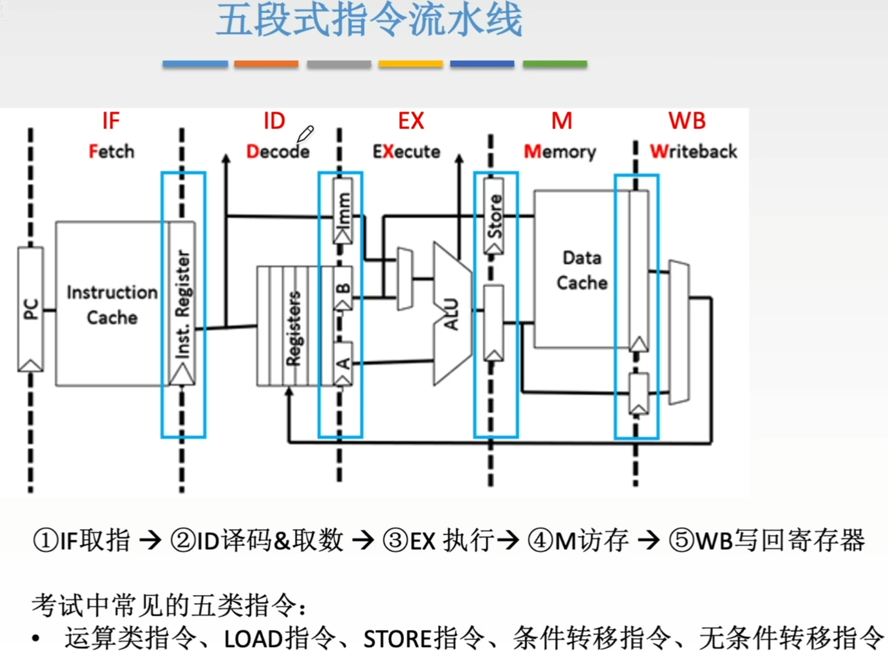
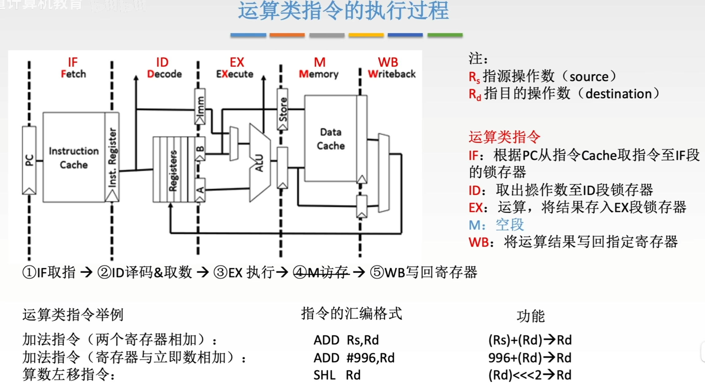
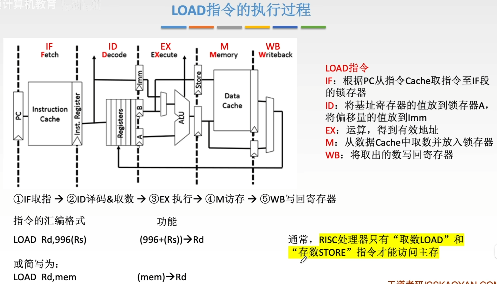

---
tags:
  - 计算机组成原理
---

# 运算类指令的执行过程

>在ID段里，锁存器有A,B,Imm三个。Imm表示的是存立即数的
>在RISC（精简指令集系统）中，所有的运算类指令，运算的两个操作数一定是来自于某个寄存器或者是立即数，运算的结果也一定是存回某个寄存器，不会直接存回主存。所以M是空段，但是时间还是要消耗的，为了方便流水线的安排

# LOAD指令

>(996+(Rs))->Rd：意思是取出Rs寄存器(基址寄存器)里的地址，加上偏移量996作为数据在主存中的地址，取出主存中地址为996+(Rs)的数据存入Rd
>M阶段一般数据都在Data Cache中，所以这里写的是从数据Cache中取数

# STORE指令
