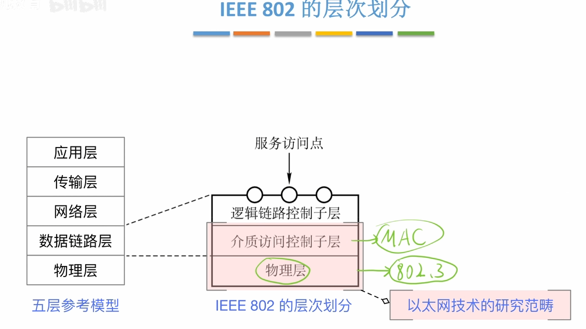
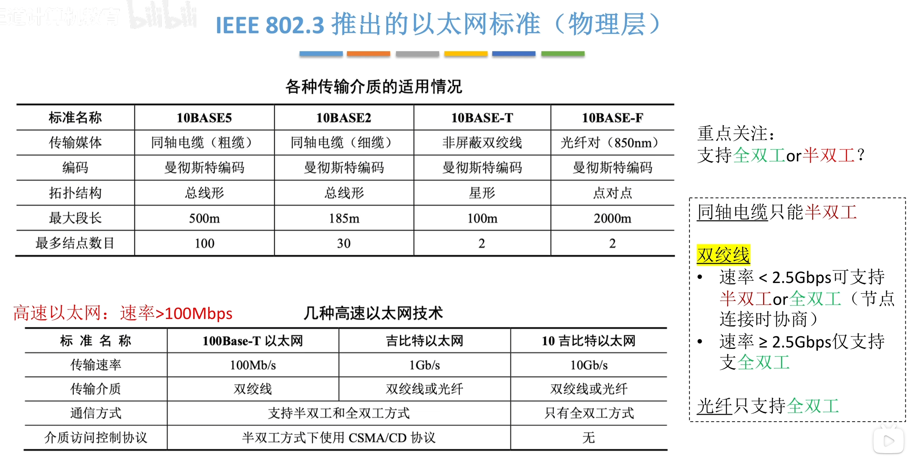
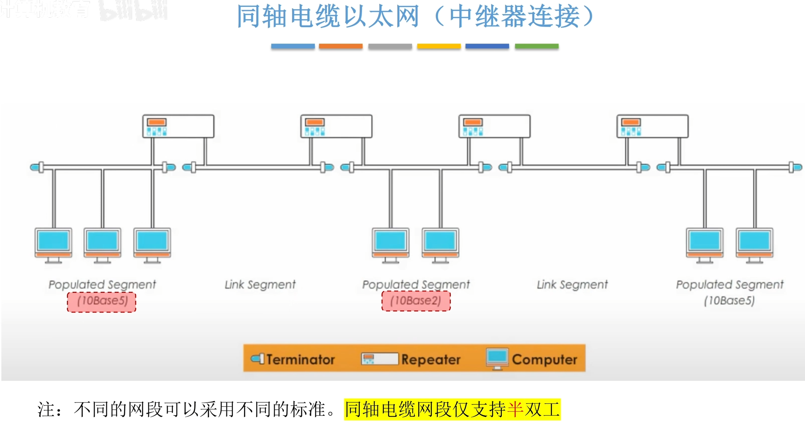
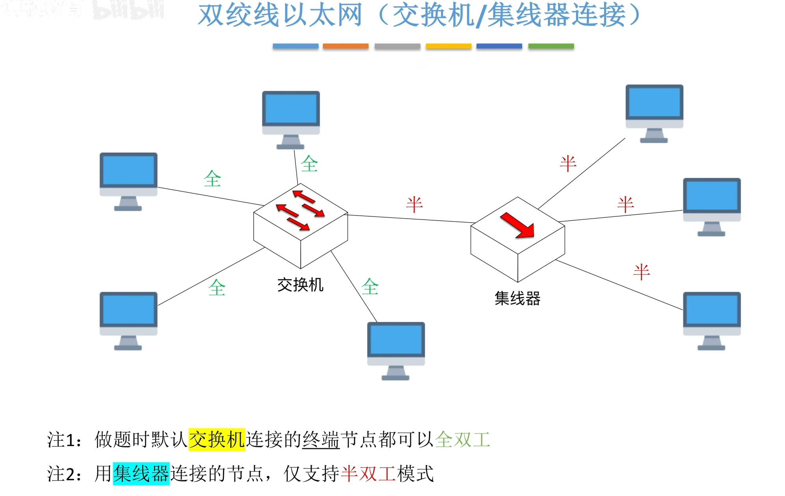
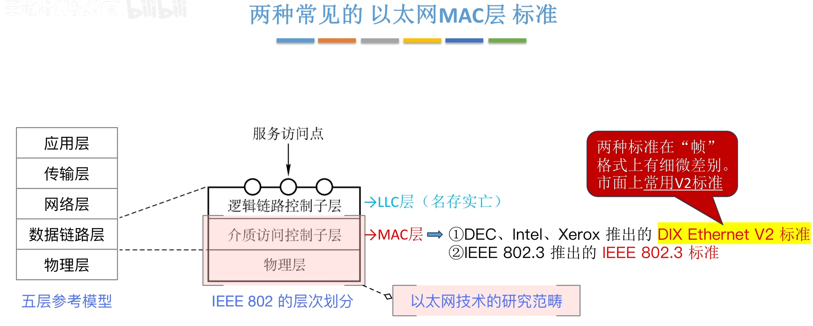
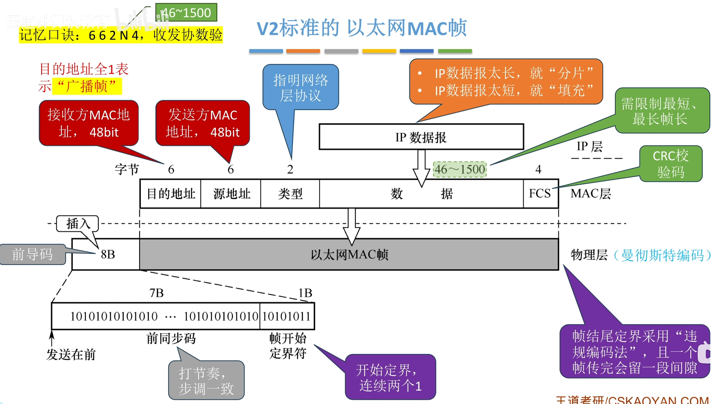
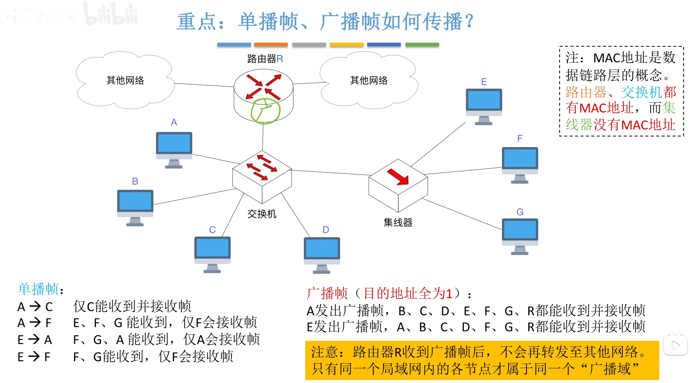
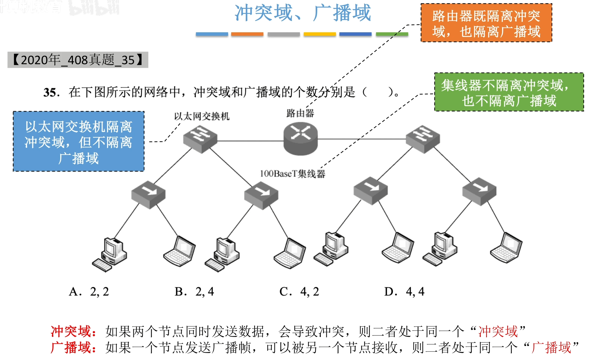
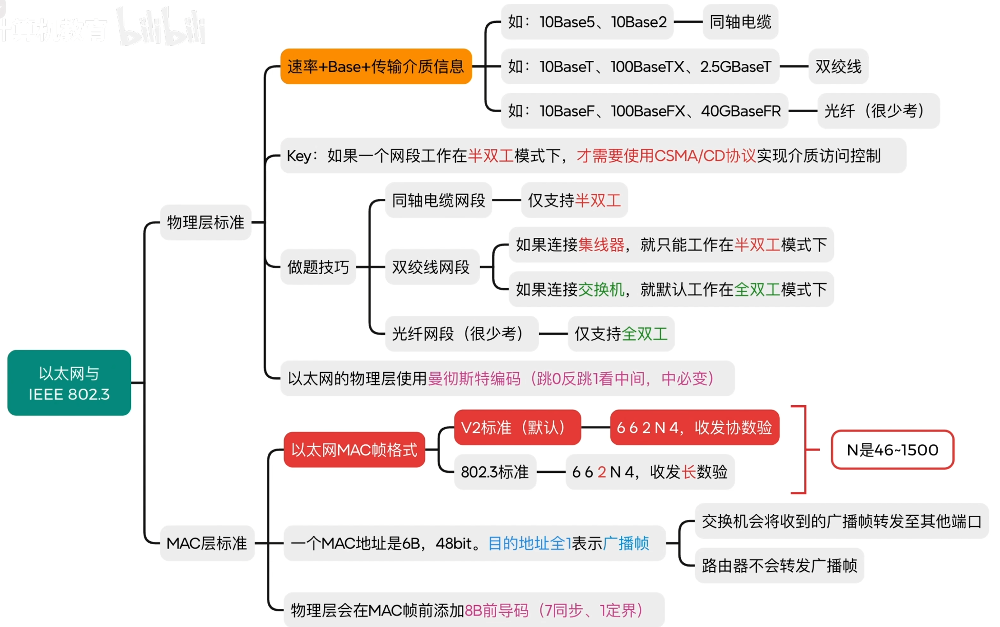

---
tags:
  - 计算机网络
---

# 物理层以太网标准

>同轴电缆只能半双工
>双绞线可以全双工或半双工

## 同轴电缆以太网

>[集线器和中继器的特性](408/物理层设备.md#集线器和中继器的特性)

## 双绞线以太网

# 两种以太网MAC层标准

## V2标准的以太网MAC帧

>在V2标准里，是实际的标准，因为LLC层已经名存实亡，所以可以将MAC层等价于数据链路层，所以MAC层的上端就是网络层，这也解释了为什么2字节的部分是指明网络层协议，而在 标准里上面还有LLC层，所以指明的是长度
>整个MAC帧前面加上前导码，从物理层发出

### 单播帧，广播帧如何传播

>集线器工作在物理层，而MAC地址是数据链路层的概念
>广播域和冲突域例题

## 802.3标准的以太网MAC帧

# 总结

