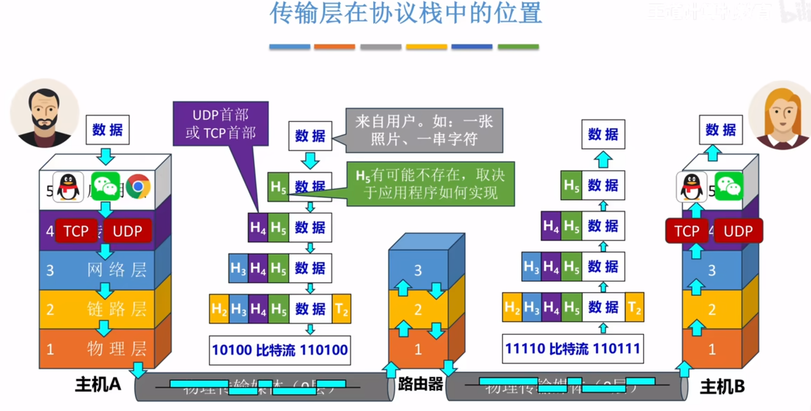
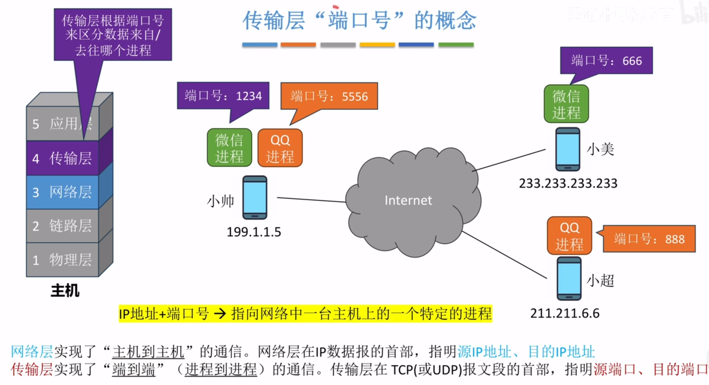
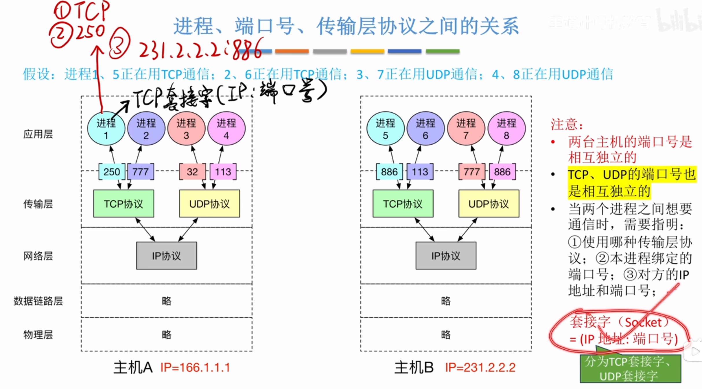
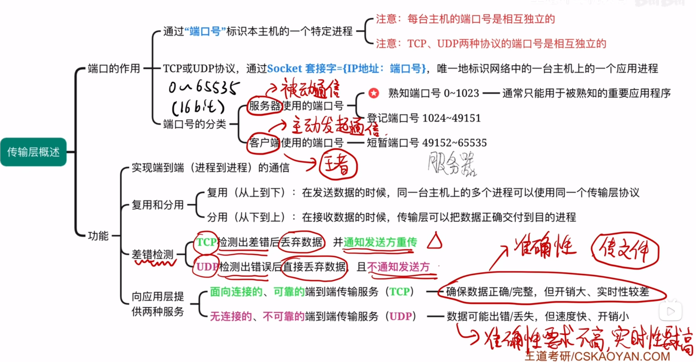
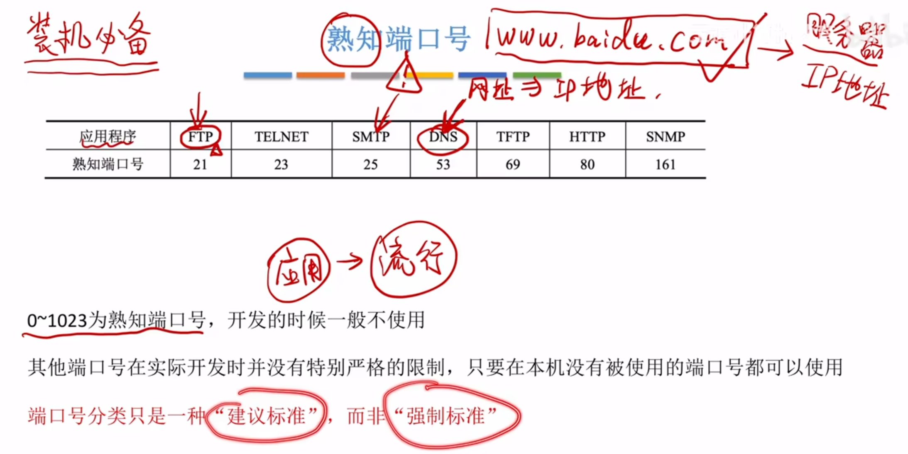
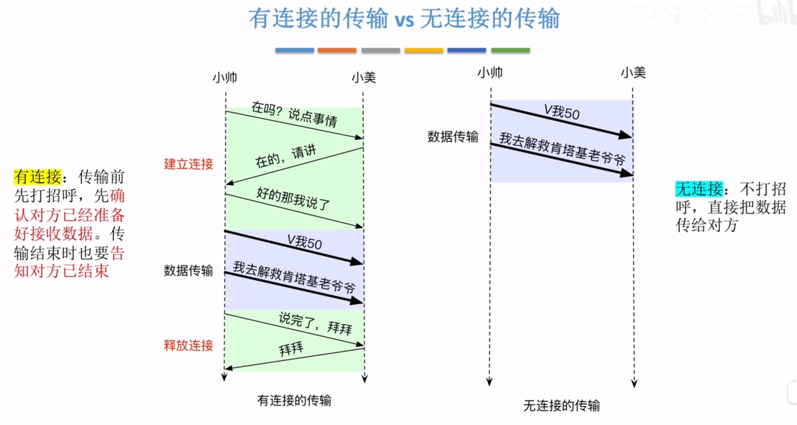
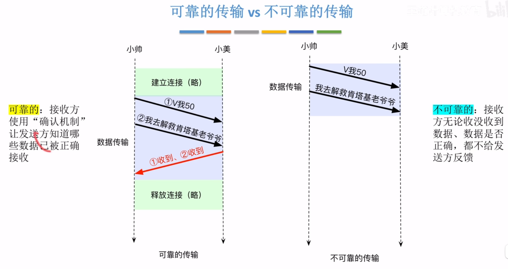

---
tags:
  - 计算机网络
---
# 传输层在协议栈的位置

# 传输层端口号的概念

# 进程，端口号，传输层协议之间的关系

>Socket套接字

# 传输层概述

## 熟知端口号

## TCP和UDP
[无连接UDP和面向连接TCP](408/无连接UDP和面向连接TCP.md)
TCP是面向连接的，它提供流量控制和拥塞控制，保证服务可靠，UDP是无连接的，不提供流量控制和拥塞控制，只能做出尽最大努力的交付
### 有连接和无连接

### 可靠和不可靠的传输

