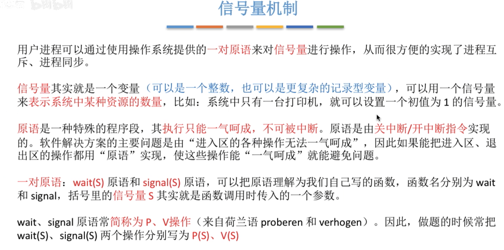
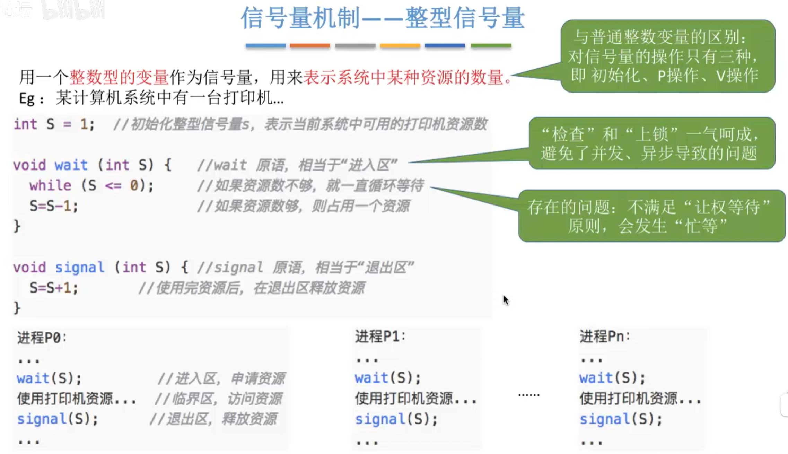

---
tags:
  - 操作系统
---
# 概念

# 整型信号量

>缺点是会发生忙等
>和[双标志先检查法](进程互斥的实现方法.md#双标志先检查法)很像，但是这个是一气呵成的
# 记录型信号量

## 小结

>P操作，V操作
>如果S.value的值大于0，那么此时表示的是系统可分配的资源的数量
>如果S.value的值小于0，那么此时绝对值表示的是当前处于等待队列的进程的数量
>