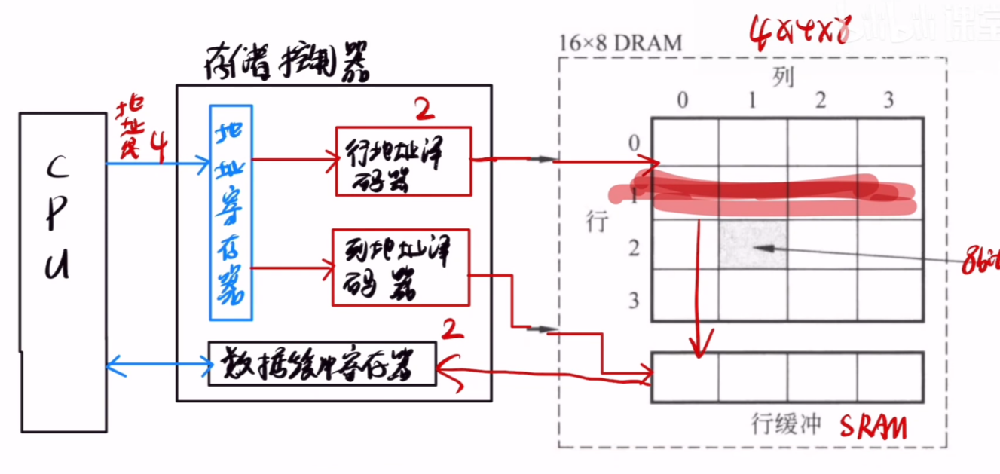

# 非DRAM芯片
不用考虑[DRAM的地址线复用技术](栅极电容对比双稳态触发器,DRAM对比SRAM.md#DRAM的地址线复用技术)
若一SRAM芯片,容量是$1024\times 8$位
>1024表示有1024个存储单元,那么要定位到1024个存储单元,就需要1024个地址,就需要10个比特位,所以地址线需要10根
>8表示存储字长,定位到某一个存储单元后,要取出这个存储单元的数据,这个存储单元里有8个bit位,所以需要8根数据线

# DRAM芯片

%%DRAM芯片内部原理%%
>对于4行4列的DRAM,有
1. 第一步,会传行地址给行地址译码器,然后行地址译码器找到DRAM内部对应的行
2. 第二步,找到对应的行之后,会把所在行的值传输到**行缓冲寄存器**当中,注意,**行缓冲寄存器的材料是SRAM**
3. 第三步,通过列地址寄存器,在**行缓冲寄存器内找到对应的数据(一格)**