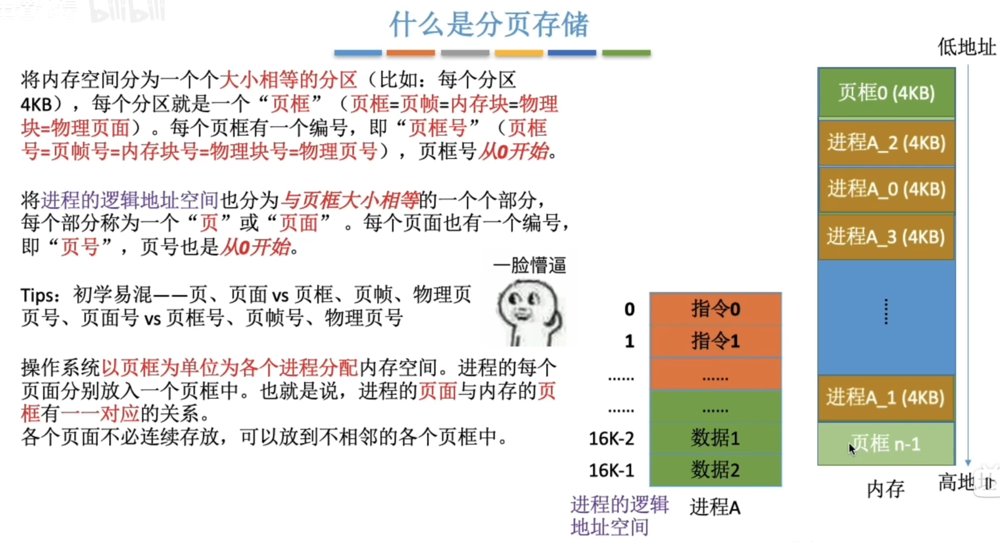
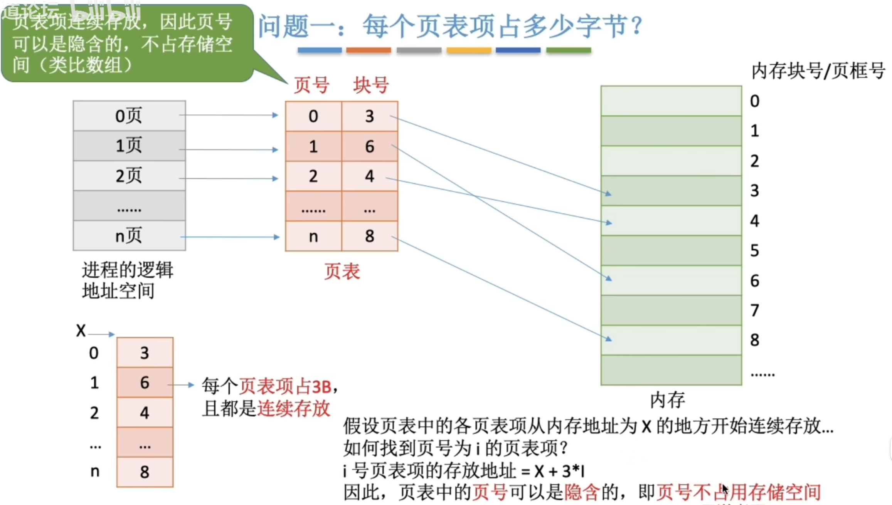
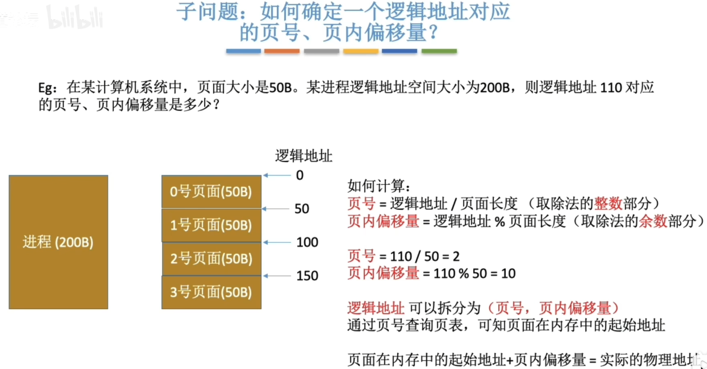
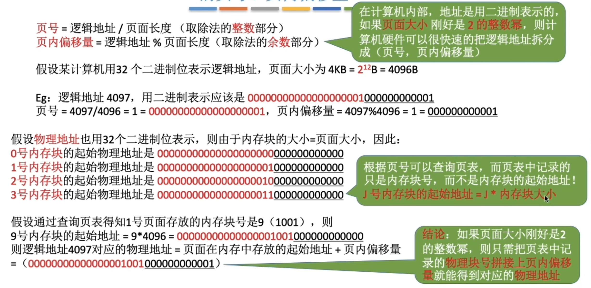
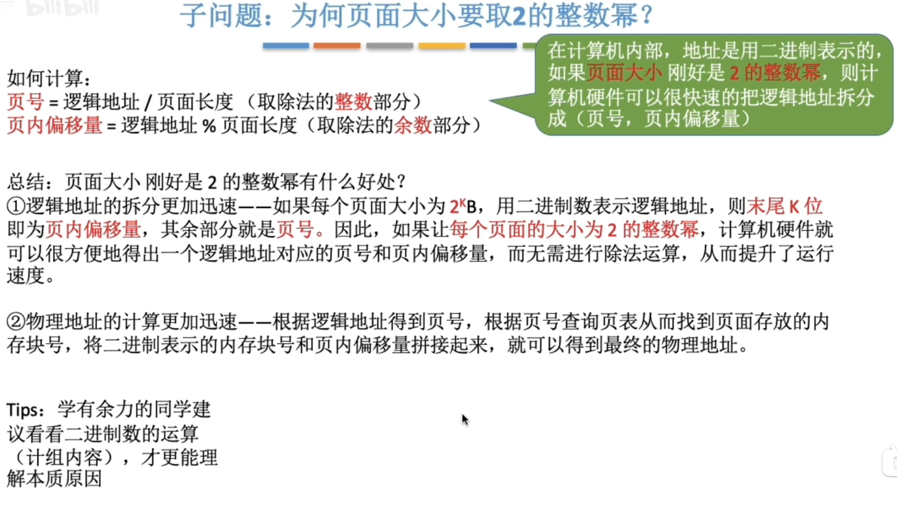

---
tags:
  - 操作系统
---
# 分页存储概念

>页框和页帧指的是内存在物理上被划分成一个一个的部分
>页和页面指的是进程在逻辑上被划分成的一个一个的部分

# 页表

## 计算块号占多少字节

## 页号不占字节

>页号就像数组下标一样，是隐含的，不占用存储空间
>
>从0到n共n+1个页表项，每个页表项占3B

## 确定页号和页内偏移量

>页面大小取2的整数次幂的好处
>

### 分页存储管理的逻辑地址结构

# 总结
