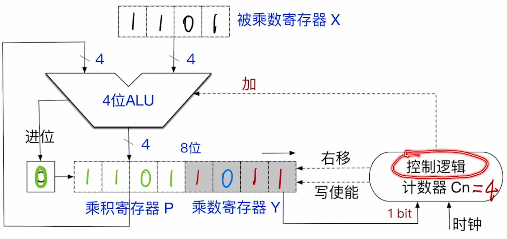

---
tags:
  - 计算机组成原理
---

- 计数器$C_n$表示乘数和被乘数的位数。(n位二进制乘以n位二进制结果最多有2n位)
- C表示进位
- 将乘法转换成多个加法，如图所示。初始让部分积P0=0，也就是乘积寄存器P一开始为0000
- 乘数寄存器一开始为1011
- 第一次加法，因为Y的最低位是1，所以执行加法，看图片中P和X的线路，意思就是，将P里的数和X里的数相加，结果再赋值回P
- 第一次加后的结果
- 
- 为了使下次相加能实现错位的效果，将C,P,Y整体右移
- 
- 其中C空出来补0.