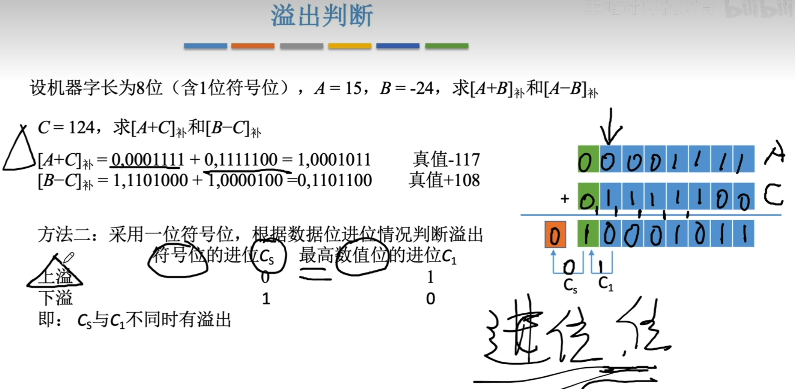

---
tags:
  - 计算机组成原理
---

# 溢出判别方法
## 采用一位符号位
其中$A_s$表示被加数的符号位，$B_s$表示加数的符号位，$S_s$表示运算结果的符号位。
- 根据**性质**：正数+正数，才会上溢——正+正=负
- 只有负数+负数，才会下溢——负+负=正
- $$A_sB_s\bar{S_s}\quad 表示的是正+正=负的情况$$
- $$\bar{A_s}\bar{B_s}S_s表示的是负+负=正的情况$$
## 采用1位符号位并结合进位情况

- $C_s$表示符号位相加后向更高位的进位，$C_1$表示符号位上一位向符号位的进位
- 图中的例子A+C是上溢的情况，也就是==正数+正数=负数的情况==
 