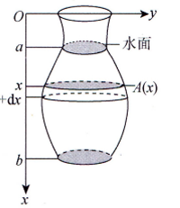
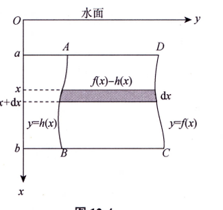

---
tags:
  - 定积分
---
 P295
1. 变力沿直线做工
	- 有点像定积分求面积
2. 抽水做功
	- 关键在于求x处的水平截面面积，也就是A(x)，A(x)dx就是这一层水的体积，然后根据物理公式$F=\rho gv$这就变得有点像变力做功了，然后路程就是x，路程x不一定刚好是x,有时候可能会抽水到水面以上的距离，要视情况而定。
	- 然后沿着x轴正方向积分从a到b
	- 
	- $W=\rho g\int_{a}^{b}xA(x)dx$
3. 静水压力
	- 关键是求矩形条的宽度**f(x)-h(x)**，pgx表示这个x深度下的压力，\[f(x)-h(x)]dx就这个矩形条的面积，面积乘以压力就是这一条所受的水压力
	- 沿着x轴正方向积分,从a到b
	- 
	- $P=\rho g\int_{a}^{b}x[f(x)-h(x)]dx$
4. 引力
	- 万有引力公式$F=G\frac{m_1\cdot m_2}{R^2}$由这个公式算df，然后积分
	  