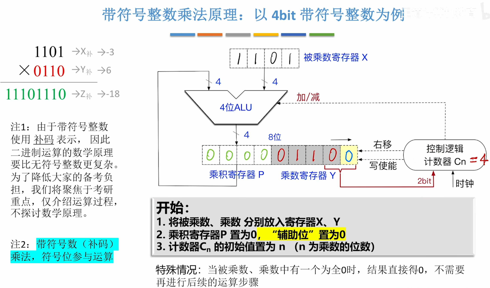
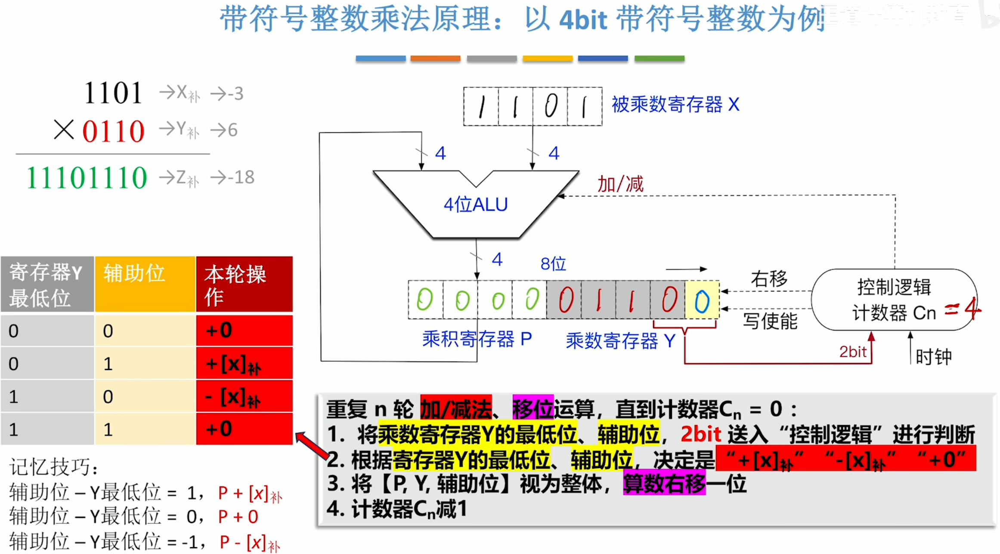
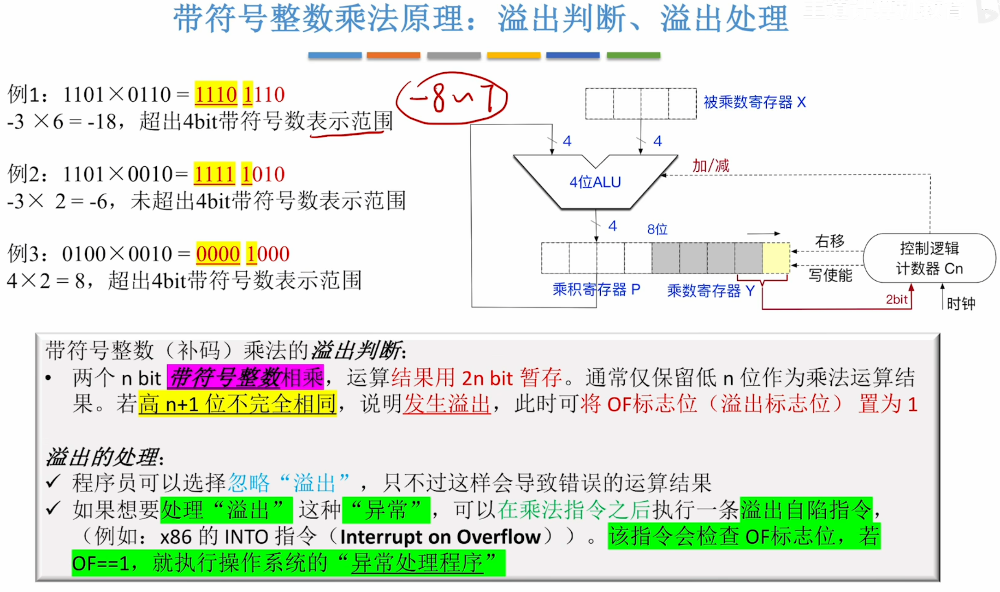

# 初始

# 计算

- 注意与无符号乘法的区别，这里是[算术右移](定点数的移位运算.md#算术右移)，高位是补符号位的
- 执行减法的时候，就是将减法转换为加法，把减数转换成它的补数[减法运算](408/无符号数的加减运算.md#减法运算)。
# 溢出判断

- ==高n+1位不完全相同==作为判断溢出的条件
- 此时将[OF（OverFlow Flag）](408/带标志位加法器.md#OF（OverFlow%20Flag）)置为1
- 处理异常可在这之后执行溢出自陷指令（trap）
---
- 这是"补码一位乘法"，这种算法也被称为布斯(Booth)算法