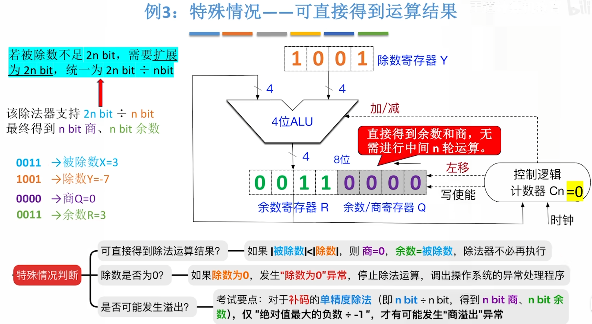
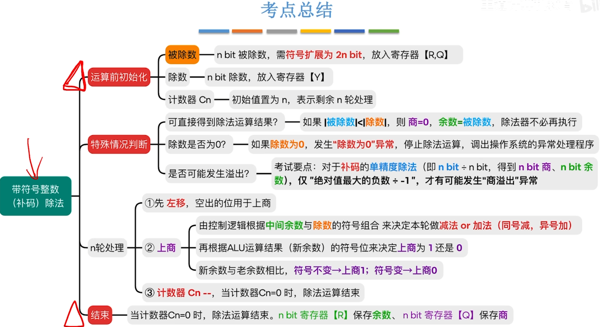

---
tags:
  - 计算机组成原理
---
# 考点

# 带符号整数除法
## 开始

- 把被除数放入Q中，进行符号扩展后占用R和Q
- 除数放入Y
- 如果上商0，则需要恢复余数，也就是原来减了就要加回去，原来加了就要减回去，恢复R的状态
- 被除数不足2n，需要进行符号扩展
## 结束
注意原被除数与除数异号时，寄存器Q还要再处理一次，如果同号，Q里存的就是正确的商
# 特殊情况

- 在第三个商溢出的异常的情况时，只有绝对值最大的负数除以-1才有可能发生
- 比如在4bit（-8~7）下，只有进行-8除以-1时，才有可能溢出
- 在初始的时候，寄存器填完数据后。控制逻辑会检查除数和被除数是否是绝对值最大的负数除以-1的这种组合。如果是这种组合==之间抛出商溢出异常，不进行后面的运算==**商溢出异常不是在n轮处理之后才发现的，而是在初始化完成之后，刚开始的时候就可以被控制逻辑发现并且及时的处理
# 总结
