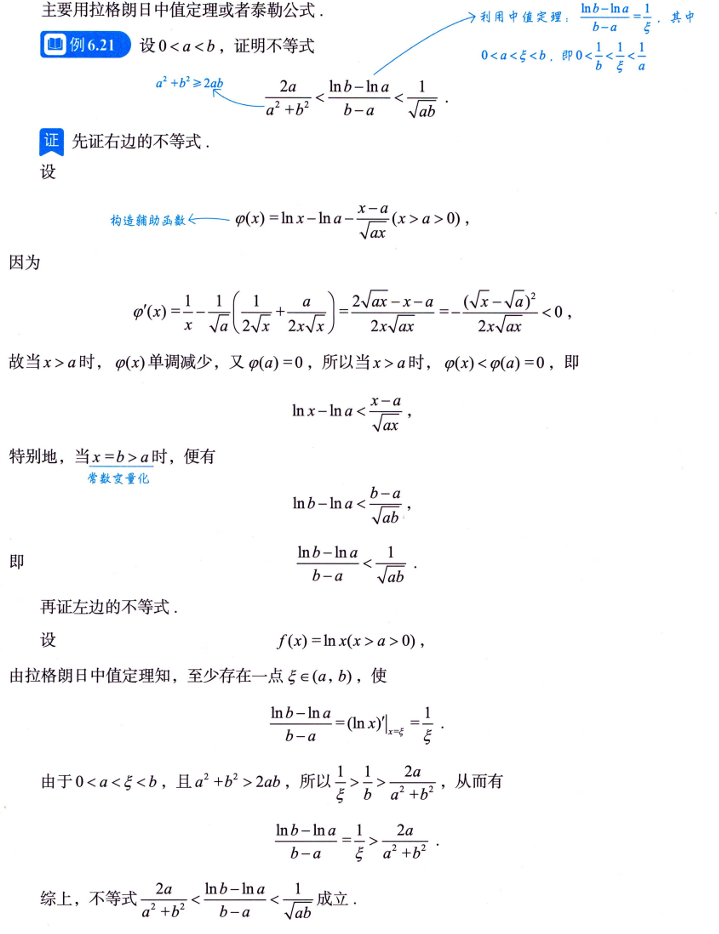

---
tags:
  - 不等式
---
# 用函数性态证明不等式
1. 求一阶导看原函数的单调性
2. 求二阶导来看一阶导函数的单调性==一般都不会只让求一阶导就可以得出单调性，往往都是需要求二阶导来判断一阶导函数的单调性，比如==$f''(x)\ge 0 ,a < x < b,则有f'(a) \le f'(x) \le f'(b)$ 往往这个会使得一阶导函数大于0或小于0
3. 唯一极值则最值
4. 凹凸性：比如函数是凹的，而且$f(a)=f(b)=0$那么a,b之间的f(x)小于0
# 用常数变量化证明不等式

^6378f2

# 用中值定理证明不等式

证明左边的不等式用到了[拉格朗日中值定理解题思路](数学/拉格朗日中值定理解题思路.md)
证明右边的不等式用到了[常数变量化](#^6378f2)，构造方程然后求导看单调性