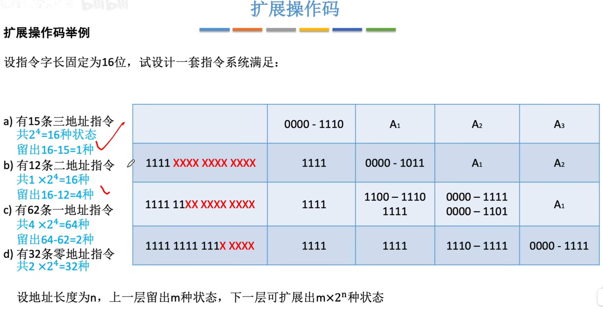

>在扩展操作码指令格式中，**2地址或3地址指令的数量完全取决于操作码部分的编码状态数**，而**地址码字段的不同地址取值不构成新的指令种类**
- **指令数量由操作码的编码状态数决定**：对于同一类地址指令（如三地址指令），其**种类数量**仅取决于操作码字段能表示的**唯一编码状态数**（例如4位操作码最多支持 $2^4=16$ 种指令）。
- **地址码变化不新增指令种类**：地址码仅指定操作数的位置（如寄存器或内存地址），**同一操作码对应的不同地址组合属于同一指令的实例**，而非不同指令。例如 `ADD R1, R2, R3` 和 `ADD R4, R5, R6` 均属于 **同一种** `ADD` 指令。
![[Excalidraw/扩展操作码图]]