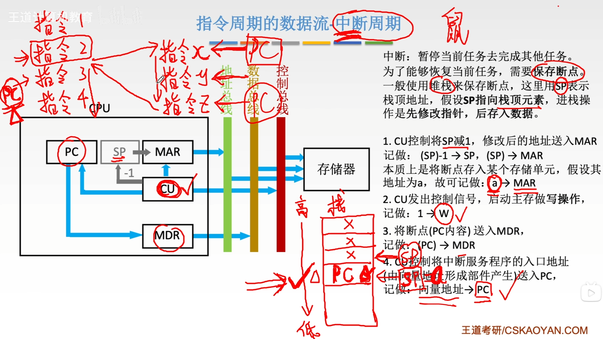
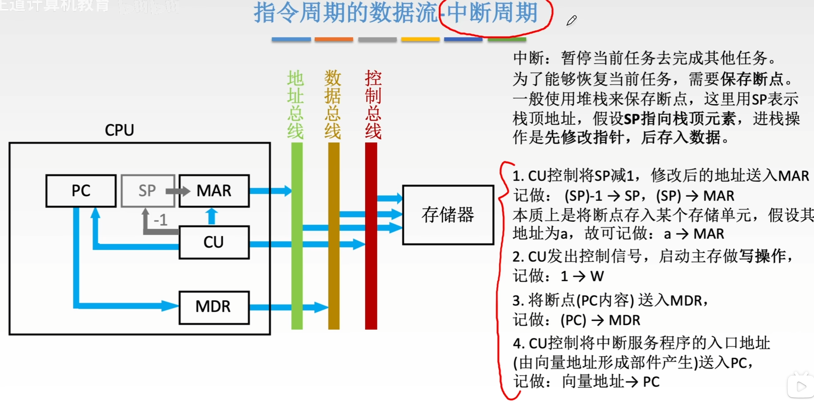

---
tags:
  - 计算机组成原理
---
# 指令周期

## 各周期的关系

>指令周期，机器周期（CPU周期），时钟周期之间的关系
>买CPU的时候提到的CPU主频就是反映了CPU每秒钟会发出多少个时钟节拍,如3.6GHz

>ADD指令包含两个机器周期，一个是取址周期，一个是执行周期

# 指令周期流程

>CPU使用触发器来判断当前是在执行取值周期，间址周期，执行周期还是中断周期
>标志触发器：FE，IND，EX，INT

## 取址周期

>**取指令阶段**

- **目标**：从内存中获取当前要执行的指令。
- **过程**：
    - 程序计数器（PC）中存放的是当前指令的地址。
    - 这个地址被送到存储器地址寄存器（MAR）。
    - 控制器（CU）发出读信号。
    - 内存根据MAR中的地址，将该地址存储的内容（即**指令**）通过数据总线送入存储器数据寄存器（MDR）。
    - 最后，MDR中的内容被送入指令寄存器（IR）进行译码。
- **结论**：在此阶段，MDR接收的是**指令**。

## 间址周期

假设指令是间接寻址，取指周期结束后，指令已经在 IR 中。

1. **发送形式地址**：
    
    - 将指令寄存器（IR）中的地址码部分（形式地址 Ad(IR)）送到存储器地址寄存器（MAR）。
    - 记做： Ad(IR)→MAR
2. **发出读命令**：
    
    - 控制器（CU）发出读信号（1→R ）。
3. **读取有效地址**：
    
    - 主存根据 MAR 中的地址，找到该单元的内容。注意，这个内容**不是操作数**，而是**操作数的有效地址**。
    - 这个有效地址通过数据总线送入 MDR。
    - 记做： M(MAR)→MDR
4. **更新地址**：
    
    - 此时 MDR 中存放的是有效地址。这个地址会被送回 MAR，或者直接用于后续的执行周期。
    - 记做： MDR→MAR （或者直接用于执行周期的寻址）
    - 图中的形式是将有效地址送到了IR中进行拼接，使IR原来存储的形式地址变成了操作数的有效地址，也是一种方法

## 执行周期
执行周期的任务是根据IR中的指令字的操作码和操作数通过ALU操作产生执行结果。
不同指令的执行周期操作不同，因此没有统一的数据流向

## 中断周期

中断周期的核心逻辑其实就一句话：**“暂停手头工作，记住回头路，转去处理急事”**。

这个过程的本质，就是硬件自动完成的一次“保护现场”和“跳转”。我们可以把它拆解为下面这四个连贯的动作：

### 核心目标

当CPU正在执行程序（比如执行到指令2）时，突然来了一个中断请求（比如键盘输入、打印机就绪）。CPU必须：

1. **保存断点**：记住刚才执行到哪了（即保存PC的值），以便处理完中断后能回来继续执行（从指令3开始）。
2. **跳转服务**：把程序计数器（PC）指向中断服务程序的入口地址，去处理紧急任务。

### 逻辑步骤详解（对应图中流程）

图中假设栈是**向下生长**的（地址由高变低），且SP指向栈顶元素。

#### 第一步：准备栈空间（修改SP）

- **逻辑**：我们要把“回头路”（断点）压入堆栈保存。首先得在堆栈里腾出一个空位。
- **操作**：栈指针（SP）减1。

- **解释**：假设原来栈顶在1000，减1后SP指向999，这就是我们要用来存放断点的新地址。

#### 第二步：发送地址（SP -> MAR）

- **逻辑**：既然要往内存里写数据，得先告诉内存写到哪个地址去。
- **操作**：将修改后的SP内容送入存储器地址寄存器（MAR）。

- **解释**：现在MAR里装的就是刚才算出来的999这个地址。

#### 第三步：准备数据（PC -> MDR）

- **逻辑**：我们要保存的“断点”其实就是当前PC的值（即下一条要执行的指令地址，比如指令3的地址）。要把这个值写入内存，得先把它送入数据缓冲寄存器（MDR）。
- **操作**：将PC的内容送入MDR。

- **解释**：现在MDR里装的是断点地址（比如指令3的地址）。

#### 第四步：写入内存（Write）

- **逻辑**：地址在MAR，数据在MDR，现在可以发出写命令了。
- **操作**：CU发出写信号，将MDR的内容写入MAR所指的主存单元。
- **图中记法**：$MDR \rightarrow M(MAR)$（虽然图中文字只写了$1 \rightarrow W$，但这是隐含的动作）。
- **结果**：断点（指令3的地址）被安全地存入了堆栈的999号单元。

#### 第五步：跳转（向量地址 -> PC）

- **逻辑**：断点保存好了，现在要正式去处理中断了。CPU需要知道中断服务程序在哪。
- **操作**：硬件直接将“向量地址”（中断服务程序的入口地址）送入PC。

- **结果**：PC被覆盖了，不再是原来的断点，而是中断程序的起始地址。下一个取指周期，CPU就会去取中断程序的第一条指令。

### 总结

整个中断周期的数据流向逻辑是：

1. **腾位置**：SP减1。

**一句话概括**：把当前的PC值压入堆栈保存，然后把中断程序的入口地址塞给PC。

### 补充
当中断处理程序结束之后，PC指向了中断处理程序序列的最后一条。
此时只需要根据之前压入栈顶的信息来恢复PC的值，就可以找到接下来应该执行的指令在什么地方
