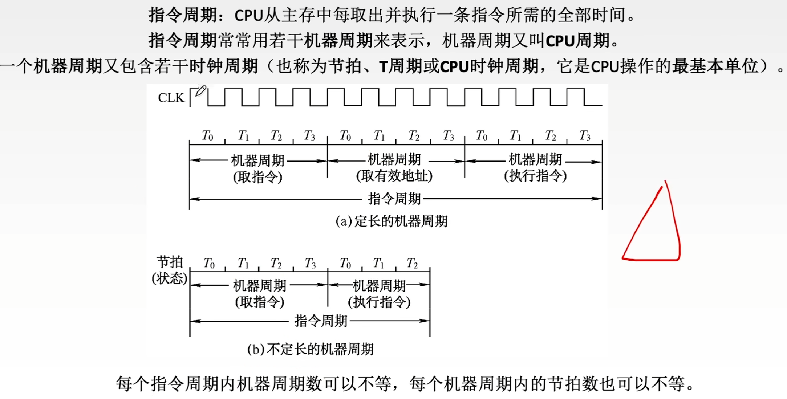
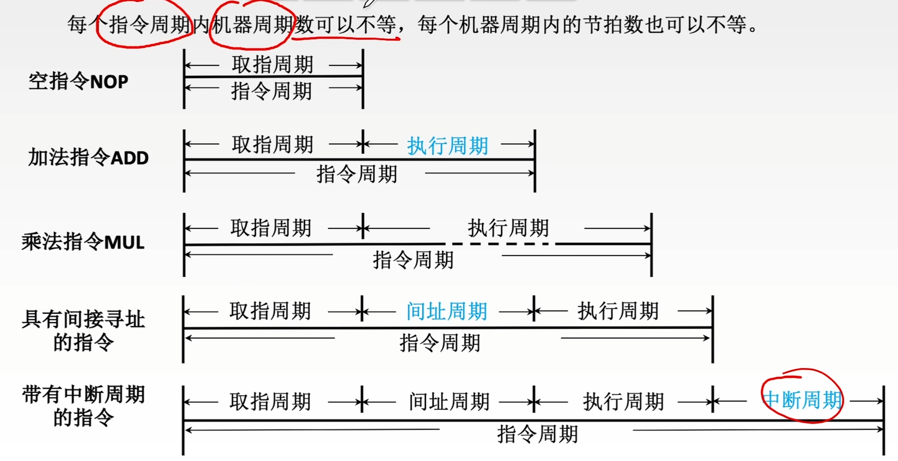
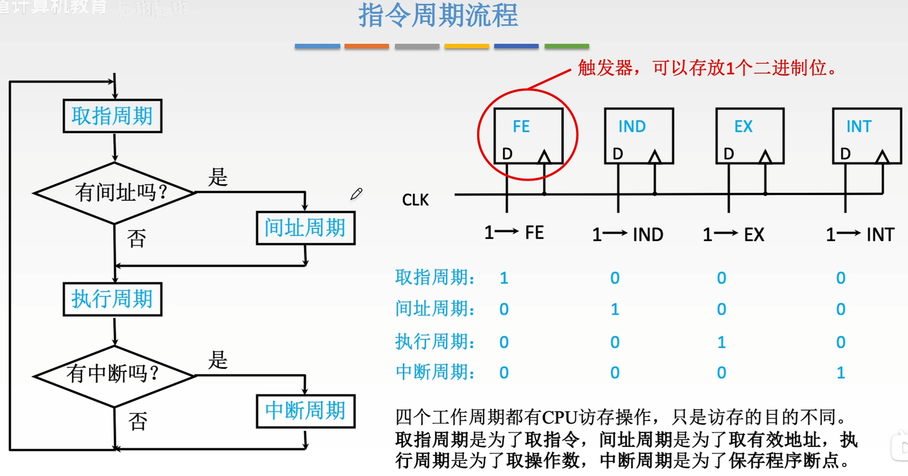
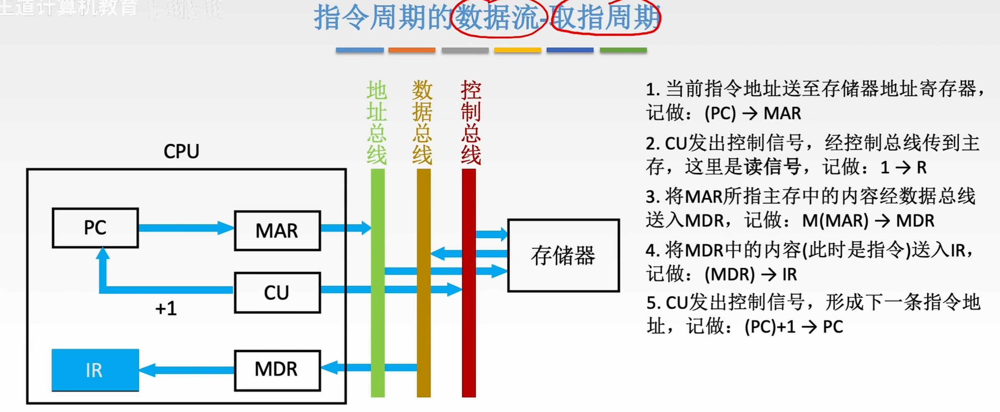
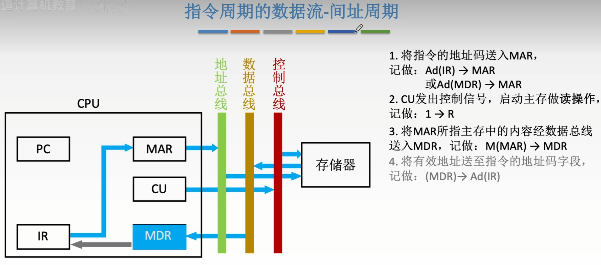

---
tags:
  - 计算机组成原理
---
# 指令周期

## 各周期的关系

>指令周期，机器周期（CPU周期），时钟周期之间的关系

>ADD指令包含两个机器周期，一个是取址周期，一个是执行周期

# 指令周期流程

>CPU使用触发器来判断当前是在执行取值周期，间址周期，执行周期还是中断周期

## 取址周期

>**取指令阶段**

- **目标**：从内存中获取当前要执行的指令。
- **过程**：
    - 程序计数器（PC）中存放的是当前指令的地址。
    - 这个地址被送到存储器地址寄存器（MAR）。
    - 控制器（CU）发出读信号。
    - 内存根据MAR中的地址，将该地址存储的内容（即**指令**）通过数据总线送入存储器数据寄存器（MDR）。
    - 最后，MDR中的内容被送入指令寄存器（IR）进行译码。
- **结论**：在此阶段，MDR接收的是**指令**。

## 间址周期

假设指令是间接寻址，取指周期结束后，指令已经在 IR 中。

1. **发送形式地址**：
    
    - 将指令寄存器（IR）中的地址码部分（形式地址 Ad(IR)）送到存储器地址寄存器（MAR）。
    - 记做： Ad(IR)→MAR
2. **发出读命令**：
    
    - 控制器（CU）发出读信号（1→R ）。
3. **读取有效地址**：
    
    - 主存根据 MAR 中的地址，找到该单元的内容。注意，这个内容**不是操作数**，而是**操作数的有效地址**。
    - 这个有效地址通过数据总线送入 MDR。
    - 记做： M(MAR)→MDR
4. **更新地址**：
    
    - 此时 MDR 中存放的是有效地址。这个地址会被送回 MAR，或者直接用于后续的执行周期。
    - 记做： MDR→MAR （或者直接用于执行周期的寻址）
    - 图中的形式是将有效地址送到了IR中进行拼接，使IR原来存储的形式地址变成了操作数的有效地址，也是一种方法