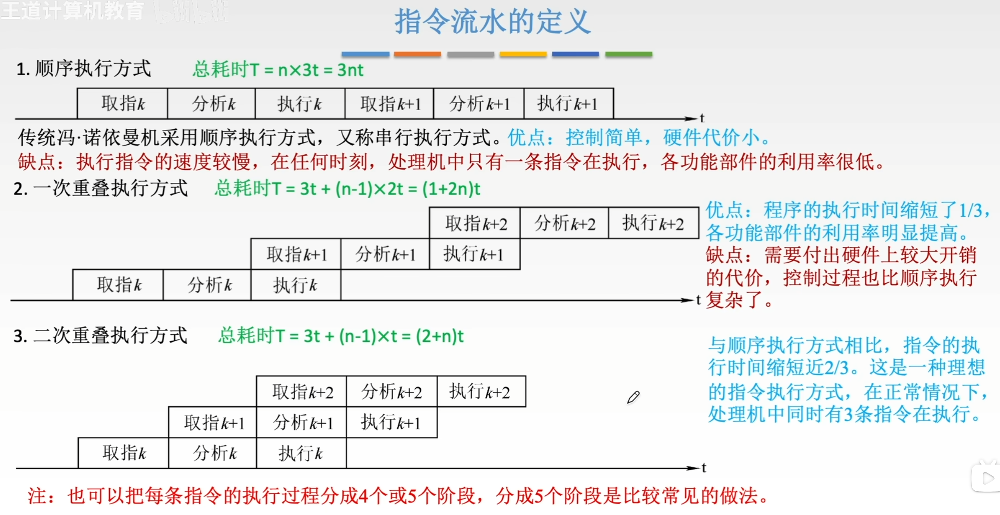
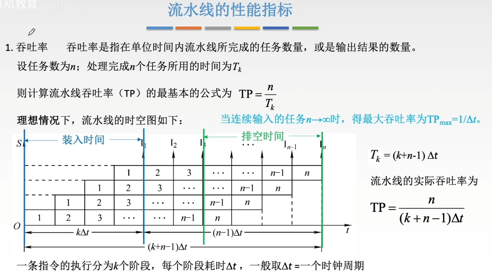
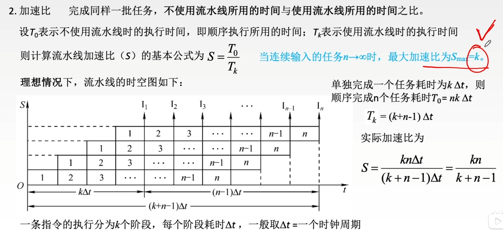
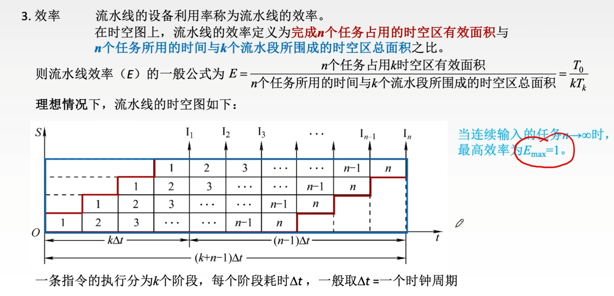

---
tags:
  - 计算机组成原理
---
# 定义
## 指令执行过程图

>
>一次重叠方式：第一条指令用事3t，3t时间之后，每过2t完成一个指令的执行周期
>二次重叠方式总耗时的计算也是同理

# 流水线的性能指标
## 吞吐率

## 加速比

## 效率

>$\frac{T_0}{kT_k}$k表示的是高，分为k个阶段，高是k。$T_k$表示总时间，是底下的宽
>这个公式就是被红色包住的区域比上一整块被蓝色包住的区域