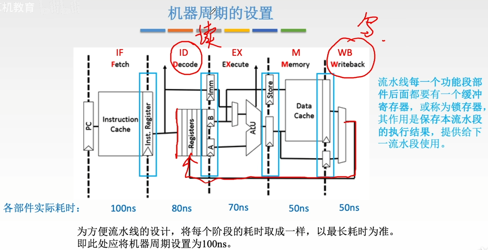
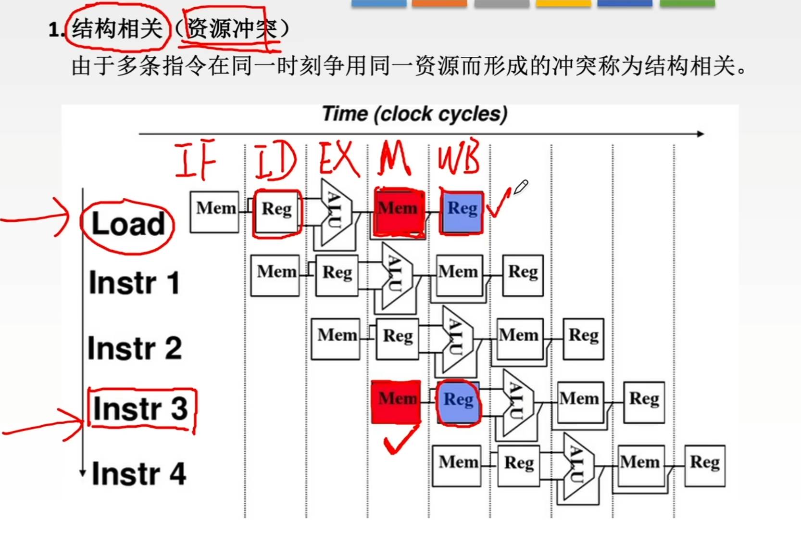
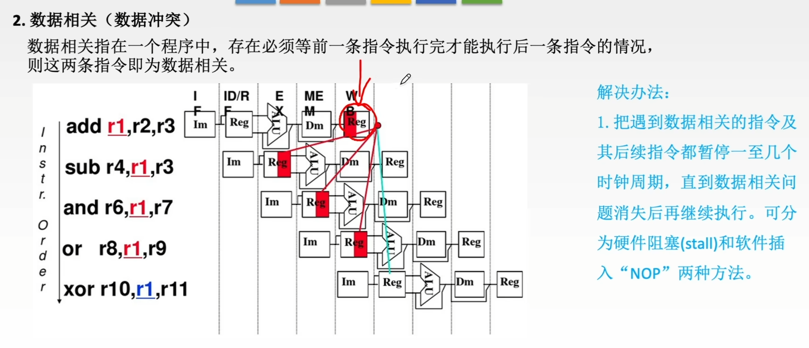
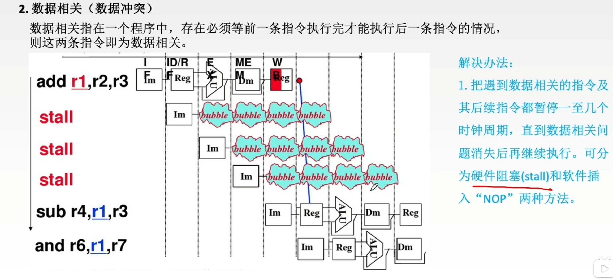
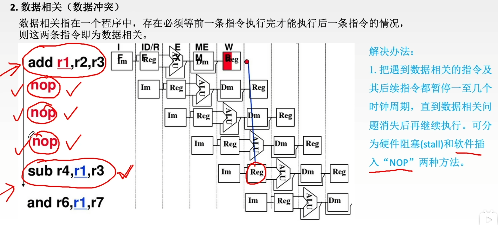

---
tags:
  - 计算机组成原理
---
# 机器周期的设置

>在[CISC和RISC](408/CISC和RISC.md)RISC架构里，取指令，取数都是去寄存器里取
>指令五个阶段：IF，ID，EX，M，WB分别是取指，译码，执行，访存，写回
>将Cache分成两个独立的指令Cache（instruction Cache）和数据Cache（Data Cache），这样就可以让ID和WB这两个阶段可以并行执行，不会发生冲突

# 影响流水线的因素
## 结构相关（资源冲突）

>第二种方法就比如：将Cache分成两个独立的指令Cache（instruction Cache）和数据Cache（Data Cache），这样就可以让ID和WB这两个阶段可以并行执行，不会发生冲突

## 数据相关（数据冲突）

>add后面的指令都要用到r1的值，比如sub在译码阶段就要取r1的值了，可是此时add的结果还没有写回r1

>解决方法

### 硬件阻塞

>由硬件系统添加bubble，把第二条指令往后拖3个周期

### 软件插入

>由编译器插入几条空指令

