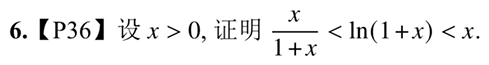

1. 当x>0时有$$\frac{1}{x}>ln(1+\frac 1 x) =ln(\frac{1+x}{x})> \frac{1}{1+x}$$
- 证明$$令f(t)=lnt,在[x,1+x]上$$由拉格朗日中值定理有$$f(1+x)-f(x)=\frac 1 \xi \cdot 1$$
- 其中$x<\xi<1+x$所以$\frac 1 {1+x} < \xi <\frac 1 x$得到$$\frac 1 {1+x}<f(1+x)-f(x)<\frac 1 x$$
- 即$$\frac{x}{1+x} < ln(1+x)<x,这是一个常用的放缩$$
	- 题源p15 ^bff6b8