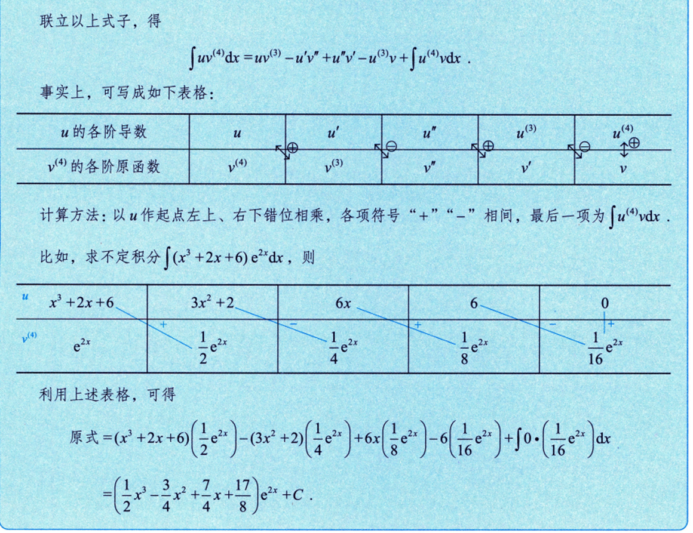
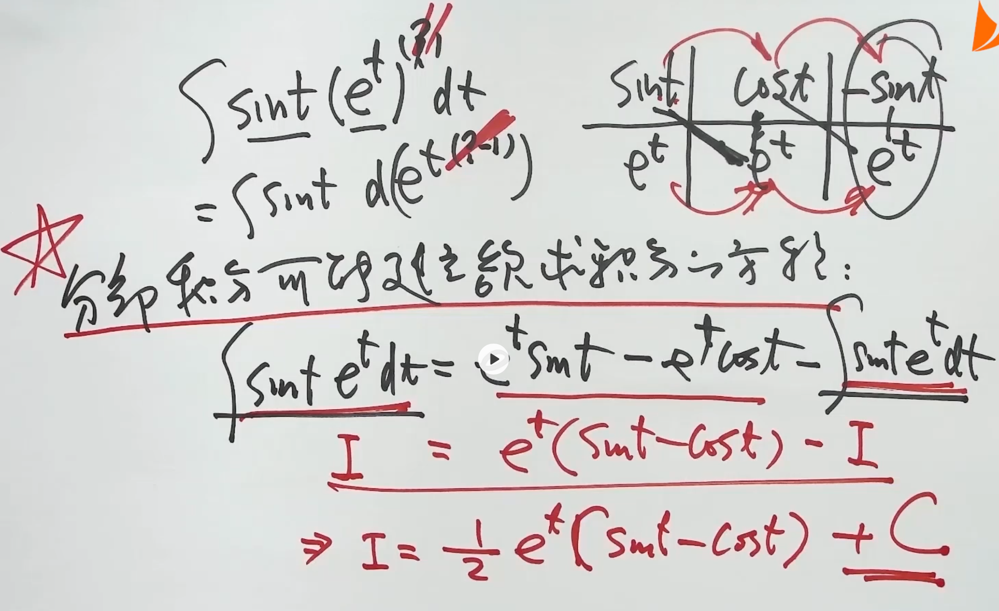

# 列表格求分部积分

> 按照反对幂指三这样的积分难度递减顺序，积分难度高的当做u来求导
> 表格第一行分别是从u的0阶导一直写到u导完为0为止
> 表格第二行则是从v照抄开始，一直积分到u为0的那块
> 然后从左上到右下错位相乘，+，-相间，注意到最后一列的时候的+-规则还是一样遵循+-相间的，也就是如果上一项是+，那这一项就是减。
> 最后一列是同列相乘然后对他们的积求积分dx

# 分部积分法：建立欲求积分的方程（以 $\int e^t \sin t \, dt$ 为例） --- ## 一、（循环型）题目 求不定积分： $$ \int e^t \sin t \, dt $$ 
---
## 二、核心思路 当被积函数是**指数函数 × 三角函数**（或 $\ln x$ × 多项式、反三角函数 × 多项式等）时，连续两次使用分部积分法，会出现与原积分相同的项，从而建立关于原积分的方程，通过解方程求出积分结果。 
---
## 分部积分法回顾 分部积分公式： $$ \int u \, dv = uv - \int v \, du $$ （口诀：**反对幂三指**，按顺序选 $u$，剩余部分为 $dv$）
---

### 五、最终结果 $$ \boxed{ \int e^t \sin t \, dt = \frac{1}{2} e^t (\sin t - \cos t) + C } $$
---
# 指数×三角函数积分通用公式($\int e^{ax}\sin bx dx$ / $\int e^{ax}\cos bx dx$) 
--- 
## 一、通用公式（可直接套用） 
### 1. 指数×正弦积分公式 $$ \int e^{ax} \sin bx \, dx = \frac{ \begin{vmatrix} (e^{ax})' & (\sin bx)' \\ e^{ax} & \sin bx \end{vmatrix} }{a^2 + b^2} + C = \frac{a e^{ax} \sin bx - b e^{ax} \cos bx}{a^2 + b^2} + C $$ 
### 2. 指数×余弦积分公式 $$ \int e^{ax} \cos bx \, dx = \frac{ \begin{vmatrix} (e^{ax})' & (\cos bx)' \\ e^{ax} & \cos bx \end{vmatrix} }{a^2 + b^2} + C = \frac{a e^{ax} \cos bx + b e^{ax} \sin bx}{a^2 + b^2} + C $$ 
---
## 二、公式记忆与理解 
### 1. 行列式形式的记忆技巧 两个公式的分子都可以用**二阶行列式**快速写出： - 第一行：两个函数的**导数** $(e^{ax})' = a e^{ax}$，$(\sin bx)' = b \cos bx$ / $(\cos bx)' = -b \sin bx$ - 第二行：两个函数**本身** $e^{ax}$，$\sin bx$ / $\cos bx$ - 分母统一为：$a^2 + b^2$ - 最后加常数 $C$ 
 
---
## 三、例题验证（承接上一题 $\int e^t \sin t dt$） 令 $a=1$，$b=1$，代入正弦公式： $$ \int e^{t} \sin t \, dt = \frac{1 \cdot e^{t} \sin t - 1 \cdot e^{t} \cos t}{1^2 + 1^2} + C = \frac{1}{2} e^t (\sin t - \cos t) + C $$ 与分部积分法推导的结果完全一致 ✅ 
---
## 四、其他示例 
##### 例1：$\int e^{-x} \sin nx dx$ 令 $a=-1$，$b=n$，代入正弦公式： $$ \int e^{-x} \sin nx \, dx = \frac{(-1) e^{-x} \sin nx - n e^{-x} \cos nx}{(-1)^2 + n^2} + C = \frac{-e^{-x} \sin nx - n e^{-x} \cos nx}{1 + n^2} + C $$
#### 例2：$\int e^{2x} \cos 3x dx$ 令 $a=2$，$b=3$，代入余弦公式： $$ \int e^{2x} \cos 3x \, dx = \frac{2 e^{2x} \cos 3x + 3 e^{2x} \sin 3x}{2^2 + 3^2} + C = \frac{e^{2x}(2\cos 3x + 3\sin 3x)}{13} + C $$ 
---
#### 适用场景：被积函数为**指数函数 × 正弦/余弦函数**的不定积分，可直接套用公式，无需重复分部积分。 3. **注意事项**： - 分母永远是 $a^2 + b^2$，不要写错符号；

>---
>
# 分部积分建立方程（抵消型）
p239例9.7
## 题目 计算不定积分 $$\int e^{2x}(\tan x + 1)^2 \mathrm{d}x$$ 
---
## 分析 展开平方，利用三角函数公式 $\tan^2 x + 1 = \sec^2 x$ 化简，再通过分部积分构造**正负相反的积分项**，实现抵消求解。 
---
## 详细解题步骤 $$ \begin{align*} \int e^{2x}(\tan x + 1)^2 \mathrm{d}x &= \int e^{2x}\left(\sec^2 x + 2\tan x\right)\mathrm{d}x \\ &= \int e^{2x}\sec^2 x \mathrm{d}x + 2\int e^{2x}\tan x \mathrm{d}x \\ &= \int e^{2x}\mathrm{d}(\tan x) + 2\int e^{2x}\tan x \mathrm{d}x \\ &= e^{2x}\tan x - 2\int e^{2x}\tan x \mathrm{d}x + 2\int e^{2x}\tan x \mathrm{d}x \\ &= e^{2x}\tan x + C \end{align*} $$ 
---
## 关键步骤拆解（抵消原理） 
##### 1. **三角恒等变形**：利用 $(\tan x + 1)^2 = \tan^2 x + 2\tan x + 1 = \sec^2 x + 2\tan x$，将原式拆分为两个积分。 
##### 2. **凑微分**：注意到 $\mathrm{d}(\tan x) = \sec^2 x \mathrm{d}x$，因此 $\int e^{2x}\sec^2 x \mathrm{d}x = \int e^{2x}\mathrm{d}(\tan x)$。 
##### 3. **分部积分**：对 $\int e^{2x}\mathrm{d}(\tan x)$ 应用分部积分公式 $\int u\mathrm{d}v = uv - \int v\mathrm{d}u$： 
- 令 $u = e^{2x}$，$\mathrm{d}v = \mathrm{d}(\tan x)$，则 $\mathrm{d}u = 2e^{2x}\mathrm{d}x$，$v = \tan x$ 
- 因此 $\int e^{2x}\mathrm{d}(\tan x) = e^{2x}\tan x - \int \tan x \cdot 2e^{2x}\mathrm{d}x = e^{2x}\tan x - 2\int e^{2x}\tan x \mathrm{d}x$ 
##### 4. **抵消求解**：分部积分后出现的 $-2\int e^{2x}\tan x \mathrm{d}x$ 与原式中的 $+2\int e^{2x}\tan x \mathrm{d}x$ 完全抵消，直接得到结果。 
---
## 补充：抵消型分部积分的核心特征 - 分部积分后，会出现**与原式中另一项完全相同、符号相反**的积分项，二者相互抵消，无需额外计算。 - 本题是典型的**指数×三角**型抵消积分，本质上也符合我们之前补充的通用结论： $$\int e^{ax}\left[f(x) + f'(x)\right]\mathrm{d}x = \frac{1}{a}e^{ax}f(x) + C$$ 本题中 $a=2$，$f(x)=\tan x$，$f'(x)=\sec^2 x$，代入公式可直接得到结果： $$\int e^{2x}(\tan x + \sec^2 x)\mathrm{d}x = e^{2x}\tan x + C$$
# 分部积分建立方程（递推型）
### $$求\int\frac{1}{(1+x^2)^2}dx，让其为I_2$$
>对于这个式子，如果没有外面这个平方，那么就是基本积分公式就是arctanx
####  $$让I_1=\int \frac{1}{1+x^2}dx=arctanx$$
>这时思路就是要从$I_1推I_2$。原来使用分部积分是为了让次方减少变简单，现在是反着来
>分母整体现在是一次方，要想变成$I_2$那样的二次方，就要求导，所以$\frac{1}{1+x^2}$当u来求导
>
 
## $$ \begin{align*} \arctan x = I_1 &= \int \frac{\mathrm{d}x}{1+x^2} = \int \frac{1}{1+x^2} \mathrm{d}x \\ &= \frac{x}{1+x^2} + \int x \cdot \frac{2x}{(1+x^2)^2} \mathrm{d}x \\ &= \frac{x}{1+x^2} + 2\int \frac{x^2+1-1}{(1+x^2)^2} \mathrm{d}x \\ &= \frac{x}{1+x^2} + 2\arctan x - 2\int \frac{\mathrm{d}x}{(1+x^2)^2} \\ I_1 &= \frac{x}{1+x^2} + 2I_1 - 2I_2 \end{align*} \\ $$
### $$$$