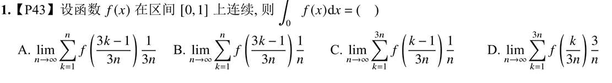

# 原始公式
# $\int_{0}^{1} f(x)dx=\lim_\limits{n \to \infty} \sum_\limits{1=1}^{n}f(\frac{i}{n})\frac 1 n$
# 定积分定义与性质 
## 核心公式 
### 1. 一般区间 $[a,b]$ 定积分定义 将 $[a,b]$ $n$ 等分，取右端点 $\xi_i = a + \frac{b-a}{n}i$ 作为高： $$\int_a^b f(x)dx = \lim_{n \to \infty} \sum_{i=1}^n f\left(a + \frac{b-a}{n}i\right) \frac{b-a}{n}$$ 取左端点 $\xi_i = a + \frac{b-a}{n}(i-1)$ 也可： $$\int_a^b f(x)dx = \lim_{n \to \infty} \sum_{i=0}^{n-1} f\left(a + \frac{b-a}{n}i\right) \frac{b-a}{n}$$

### 特殊区间 $[0,1]$ 定积分定义（常用） $$\int_0^1 f(x)dx = \lim_{n \to \infty} \sum_{i=1}^n f\left(\frac{i}{n}\right) \frac{1}{n}$$ **对应关系**：$\frac{i}{n} \to x$，$\frac{1}{n} \to dx$
## 关键性质
### 积分与变量符号无关 定积分值仅由**被积函数**和**积分区间**决定，与积分变量字母无关： $$\int_a^b f(x)dx = \int_a^b f(t)dt = \int_a^b f(u)du$$
### 补充
这个式子跟将这个区间**几等分，取左端点还是右端点或者中间的端点无关**
$$\int_0^1 f(x)dx = \lim_{n \to \infty} \sum_{i=1}^n f\left(\frac{i}{n}\right) \frac{1}{n}$$
#### $$我写成\sum_{i=1}^{3n} f\left(\frac{i-1}{n}\right) \frac{1}{3n},也就是3n等分,原来是取右端点，我现在取左端点$$一样可以得到$$\sum_{i=1}^{3n} f\left(\frac{i-1}{n}\right) \frac{1}{3n}=\int_0^1 f(x)dx$$
比如1000题p18No1
答案选B，分子分母同时除3，看出端点取在k~k-1之间