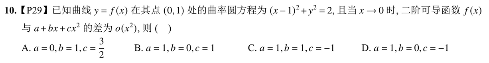

---
tags:
  - 错题
---

# 1000题p12 No7

$$
  y(x) = \ln|e^{2x} - 1| ) 的斜渐近线为（） A.( y = 2x + \dfrac{1}{e} ) B. ( y = 2x ) C. ( y = -2x + \dfrac{1}{e} ) D. ( y = -2x )
$$
- 先用$\lim\limits_{x \to +\infty} \frac{\ln (e^{2x} - 1)}{x}$求出极限为2也就是$a = 2$
- 在算$$\lim\limits_{x \to +\infty}f(x) - 2x = \lim_{x \to + \infty}\ln(e^{2x}-1) -2x$$
- 时，是无穷比无穷型，这时用倒代换也做不出来，这里有个[[计算技巧]]即
- 遇到形如$$\ln{e^x} - x$$
- 这种式子，将$x$写成$e^{ln x}$此时对于上面的公式，可以写成
- $$\lim_{x \to \infty}\ln{(e^{2x} - 1) - \ln e^{2x}} = \lim_{x \to +\infty}\ln \frac{e^{2x} - 1}{e^{2x}} = \ln 1 = 0$$
- 所以$a = 2, b = 0$答案选B
- 除了将x改写，还有另一种这个极限的解法
- 在[在对数中提取公因子](计算技巧.md#在对数中提取公因子)中，在$e^{2x - 1}$里提取一个$e^{2x}$原式变成$$\lim_{x \to +\infty}\ln\left(e^{2x}\left(1-e^{-2x}\right)\right) - 2x=\ln e^{2x}+\ln\left(1-e^{-2x}\right) - 2x = \lim_{x \to +\infty}\ln(1-e^{-2x})=0$$
# 1000题P12 NO10

- 这道题要用到[[曲率]]里面的一个曲率圆的性质，即曲率圆方程在这一点上**一阶导和二阶导与原函数$f(x)$ 是相同的**。而且，看到$o(x^2)$应该想到泰勒展开，将式子写出来$$f(x) - (a + b  + cx^2)=o(x^2)$$对应泰勒展开$$f(x) = f(0)+f'(0)x+\frac{f''(0)}{2}x^2+o(x^2)$$
- 所以这里面的abc就是与泰勒展开的系数一一对应的，一开始由题可知$f(0)=1$所以a=1。然后对曲率原方程两边求导$$2(x-1)+2y\cdot y'=0 \qquad y'=1$$
- 再求导$$2+2y\cdot (y'')^2+2y\cdot y''=0 \qquad y''=-2$$
- 所以$$a=1 \quad b=1\quad c=-1\qquad 答案选C$$
# 1000题P14No23
曲线$y=e^{(-\frac 1 x)}·\sqrt{(x²-4x+1)}$的渐近线条数为（3）
## 错误点
1. 遇到$e^{\infty} \quad \sqrt{x^2}$时要[[分类讨论]]，在求斜渐近线时，我没有进行分类讨论
- 在求斜渐近线斜率的时候，尤其是分类讨论到$x \to -\infty$时对于$$\frac{\sqrt{(x²-4x+1)}}{x}$$这一部分，因为x是小于0的，所以**不可以直接放到根号里面**，正确做法是，只能放-x，也就是x变成$-\sqrt{x^2}$然后才能放到分母里面，变成$$-\sqrt{\frac{{(x²-4x+1)}}{x^2}}$$
- 为了避免大意出错，遇到这种趋于负无穷的，直接代换，令t=-x就不容易出错了
 2. 在求斜渐近线截距时遇到了困难，用倒带换，通分，然后洛必达就可以求出了。b分别是-3和3

# 30讲P256No9.16