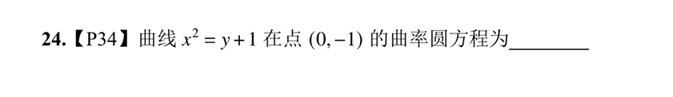

# 公式$$曲率\quad k=\frac{|y''|}{[1+(y'^2)]^{\frac{3}{2}}}$$
# 曲率半径$$R = \frac{1}{k}$$
## 曲率半径的性质
- 曲率圆方程在这一点上**一阶导和二阶导与原函数$f(x)$ 是相同的
- 在[1000题P12 NO10](我的数学错题.md#1000题P12%20NO10)有使用
## 曲率圆

求出曲率半径是$\frac 1 2 \quad y'|_{x=0} =0$由此可得法线斜率是无穷大，又因为是在（0,1）点，所以法线就是y轴，而且曲线这个点y=-1。沿着法线（y轴）走二分之一就是圆心$(0,-\frac 1 2)$了，所以曲率圆方程为$$x^2+(y+\frac 1 2)^2=\frac 1 4$$