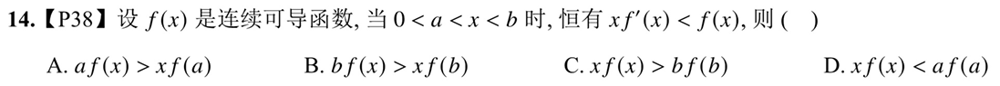

---
tags:
  - 罗尔定理
---
 # 乘积求导公式的逆用
1. $$见到f(x)f'(x),令F(x)=f^2(x)$$
2. $$见到[f'(x)]^2+f(x)f''(x),令F(x)=f(x)f'(x)$$
3. $$见到f'(x)+f(x)\phi '(x),令F(x)=f(x)e^{\phi(x)}$$
# 商的求导公式的逆用
1. $$见到f'(x)x-f(x)，令F(x)= \frac{f(x)}{x}$$
2. $$见到f''(x)f(x)-[f'(x)]^2,令F(x)=\frac{f'(x)}{f(x)}\quad 或F(x)=lnf(x)$$
3. $$见到\frac{f'(x)}{f(x)},令F(x)=lnf(x)$$
# 一个构造函数的模板
将原函数改造成类似这样的形式$$f'(x)+g(x)f(x),注意f'(x)的系数是1$$
那么这个式子的原函数就为$$F(x)=e^{\int g(x)dx}\cdot f(x)$$
举例：
1. $$f(x)+xf'(x)=0,将f'(x)的系数变为1，除以x\rightarrow f'(x)+\frac 1 x f(x)$$$$所以F(x)=e^{\int \frac 1 x dx}\cdot f(x)=x\cdot f(x)$$ ^a01ee2
---
2. $$xf(x)+f'(x)=0,g(x)=x$$
$$F(x)=e^{\int x dx}\cdot f(x) =e^{\frac {x^2}{2}\cdot f(x)}$$
# 需要构造函数的不等式题目

看到关系式，把右边式子都挪到左边$$xf'(x)-f(x)<0,想到构造函数F(x)=\frac{f(x)}{x}$$
由题目给的条件$F(x)求导小于0，所以F(x)是单调递减的，又由0<a<x<b$得到
$$F(a)>F(x)>F(b) \to \frac{f(a)}{a}>\frac{f(x)}{x}>\frac($$