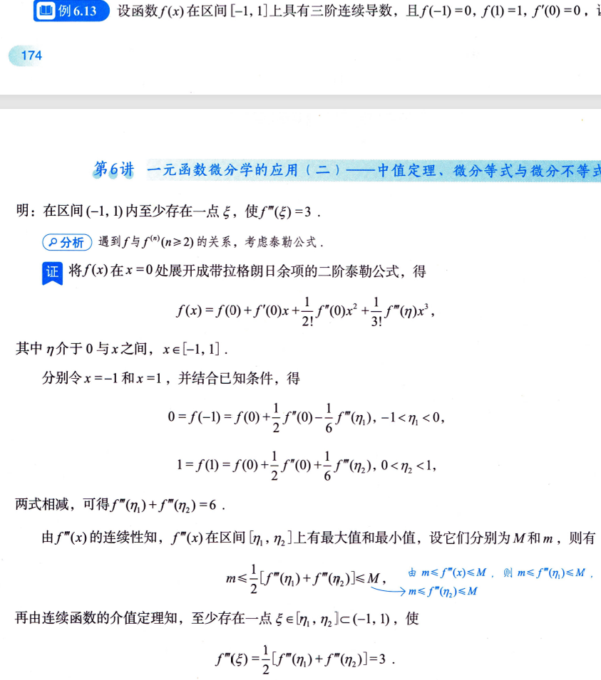

# 例6.10

- 对于A.B选项，构造函数$F(x)=xf(x)$求导看单调性然后得出答案
- 对于C.D选型，构造函数$F(X)=\frac{f(X)}{x}$然后求导，求导之后就是图片上的$h'(x)$，此时对于这个式子，要判断原函数和导函数的大小是困难的，此时由[[拉格朗日中值定理解题思路]]。利用拉格朗日使原函数与导函数联系起来其中$\xi$在0到x之间
# 例6.13

条件给的是$f(x)$在==区间==有导数，用[带拉格朗日余项的泰勒公式](../泰勒公式.md#带拉格朗日余项的泰勒公式)求解问题，三阶可导，所以写到二阶，第三阶是余项。[泰勒公式](../泰勒公式.md)中有$x和x_0$,==x和x0的选取，有以下两点方向==
1. 题设中给了什么信息
2. 使展开式尽可能简单
- 题目中给了$f'(0)=0$所以取$x_0=0$这样展开式里有$f'(0)$的那项就变为0了，然后x选取1和-1，代入展开式求解。
- 最后根据平均值定理得到答案