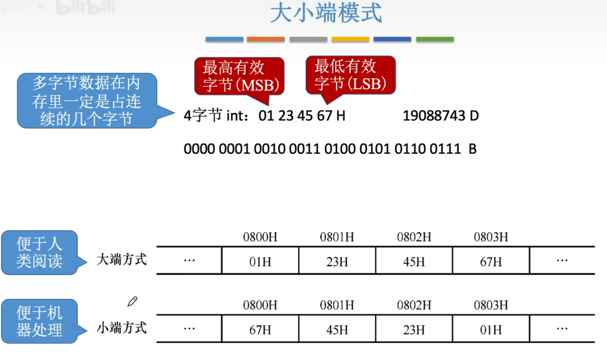
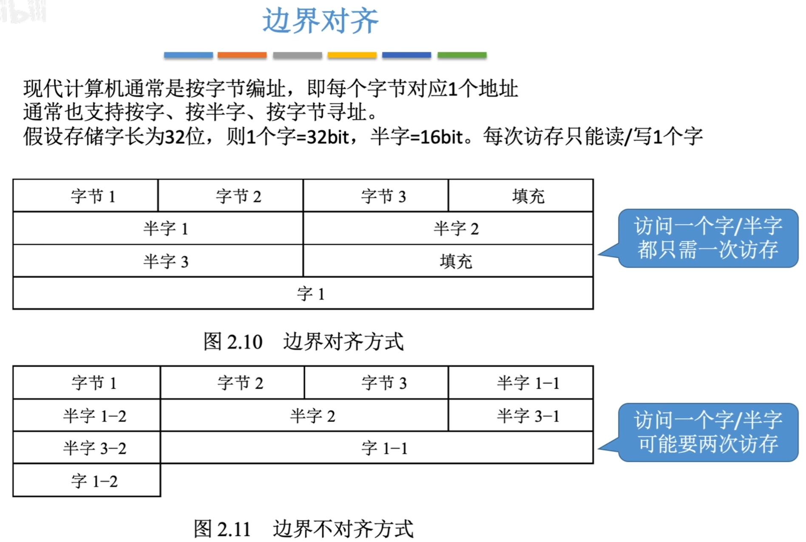

---
tags:
  - 计算机组成原理
---

# 大小端模式

>地址是低到高排列的
>大端存储像人类正常看数字，低地址存的是最高有效字节，高地址存的是最低有效字节
>小段存储是地址从低到高，数字的权值也是从低到高

# 边界对齐

>**存储字长**：存储单元中二进制代码的位数
>字长或机器字长值数据通路的宽度，等于CPU内部总线的宽度、运算器的位数、通用寄存器的宽度
>假设一个字为32位，那么一个字=4个字节。而计算器是按字节编址。那么字节1的地址就是0
>字节2的地址就是1，字节3的地址就是2，填充的地址就是3，第二行的字节1的地址就是4
>那么假设我要读2号字，我需要知道2号字的地址，第一行起始地址是0，第一行一整行是0号字
>第二行就是1号字，那么2号字就在第3行且起始地址为8（半字3的开头）。计算机在找2号字的过程中，会先找出它对应的编号，通过一个字等于4个字节，那么两个字就是8个字节，算出8的过程就是通过对2$(10)_2$进行逻辑左移两位，相当于乘4得到8。那么就找到了2号字的起始地址

>存储对齐：跟结构体的内存对齐和访存次数有关。因为每次访存都只能读/写1个字。假设第一行前3个字节都被char填充，接下来要往这个结构体里再放一个short，如果不对齐，那么就得把short分两半，一半存在第一行最后一格，另一半存在第二行第一格，这样访存的时候就得访问两次
>内存对齐是一种**以空间换时间的策略**