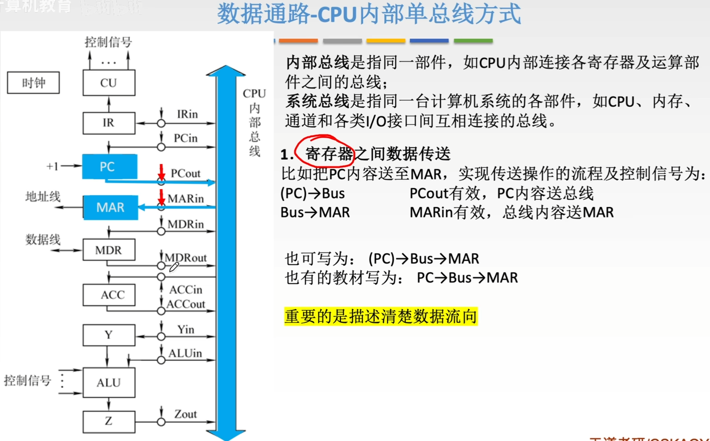
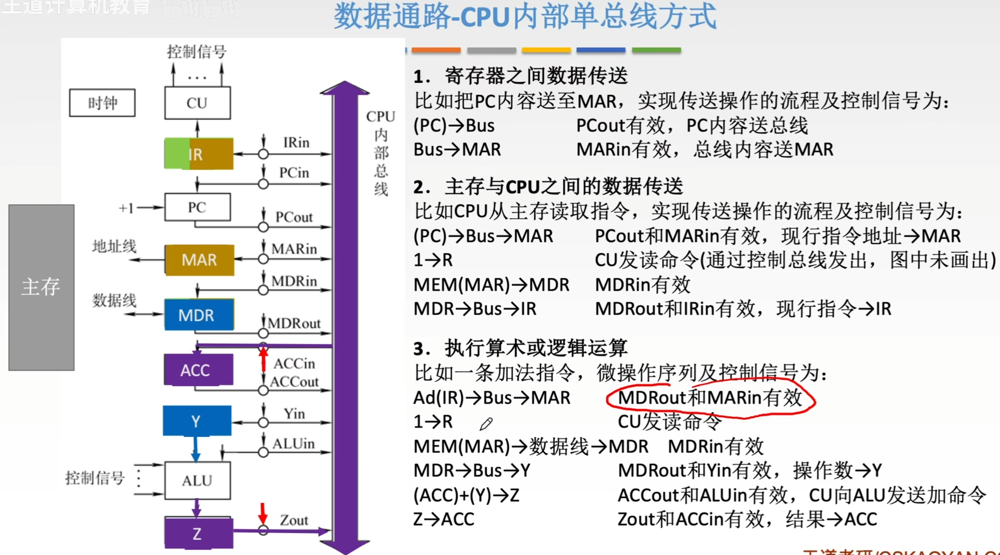
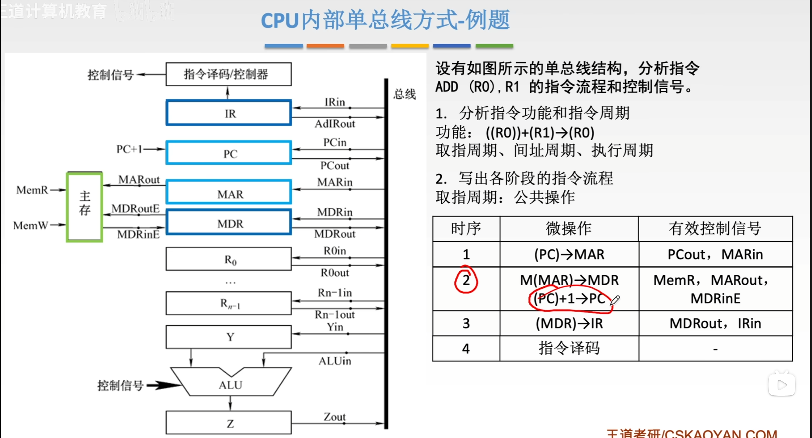
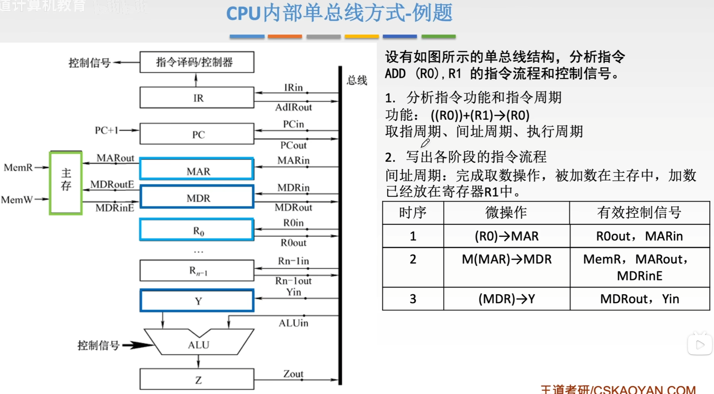

---
tags:
  - 计算机组成原理
---
# CPU单总线方式
## 寄存器之间数据传送

>CU控制$\text{PC}_{out},\text{MAR}_{in}$有效，寄存器out和in有效位实际上是有线与CU连接的，都是由CU来控制
>Bus就是总线的英文

## 主存与CPU之间数据传送

### 读操作：CPU从主存取数据（或指令）

这就是图中“比如CPU从主存读取指令”所描述的过程。

**逻辑流程**：CPU告诉主存“我要哪个地址的数据”，主存把数据发回来。

1. **发地址**：
    
    - **动作**：CPU先把想访问的内存地址（存在PC里）放到内部总线上，然后送进MAR。
    - **控制信号**：`PCout`有效（打开PC的出口开关），`MARin`有效（打开MAR的入口开关）。
    
2. **发命令**：
    
    - **动作**：CU（控制器）通过控制总线向主存发送一个“读”信号。
    - **控制信号**：$1 \rightarrow R$（Read信号有效）。
    - **解释**：这就像CPU对外喊了一声：“我要读数据！”
3. **主存回传数据**：
    
    - **动作**：主存收到地址和读命令后，找到对应位置的数据，通过数据总线送回给CPU的MDR。
    - **控制信号**：`MDRin`有效（打开MDR的入口开关）。
    - **数据流向**：$MEM(MAR) \rightarrow MDR$（注意：这一步数据是走外部数据总线进来的）。
4. **内部流转（如果是取指令）**：
    
    - **动作**：数据到了MDR后，如果这是一条指令，CPU会把它送进IR（指令寄存器）去分析。
    - **控制信号**：`MDRout`有效，`IRin`有效。
    
### 写操作：CPU往主存存数据

虽然图中主要演示了读，但逻辑是反过来的。

**逻辑流程**：CPU告诉主存“我要把数据存到哪个地址”。

1. **发地址**：先把目标地址送入MAR（同上）。
2. **发数据**：把要存的数据（比如在ACC累加器里）送入MDR。
3. **发命令**：CU发送“写”信号（$1 \rightarrow W$）。
4. **主存接收**：主存把MDR里的数据写入到MAR指定的地址中。

### 总结图中的核心要点

1. **总线是独木桥**：不管是PC、MAR还是MDR，它们之间传数据都要经过中间那条绿色的“CPU内部总线”。同一时刻，总线上只能有一路数据在传输。
2. **控制信号是开关**：
    - `xxOut` 代表把寄存器的数据放到总线上。
    - `xxIn` 代表把总线上的数据拉进寄存器里。
3. **MAR和MDR是接口**：
    - **MAR**只负责存地址（告诉主存去哪找）。
    - **MDR**只负责存数据（真正要读写的内容）。

## 执行算术或逻辑运算

>被加数已经存在ACC里了
这张图展示的是**CPU内部单总线结构**下，执行一条加法指令（比如 `ADD @X`，即把内存地址X里的数加到累加器ACC中）时的微操作流程。

简单来说，算术运算的过程就是：**取操作数 -> 送ALU计算 -> 存结果**。

以下是详细的数据传输逻辑梳理：

### 第一步：取操作数地址 (Ad(IR) -> MAR)

在执行加法前，指令已经在IR（指令寄存器）里了。指令中包含了操作数的地址信息（形式地址）。

- **动作**：将IR中的地址码部分（Ad(IR)）送到MAR。
- **控制信号**：`Ad(IR)`部分通过内部总线传输，`MARin`有效。
- **目的**：告诉内存，“我要去这个地址取操作数”。

### 第二步：从主存读取操作数 (MEM -> MDR)

这一步是CPU和主存之间的交互。

- **动作**：
    1. CU发出读命令（$1 \rightarrow R$）。
    2. 主存根据MAR的地址，把数据通过数据线送回MDR。
- **控制信号**：`MDRin`有效（打开MDR入口）。
- **结果**：操作数现在躺在MDR里。

### 第三步：将操作数送入暂存器Y (MDR -> Y)

**这是单总线结构的关键点**。  
ALU（算术逻辑单元）的两个输入端不能直接连在总线上（否则总线会被占用，且无法同时提供两个不同的数）。因此，CPU内部通常设有一个**暂存器Y**，专门用来暂存ALU的一个输入。

- **动作**：将MDR中的操作数送到Y寄存器。
- **控制信号**：`MDRout`有效（打开MDR出口到总线），`Yin`有效（打开Y入口）。
- **数据流向**：$MDR \rightarrow Bus \rightarrow Y$。
- **状态**：现在，ALU的一个输入端（Y）已经准备好了操作数。

### 第四步：执行加法运算 ((ACC) + (Y) -> Z)

现在，操作数在Y里，被加数在ACC（累加器）里。

- **动作**：
    1. ACC的内容直接送入ALU的一个输入端（ACC通常直接连在ALU上，或者通过总线快速传输）。
    2. Y的内容送入ALU的另一个输入端。
    3. ALU执行加法。
    4. 运算结果暂存在Z寄存器中（Z也是ALU输出端的缓冲寄存器）。
- **控制信号**：`ACCout`有效，`ALUin`有效（或CU直接控制ALU做加法），结果存入Z。
- **注意**：图中写的是 `(ACC)+(Y) -> Z`，意味着结果先不落回ACC，而是暂存在Z，防止运算过程中破坏ACC的原值（万一运算还没结束，ACC就被改写会很麻烦）。

### 第五步：结果写回ACC (Z -> ACC)

运算结束后，将结果保存。

- **动作**：将Z寄存器的内容送回ACC。
- **控制信号**：`Zout`有效（打开Z出口），`ACCin`有效（打开ACC入口）。
- **数据流向**：$Z \rightarrow Bus \rightarrow ACC$。
### 总结关键点

1. **Y寄存器的作用**：在单总线结构中，因为总线同一时间只能传一个数据，所以必须用Y寄存器“锁住”一个操作数，才能配合ACC里的数进行运算。
2. **Z寄存器的作用**：作为ALU输出端的缓冲，保证运算结果稳定后再写回通用寄存器。
3. **流程核心**：
    - 先取数到 **MDR**。
    - 再从 MDR 搬运到 **Y**。
    - **ACC** 和 **Y** 在 ALU 里相加。
    - 结果经 **Z** 写回 **ACC**。

---

# 微操作
通过CU发出不一样的控制信号，就可以让微操作一步一步的执行下去
每个微操作的执行，至少需要消耗一个时钟周期，每个时钟周期内，CU都会发出一组相应的控制信号，来完成其中的每一个微操作
指令的执行就是通过一个一个的微操作，一组一组的控制信号来完成的

---

## 单总线例题
### [取址周期](指令周期.md#取址周期)

看指令功能((R0))表示R0里的内容(R0)是一个地址这个地址指向的内容((R0))才是操作数，所以这是一个**寄存器间接寻址**。(R1)表示R1里的内容是操作数是**寄存器寻址**
#### `ADD (R0), R1` 指令的取指周期分析

取指周期（Fetch Cycle）是所有指令执行前都必须经历的公共阶段，其目的是从内存中取出指令。根据图中的单总线结构，取指周期分为以下几个步骤：

1. **时序1：将指令地址送入MAR**
    
    - **说明**: 程序计数器（PC）中存放的是当前指令的地址。为了从内存中读取指令，首先需要将这个地址送到内存地址寄存器（MAR）中。
    - **有效控制信号**:
        - `PCout`: 允许PC将其内容输出到总线上。
        - `MARin`: 允许MAR从总线上接收数据。
2. **时序2：从内存读取指令，同时PC加1**
    
    - **说明**:
        - CPU向主存发出读请求（`MemR`信号），MAR将其中的地址通过地址线送出（`MARout`信号）。主存根据该地址找到指令，并将其放到数据总线上。MDR从数据总线上接收指令内容（`MDRinE`信号）。
        - 与此同时，PC的内容自动加1，指向下一条指令的地址，为下一次取指做准备。
    - **有效控制信号**: `MemR`, `MARout`, `MDRinE`。
3. **时序3：将指令从MDR送入IR**
    
    - **说明**: 取到的指令现在存放在MDR中，需要将其送到指令寄存器（IR）中，以便进行译码。
    - **有效控制信号**:
        - `MDRout`: 允许MDR将其内容（即指令）输出到总线上。
        - `IRin`: 允许IR从总线上接收数据。
4. **时序4：指令译码**
    
    - **微操作**: 指令译码
    - **说明**: 指令进入IR后，由指令译码/控制器分析指令的操作码和寻址方式，并产生后续执行周期所需的一系列控制信号。这个阶段没有特定的总线操作，因此没有列出有效控制信号。

完成以上取指周期后，CPU就获得了 `ADD (R0), R1` 这条指令，接下来就会进入间址周期和执行周期来完成具体的加法操作。

### 间址周期

这张图展示的是**间址周期**的微操作流程。

结合题目给出的指令功能 `((R0))+(R1)→(R0)`，我们可以明确：`(R0)` 表示寄存器间接寻址，意味着真正的**被加数**（操作数）存放在主存中，而存放该数据的内存地址在寄存器 `R0` 里。

**间址周期的核心任务**就是：**根据 R0 中的地址，去内存里把那个“被加数”取出来，暂时放在 MDR 里。**

我们结合图中的表格和左侧的数据通路图，一步步来看这个过程：

#### 第一步：送地址 (时序 1)

- **目标**：把存放数据的地址送给 MAR（内存地址寄存器）。
- **来源**：地址在寄存器 `R0` 中。
- **操作**：`(R0) -> MAR`
- **控制信号**：
    - `R0out`：打开 R0 的出口开关，让数据上总线。
    - `MARin`：打开 MAR 的入口开关，把总线上的数据（即地址）锁存进 MAR。
- **通俗解释**：CPU 拿着 R0 里的“藏宝图坐标”，把它写在 MAR 这个“信封”上。
>MAR收到的是R0里的内容(R0)，这表示操作数在主存的地址，MAR拿到(R0)后，会找到地址为(R0)的操作数返回给MDR
#### 第二步：读内存 (时序 2)

- **目标**：根据 MAR 里的地址，从主存读出数据，存入 MDR。
- **操作**：`M(MAR) -> MDR`
- **控制信号**：
    - `MARout`：（图中虽然写了，但在很多简化模型中，MAR内容通常自动送往地址总线，这里可能是指允许地址输出到地址总线）。
    - `MemR`：这是发给主存的“读命令”信号（Memory Read）。
    - `MDRinE`：打开 MDR 的入口开关（E代表来自外部/主存），准备接收主存送回来的数据。
- **通俗解释**：邮递员（主存）看到信封（MAR）上的地址，去仓库找到对应的包裹（数据），放进邮箱（MDR）里。
>MDR存的是操作数本身，即((R0))
#### 第三步：送暂存器 (时序 3)

- **目标**：把刚从内存取出来的数据（现在在 MDR 里），送到 ALU 的暂存器 Y 中，为加法做准备。
- **操作**：`(MDR) -> Y`
- **控制信号**：
    - `MDRout`：打开 MDR 的出口开关，让数据上内部总线。
    - `Yin`：打开 Y 寄存器的入口开关，把数据存进去。
- **通俗解释**：把邮箱（MDR）里的包裹取出来，放到工作台（Y寄存器）上，等着和另一个数（R1）相加。

### 执行周期
这个**执行周期**的核心任务，就是完成题目要求的加法运算 `((R0)) + (R1) -> (R0)`，并将结果写回内存。

结合之前的**间址周期**（我们已经把被加数 `((R0))` 取出来放进了暂存器 `Y`），现在的状态是：

- **Y 寄存器**：存着被加数 `((R0))`（从内存取出来的）。
- **R1 寄存器**：存着加数 `(R1)`（直接在寄存器里）。
- **MAR 寄存器**：依然存着目标地址 `(R0)`（从间址周期保留下来的，因为最后要把结果写回这个地址）。

我们来看表格中的三个步骤：

#### 时序 1：执行加法运算

- **微操作**：`(R1) + (Y) -> Z`
- **解释**：
    - 这是算术逻辑单元真正干活的一步。
    - ALU 的两个输入端，一个连接着寄存器组（这里选 R1），另一个连接着暂存器 Y。
    - 控制器让 R1 和 Y 的内容同时进入 ALU 进行相加。
    - 运算结果不能直接回总线（会造成冲突），所以先暂存在 **Z 寄存器**中。
- **控制信号**：
    - `R1out`：打开 R1 出口，数据上总线/通路。
    - `ALUin`（或 ADD 信号）：告诉 ALU 执行加法操作。
    - （隐含）结果自动存入 Z。

#### 时序 2：结果送 MDR

- **微操作**：`(Z) -> MDR`
- **解释**：
    - 运算结果现在在 Z 里，但我们要把它写回**主存**。
    - 写入主存的数据必须先放在 **MDR**（数据缓冲寄存器）里。
    - 所以，这一步把 Z 里的计算结果搬运到 MDR。
- **控制信号**：
    - `Zout`：打开 Z 的出口，数据上内部总线。
    - `MDRin`：打开 MDR 的入口（注意这里通常是内部写入，区别于间址周期的 `MDRinE` 外部写入），把总线上的结果存进 MDR。

#### 时序 3：写回主存

- **微操作**：`(MDR) -> M(MAR)`
- **解释**：
    - 这是“回写”阶段。
    - **数据**：在 MDR 里（刚才算好的和）。
    - **地址**：在 MAR 里（从间址周期开始就一直没变过，存的是 R0 的值，即目标内存地址）。
    - CPU 发出写命令，把 MDR 的内容写入到 MAR 指定的内存单元中。
    - 这就完成了 `-> (R0)` 的要求。
- **控制信号**：
    - `MemW`：发给主存的“写”命令。
    - `MDRoutE`：打开 MDR 出口到外部数据总线。
    - `MARout`：（通常地址会自动保持在地址总线上，或者再次确认输出）确保地址有效。
>最终结果是写回到了 **由 R0 内容所指向的那个主存单元** 中。
#### 总结

这个执行周期就是一个标准的 **“算 -> 传 -> 写”** 过程：

1. **算**：R1 加 Y，结果存 Z。
2. **传**：把结果从 Z 搬到 MDR，准备写入。
3. **写**：把 MDR 里的结果写回 MAR 指向的内存地址。
