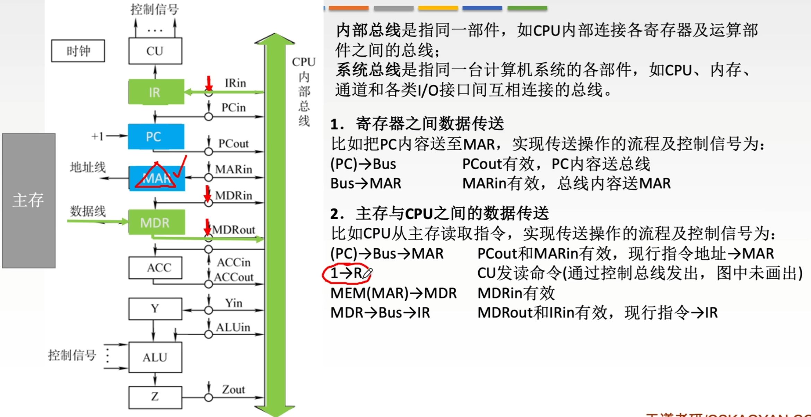

---
tags:
  - 计算机组成原理
---
# CPU单总线方式
## 寄存器之间数据传送

>CU控制$\text{PC}_{out},\text{MAR}_{in}$有效，寄存器out和in有效位实际上是有线与CU连接的，都是由CU来控制
>Bus就是总线的英文

## 主存与CPU之间数据传送

### 读操作：CPU从主存取数据（或指令）

这就是图中“比如CPU从主存读取指令”所描述的过程。

**逻辑流程**：CPU告诉主存“我要哪个地址的数据”，主存把数据发回来。

1. **发地址**：
    
    - **动作**：CPU先把想访问的内存地址（存在PC里）放到内部总线上，然后送进MAR。
    - **控制信号**：`PCout`有效（打开PC的出口开关），`MARin`有效（打开MAR的入口开关）。
    
2. **发命令**：
    
    - **动作**：CU（控制器）通过控制总线向主存发送一个“读”信号。
    - **控制信号**：$1 \rightarrow R$（Read信号有效）。
    - **解释**：这就像CPU对外喊了一声：“我要读数据！”
3. **主存回传数据**：
    
    - **动作**：主存收到地址和读命令后，找到对应位置的数据，通过数据总线送回给CPU的MDR。
    - **控制信号**：`MDRin`有效（打开MDR的入口开关）。
    - **数据流向**：$MEM(MAR) \rightarrow MDR$（注意：这一步数据是走外部数据总线进来的）。
4. **内部流转（如果是取指令）**：
    
    - **动作**：数据到了MDR后，如果这是一条指令，CPU会把它送进IR（指令寄存器）去分析。
    - **控制信号**：`MDRout`有效，`IRin`有效。
    

---

### 写操作：CPU往主存存数据

虽然图中主要演示了读，但逻辑是反过来的。

**逻辑流程**：CPU告诉主存“我要把数据存到哪个地址”。

1. **发地址**：先把目标地址送入MAR（同上）。
2. **发数据**：把要存的数据（比如在ACC累加器里）送入MDR。
3. **发命令**：CU发送“写”信号（$1 \rightarrow W$）。
4. **主存接收**：主存把MDR里的数据写入到MAR指定的地址中。

---

### 总结图中的核心要点

1. **总线是独木桥**：不管是PC、MAR还是MDR，它们之间传数据都要经过中间那条绿色的“CPU内部总线”。同一时刻，总线上只能有一路数据在传输。
2. **控制信号是开关**：
    - `xxOut` 代表把寄存器的数据放到总线上。
    - `xxIn` 代表把总线上的数据拉进寄存器里。
3. **MAR和MDR是接口**：
    - **MAR**只负责存地址（告诉主存去哪找）。
    - **MDR**只负责存数据（真正要读写的内容）。

## 执行算术或逻辑运算

>被加数已经存在ACC里了
这张图展示的是**CPU内部单总线结构**下，执行一条加法指令（比如 `ADD @X`，即把内存地址X里的数加到累加器ACC中）时的微操作流程。

简单来说，算术运算的过程就是：**取操作数 -> 送ALU计算 -> 存结果**。

以下是详细的数据传输逻辑梳理：

### 第一步：取操作数地址 (Ad(IR) -> MAR)

在执行加法前，指令已经在IR（指令寄存器）里了。指令中包含了操作数的地址信息（形式地址）。

- **动作**：将IR中的地址码部分（Ad(IR)）送到MAR。
- **控制信号**：`Ad(IR)`部分通过内部总线传输，`MARin`有效。
- **目的**：告诉内存，“我要去这个地址取操作数”。

### 第二步：从主存读取操作数 (MEM -> MDR)

这一步是CPU和主存之间的交互。

- **动作**：
    1. CU发出读命令（$1 \rightarrow R$）。
    2. 主存根据MAR的地址，把数据通过数据线送回MDR。
- **控制信号**：`MDRin`有效（打开MDR入口）。
- **结果**：操作数现在躺在MDR里。

### 第三步：将操作数送入暂存器Y (MDR -> Y)

**这是单总线结构的关键点**。  
ALU（算术逻辑单元）的两个输入端不能直接连在总线上（否则总线会被占用，且无法同时提供两个不同的数）。因此，CPU内部通常设有一个**暂存器Y**，专门用来暂存ALU的一个输入。

- **动作**：将MDR中的操作数送到Y寄存器。
- **控制信号**：`MDRout`有效（打开MDR出口到总线），`Yin`有效（打开Y入口）。
- **数据流向**：$MDR \rightarrow Bus \rightarrow Y$。
- **状态**：现在，ALU的一个输入端（Y）已经准备好了操作数。

### 第四步：执行加法运算 ((ACC) + (Y) -> Z)

现在，操作数在Y里，被加数在ACC（累加器）里。

- **动作**：
    1. ACC的内容直接送入ALU的一个输入端（ACC通常直接连在ALU上，或者通过总线快速传输）。
    2. Y的内容送入ALU的另一个输入端。
    3. ALU执行加法。
    4. 运算结果暂存在Z寄存器中（Z也是ALU输出端的缓冲寄存器）。
- **控制信号**：`ACCout`有效，`ALUin`有效（或CU直接控制ALU做加法），结果存入Z。
- **注意**：图中写的是 `(ACC)+(Y) -> Z`，意味着结果先不落回ACC，而是暂存在Z，防止运算过程中破坏ACC的原值（万一运算还没结束，ACC就被改写会很麻烦）。

### 第五步：结果写回ACC (Z -> ACC)

运算结束后，将结果保存。

- **动作**：将Z寄存器的内容送回ACC。
- **控制信号**：`Zout`有效（打开Z出口），`ACCin`有效（打开ACC入口）。
- **数据流向**：$Z \rightarrow Bus \rightarrow ACC$。

---

### 总结关键点

1. **Y寄存器的作用**：在单总线结构中，因为总线同一时间只能传一个数据，所以必须用Y寄存器“锁住”一个操作数，才能配合ACC里的数进行运算。
2. **Z寄存器的作用**：作为ALU输出端的缓冲，保证运算结果稳定后再写回通用寄存器。
3. **流程核心**：
    - 先取数到 **MDR**。
    - 再从 MDR 搬运到 **Y**。
    - **ACC** 和 **Y** 在 ALU 里相加。
    - 结果经 **Z** 写回 **ACC**。

# 微操作
通过CU发出不一样的控制信号，就可以让微操作一步一步的执行下去
每个微操作的执行，至少需要消耗一个时钟周期，每个时钟周期内，CU都会发出一组相应的控制信号，来完成其中的每一个微操作
指令的执行就是通过一个一个的微操作，一组一组的控制信号来完成的