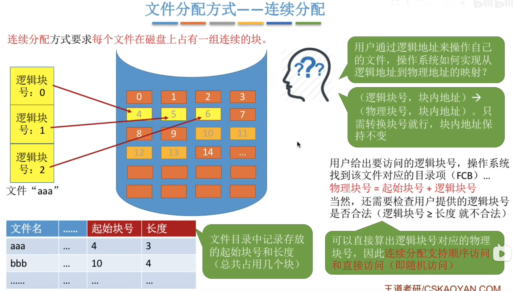
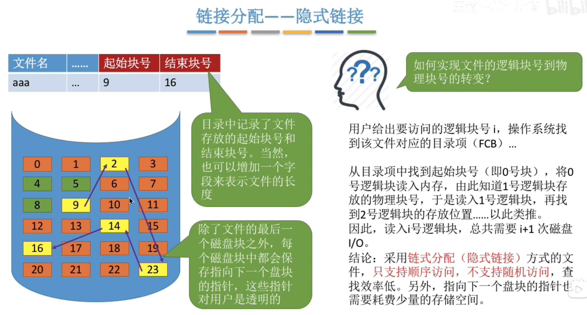

---
tags:
  - 操作系统
---
# 文件块，磁盘块

# 连续分配

>连续分配方式要求每个文件在磁盘上占有一组连续的块。
>优点：支持顺序访问和直接访问（即随机访问）；连续分配的文件在顺序访问时速度最快
>缺点：不方便文件拓展；存储空间利用率低，会产生磁盘碎片

# 链接分配
## 隐式链接

>隐式链接一一除文件的最后一个盘块之外，每个盘块中都存有指向下一个盘块的指针。文件目录包括文件第一块的指针和最后一块的指针。
>优点：很方便文件拓展，不会有碎片问题，外存利用率高。
>缺点：只支持顺序访问，不支持随机访问，查找效率低，指向下一个盘块的指针也需要耗费少量的存储空间。