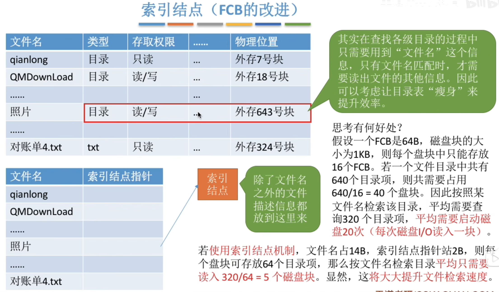
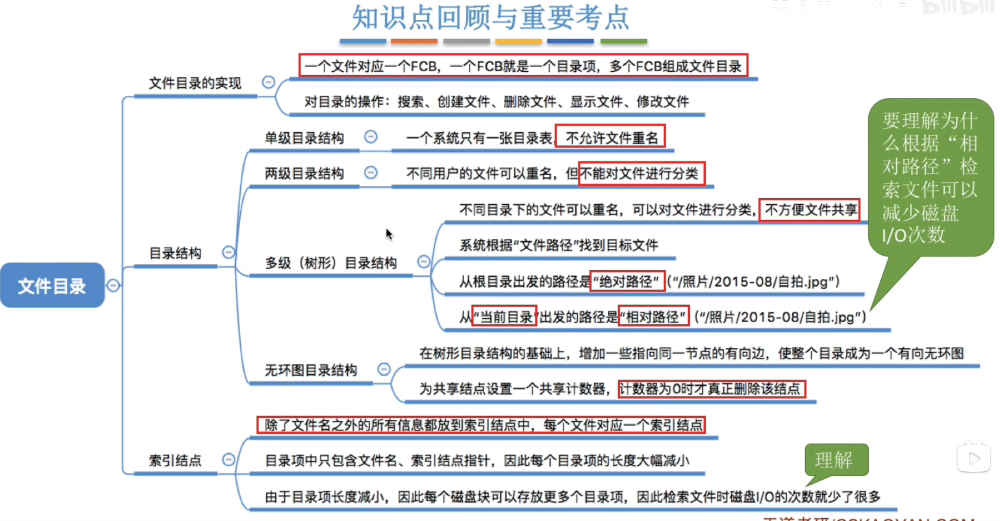

---
tags:
  - 操作系统
---
# 文件控制块

>目录文件中的一条记录就是一个文件控制块（FCB）

# 单级目录

# 两级目录结构

# 多级目录结构

## 当前目录

>相对路径和当前目录

# 索引结点

>当找到文件名对应的目录项时，才需要将索引结点调入内存，索引结点中记录了文件的各种信息，包括文件在外存中的存放位置，根据“存放位置”即可找到文件。存放在外存中的索引结点称为“**磁盘索引结点**”，当索引结点放入内存后称为“**内存索引结点**”。
相比之下内存索引结点中需要增加一些信息，比如：文件是否被修改、此时有几个进程正在访问该文件等。
# 总结

